# 🛩️ The Specialist Agent — Complete Product Requirements Document

> **Owner:** Daniel Lohn | **Version:** V2.7 | **Status:** Living Document
>
> This is the master reference for the Specialist Agent — AviationChat's primary text-based learning engine. It synthesizes the Talker, 6-Search Librarian, Socratic Teacher, Quiz Tutor, Quiz Loop, Cognitive Load Monitoring, and Mastery Progression systems into a single unified PRD.

---

## Table of Contents

1. [System Overview](#1-system-overview)
2. [The Three-Lane Expert Witness Architecture](#2-the-three-lane-expert-witness-architecture)
3. [The Talker Agent (Sub-Agent 1)](#3-the-talker-agent)
4. [The 6-Search Librarian (Sub-Agent 2)](#4-the-6-search-librarian)
5. [The Reasoner (Sub-Agent 3)](#5-the-reasoner)
6. [Cognitive Load Theory Foundation](#6-cognitive-load-theory-foundation)
7. [The Socratic Teacher Pipeline](#7-the-socratic-teacher-pipeline)
8. [Core Pedagogical Features](#8-core-pedagogical-features)
9. [The Quiz System & 4-Strike Failsafe](#9-the-quiz-system--4-strike-failsafe)
10. [The Socratic Quiz Tutor](#10-the-socratic-quiz-tutor)
11. [Mastery Progression & Learning Decay](#11-mastery-progression--learning-decay)
12. [Dashboard Rollup & Igor Unlock](#12-dashboard-rollup--igor-unlock)
13. [Prerequisite DAG & Pre-Bunking](#13-prerequisite-dag--pre-bunking)

---

## 1. System Overview

The Specialist Agent is the central orchestrator for all text-based student interactions. It is **not** a single LLM — it is a multi-agent system coordinating 6+ sub-agents and services through a stateless webhook pattern.

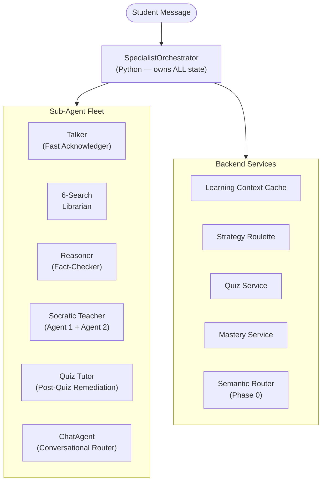

**Key Invariant:** The Python Orchestrator owns ALL state. Every sub-agent is stateless — they receive context, produce structured output, and exit. The Orchestrator decides what happens next.

---

## 2. The Three-Lane Expert Witness Architecture

When a student asks a technical aviation question, the Specialist fires three parallel lanes:

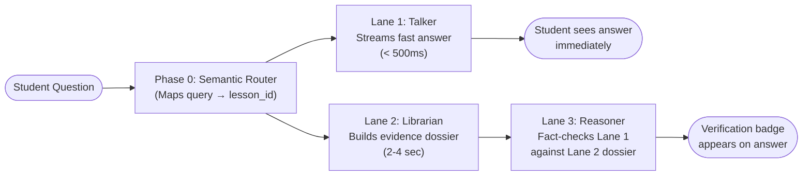

| Lane | Agent | Model | Purpose | Latency |
|------|-------|-------|---------|---------|
| 1 | Talker | Flash Lite | Stream a fast, curriculum-grounded answer | < 500ms |
| 2 | Librarian | Vertex AI Search | Build a multi-source evidence dossier | 2-4s |
| 3 | Reasoner | Pro | Fact-check Lane 1 against Lane 2 evidence | 1-2s |

> [!IMPORTANT]
> **Phase 0 (Semantic Router)** runs in parallel with Lane 1. It maps the student's free-text question to a specific `lesson_id` in the curriculum. This determines whether the question is on-syllabus or off-syllabus, which controls how many RAG lanes fire.

---

## 3. The Talker Agent

The Talker is the student's first point of contact. It handles 4 distinct sub-flows depending on the student's intent:

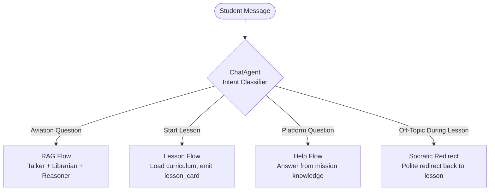

### Sub-Flow Summary

| Flow | Trigger | Agents Involved | RAG? |
|------|---------|----------------|------|
| **RAG Flow** | Student asks aviation question | Talker → Librarian → Reasoner | ✅ Full 6-Search |
| **Lesson Flow** | Student says "I'm ready to study" | ChatAgent → Lesson Card UI | ❌ |
| **Help Flow** | Student asks "How does this work?" | ChatAgent (internal knowledge) | ❌ |
| **Socratic Redirect** | Student goes off-topic mid-lesson | Socratic Teacher intercepts | ❌ |

---

## 4. The 6-Search Librarian

The Librarian uses a **Dual-DB Topology** executing up to 6 parallel search lanes to build an evidence dossier.

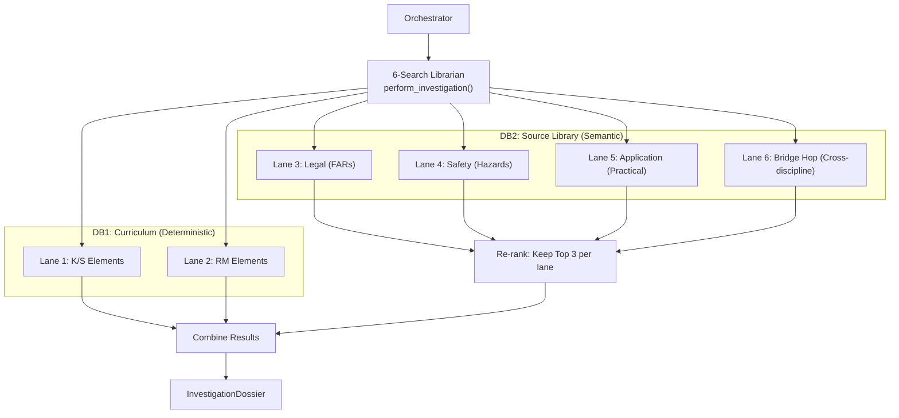

### Operating Modes

| Mode | Lanes | When Used |
|------|-------|-----------|
| **Full Curriculum (6-Lane)** | DB1 + DB2 | Main Socratic Teacher flow |
| **RKP-First Q&A (4-Lane)** | DB2 only | Mid-lesson student questions |
| **Off-Syllabus (6-Search)** | DB2 (Legal, Safety, App) | Random aviation questions |

---

## 5. The Reasoner

The Reasoner (Lane 3) is the fact-checker. It receives the Talker's fast answer and the Librarian's evidence dossier, then:
1. Cross-references claims against source documents
2. Flags hallucinations or inaccuracies
3. Emits a verification badge (`verified`, `corrected`, or `unverified`)
4. Attaches source citations (FAR §, AIM sections, PHAK chapters)

---

## 6. Cognitive Load Theory Foundation

The entire Socratic architecture is built on **John Sweller's Cognitive Load Theory (CLT)**, targeting **Germane Load maximization**.

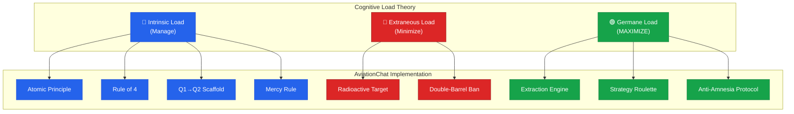

### Real-Time Monitoring: The `confusion_score`

The `confusion_score` (0.0–1.0) is a float output by Agent 2 on every evaluation. It maps to 3 cognitive zones:

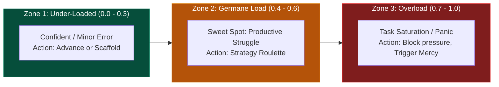

**Orchestrator Rules:**
- **Zone 3 blocks Devil's Advocate** — a stressed student needs a Confidence Reset, not pressure
- **Rapid spikes trigger early Mercy** — even before the 4-attempt limit
- **We never write "maximize Germane Load" in prompts** — LLMs misinterpret it as "make questions harder"

---

## 7. The Socratic Teacher Pipeline

The Socratic Teacher is a **two-agent pipeline** communicating via strict Pydantic schemas.

| Agent | Role | Model | Output |
|-------|------|-------|--------|
| **Agent 1** (Lesson Planner) | Decides *what* to teach | Pro | `LessonPlan` with 4 `SocraticNode`s |
| **Agent 2** (Executor) | Decides *how* to respond | Pro | `SocraticExecutorResponse` with `routing_tag` + `confusion_score` |

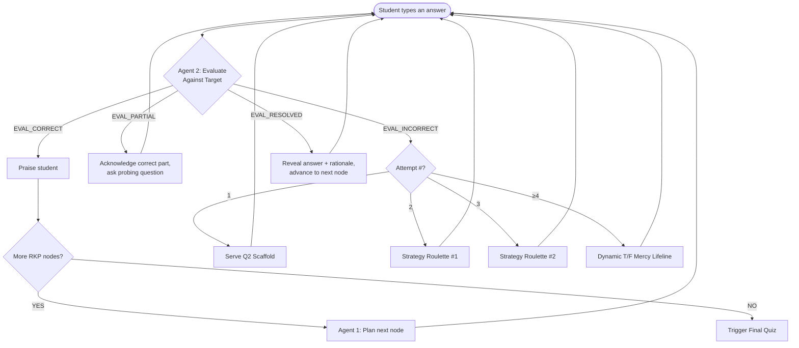

### 7.1 Session Resumption & State Persistence

The Socratic Teacher incorporates a highly resilient state hydration mechanism to respect adult learners' time and prevent loss of progress. When a student navigates to a lesson, the frontend calls `GET /api/lessons/{lesson_id}/progress`. This endpoint computes the exact `resumed_step` (1-4) by resolving two systems:
1. **The Volatile Session Document:** (`socratic_sessions/{lesson_id}`) Tracks mid-session progression (`node_index`, `attempt`).
2. **The Durable Plan Cache:** (`lesson_plan_cache/{lesson_id}`) Holds the `socratic_completed_at` timestamp. This survives intentional resets (e.g., clicking "Retake Socratic") and prevents completed sessions from regressing the UI.

The React frontend uses a `STATE_RANK` merger pattern to guarantee that any incoming `/progress` hydration will NEVER downgrade a step the user has already unlocked locally. This architecture natively supports N-node RKP manifests without hardcoded constraints.

---

## 8. Core Pedagogical Features

Both the Socratic Teacher and the Quiz Tutor share the same feature suite:

### 1. Extraction Engine (Prime Directive)
The AI must **never give the answer**. It forces the student to articulate the correct response themselves. *Saying it* is the learning event.

### 2. Radioactive Target Protocol
The `target_answer` is treated as radioactive — Agent 2 cannot use its core nouns/verbs in hints. This prevents the "Illusion of Competence" where the student parrots without understanding.

### 3. Strategy Roulette
On attempts 2-3, the Orchestrator injects a `roulette_directive` forcing Agent 2 to pivot its teaching angle:

| Strategy | Example |
|----------|---------|
| **Devil's Advocate** | *"The FAA manual says [distractor]. Defend your answer."* |
| **Socratic Analogy** | *"Think of the electrical system like plumbing..."* |
| **Inverted Scenario** | *"If you WANTED to cause this emergency, what would you do?"* |
| **Explain Like I'm 5** | *"How would you explain it to a non-pilot passenger?"* |

### 4. Anti-Amnesia Protocol
The orchestrator maintains a `node_history` transcript (last 6 turns) injected into Agent 2's prompt so it can reference partial progress and avoid repeating rejected hints.

### 5. Dynamic Mercy Rule (T/F Lifeline)
When `attempt >= 4` or `confusion_score > 0.7`:
1. Agent 2 scans `node_history` for the student's **closest** past answer
2. Warm acknowledgment: *"Earlier you mentioned [X] — solid instinct."*
3. Generates a contextual True/False question isolating one fact
4. T/F correct → advance | T/F incorrect → reveal answer and advance

---

## 9. The Quiz System & 4-Strike Failsafe

After the Socratic conversation completes, the system generates a Scenario-Based Judgment Test (SJT) with 5 questions from the quiz bank. The student must score **80%+** to pass.

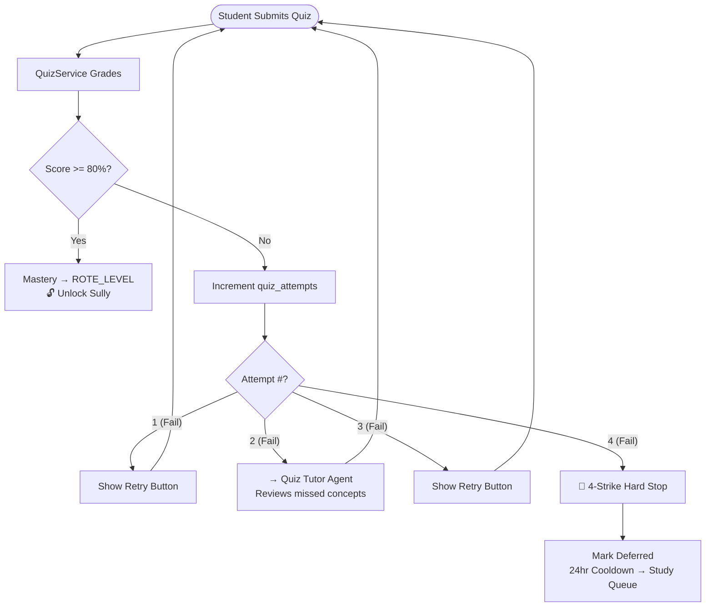

### Deferred Lesson Management
When the 4-strike failsafe fires:
- Lesson flagged `deferred = True` with timestamp
- After **24 hours**, the system re-injects the lesson into the `review` bucket of the Study Queue
- The Socratic Tutor gives a compassionate close-out: *"Great effort — your brain needs time to absorb this. We'll circle back."*

---

## 10. The Socratic Quiz Tutor

The Quiz Tutor is the "brother agent" of the Socratic Teacher. It activates on **Fail 2** and **Fail 4** to walk the student through their specific missed questions.

| Property | Socratic Teacher | Quiz Tutor |
|----------|-----------------|------------|
| **Trigger** | Lesson start | Quiz failure |
| **Input** | RKP Manifest + Lesson Plan | Missed quiz questions |
| **Model** | Gemini 3.1 Pro | Gemini 3.1 Flash Lite |
| **Pydantic Schema** | `SocraticExecutorResponse` | Same — shared schema |
| **Features** | Full suite (Roulette, Mercy, etc.) | Full suite (inherited) |
| **`confusion_score`** | ✅ Tracked per turn | ✅ Tracked per turn |

### Context Loading

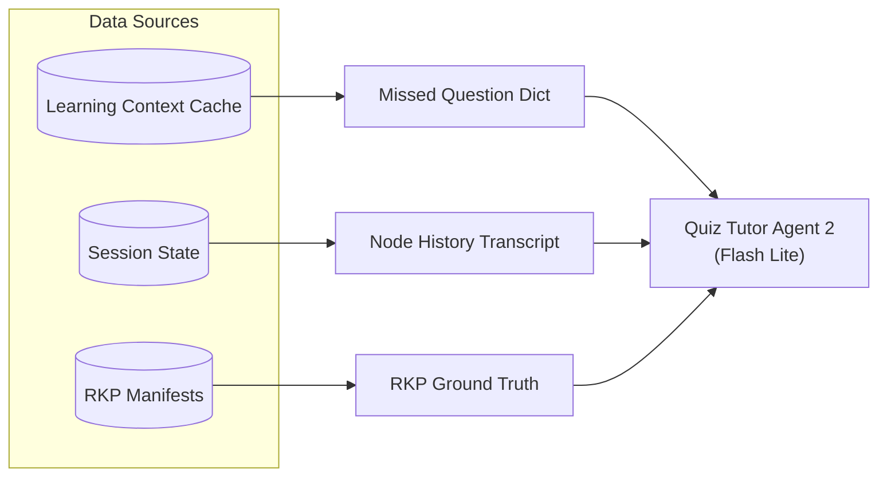

---

## 11. Mastery Progression & Learning Decay

### The 5-Phase Grading Waterfall

Each micro-lesson progresses through 5 cognitive phases:

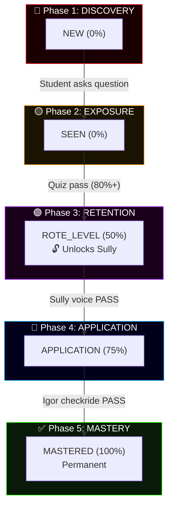

### Gate Responsibilities

| Gate | Who Teaches | Who Grades |
|------|-------------|------------|
| `new` → `seen` | Specialist (Talker) | *None — exposure only* |
| `seen` → `rote_level` | Socratic Teacher | Quiz Engine (auto-graded) |
| `rote_level` → `application` | Sully (CFI Voice) | **Admin Agent** (transcript) |
| `application` → `mastered` | Igor (DPE Voice) | **Admin Agent** (transcript) |

> [!IMPORTANT]
> **Teaching agents NEVER grade.** The Admin Agent is the sole grading authority for all voice sessions. This prevents personality bias from affecting mastery transitions.

### Learning Decay (The Vault Keeper)

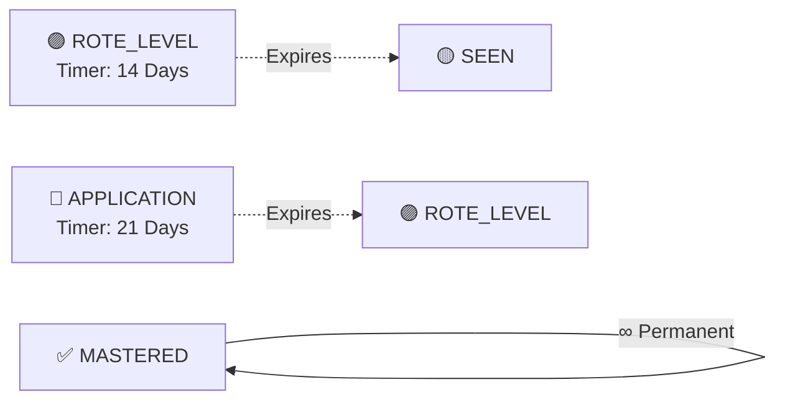

- **14-Day Cliff** (`rote_level` → `seen`): Lose Sully access, must re-pass quiz
- **21-Day Cliff** (`application` → `rote_level`): Drop back, must redo Sully session
- **Permanent**: Once mastered via Igor, never decays

### Study Queue Priority

| Priority | Bucket | Description |
|----------|--------|-------------|
| 1st | 🔴 **Review** | Decayed/failed lessons (plug leaks first) |
| 2nd | 🟡 **New** | Untouched lessons |
| 3rd | 🟢 **Maintenance** | Safe-zone lessons with active timers |

---

## 12. Dashboard Rollup & Igor Unlock

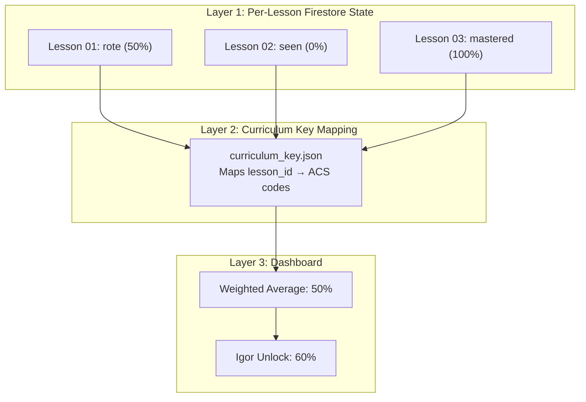

### Weight Table

| State | Weight | Color |
|-------|--------|-------|
| `new` | 0% | 🔴 Red |
| `seen` | 0% | 🟡 Yellow |
| `rote_level` | 50% | 🟣 Purple |
| `application` | 75% | 🔵 Blue |
| `mastered` | 100% | ✅ Green |

**Igor unlocks at 60% overall** — most lessons need at least `rote_level` (50%) to cross the threshold.

---

## 13. Prerequisite DAG & Pre-Bunking

The curriculum is not a flat list — concepts build on each other. Every lesson in `curriculum_key.json` declares a `prerequisite_acs_nodes` array forming a Directed Acyclic Graph (DAG).

### ✅ What's Built (V2): The Data Layer

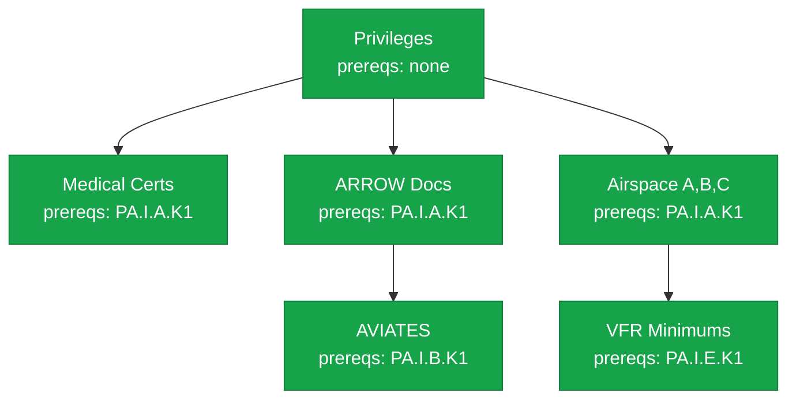

- ✅ All 33+ Area I lessons have `prerequisite_acs_nodes` authored
- ✅ The Study Queue implicitly presents lessons in dependency order

### 🔶 V3 Vision: Active Pre-Bunking

When a lesson starts, the system will cross-reference `prerequisite_acs_nodes` with the student's ACS Knowledge Ledger. If a misconception exists on a prerequisite, Agent 1 generates a **5-Node Plan** with a Pre-Bunk clearing node at `node_index = -1`.

The student experience is completely conversational — no clinical alerts:

> **Specialist:** *"Before we dive into cloud clearances, remind me — what are the dimensions of Class C airspace?"*

If correct, proceed normally. If wrong, Strategy Roulette clears the misconception before the main lesson begins.

| V3 Dependency | Status |
|--------------|--------|
| `prerequisite_acs_nodes` data | ✅ Complete |
| ACS Knowledge Ledger | ✅ Built |
| Pre-Bunk Directive injection | ❌ Not built |
| `node_index = -1` orchestrator routing | ❌ Not built |
| SAR telemetry for pre-bunk effectiveness | ❌ Not built |
