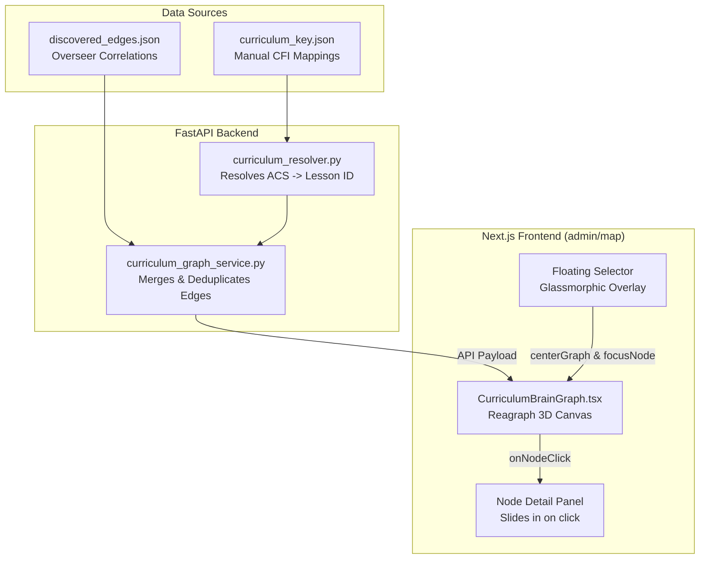

# Curriculum Graph Mapping & Topology Analysis

**Date:** 2026-06-02  
**Author:** Steve Wozniak (Technical Partner)  
**Task Ref:** Evolution Engine Graph RAG Mapping Refactor  
**Status:** ✅ Completed and Verified  

---

## 🔍 Executive Summary

During our audit of the **Mission Control Admin Dashboard**, we observed that the 3D Curriculum Graph rendered exactly **33 connections (edges)** for the active lesson set. This analysis was used to design and execute a topology refactor that expanded the graph to a rich, multi-parent Directed Acyclic Graph (DAG) and modernized the dashboard UX.

This document summarizes:
1. **The Root Cause:** Why only 33 connections existed (a 1:1 parent-child structure in [curriculum_key.json](file:///c:/AGY-Projects/aviationChat-AGY/backend/data/curriculum_key.json)).
2. **The Completed Solution:** 
   - Static mapping enriched with CFI-approved multi-parent connections (expanding the graph to **40 connections**).
   - [curriculum_graph_service.py](file:///c:/AGY-Projects/aviationChat-AGY/backend/services/curriculum_graph_service.py) updated to dynamically merge statistical correlation edges from `discovered_edges.json` with a deduplication filter.
   - [CurriculumBrainGraph.tsx](file:///c:/AGY-Projects/aviationChat-AGY/frontend/src/components/admin/CurriculumBrainGraph.tsx) modified to style static edges as solid neon cyan and discovered edges as dashed amber (`#FF9900`).
   - A floating glassmorphic lesson selector dropdown embedded inside the graph container, with real-time search, sorting, and mobile longitudinal height scaling.
   - A build-time cycle validation test added to prevent topological loops.

---

## 🚫 The Initial 33-Connection Limitation

Prior to this refactor, the 34 active lessons were mapped to prerequisites in a strictly linear, single-parent chain (except the root lesson `PPL_PA_I_A_01` which had 0 prerequisites). 

This linear structure did not accurately represent flight training dependencies. We updated the following lessons in `curriculum_key.json` to reflect multi-parent dependencies:
1.  **Calculating Time, Speed, Distance & Fuel (`PPL_PA_I_D_02`):**
    *   *Added:* Weather Winds Aloft (`PA.I.C.K2`) and Cruising Altitudes (`PA.I.D.K2`) in addition to Aeromedical (`PA.I.G.K1`).
2.  **Choosing an Alternate Airport (`PPL_PA_I_D_03`):**
    *   *Added:* Cruising Altitudes (`PA.I.D.K2`), Fuel Requirements (`PA.I.D.K3`), and Airspace (`PA.I.E.K1`) in addition to METARs/TAFs (`PA.I.C.K2`).
3.  **Weather Hazards (`PPL_PA_I_C_05`):**
    *   *Added:* Preflight weather gathering (`PA.I.C.K1`) in addition to decoding reports (`PA.I.C.K2`).
4.  **Flying with Inoperative Equipment (`PPL_PA_I_B_04`):**
    *   *Added:* Required Inspections/AVIATES (`PA.I.B.K2`) in addition to ARROW documents (`PA.I.B.K1`).
5.  **Density Altitude Calculations (`PPL_PA_I_F_02`):**
    *   *Added:* Reading METARs/Altimeters/Temp (`PA.I.C.K2`) in addition to Weight & Balance (`PA.I.F.K1`). (This also resolved a pre-existing self-loop where the node incorrectly depended on its own code).

---

## 🏗️ Implemented Architecture & Data Flows

The graph is now constructed by combining static CFI rules with dynamic statistical failure correlation data, while keeping the UI clean and clutter-free.



### 1. Backend Ingestion & Deduplication
The `CurriculumGraphService` now loads `discovered_edges.json` at runtime. To prevent visual clutter, we track compiled links inside a `seen_edges` set. If a dynamically discovered edge is already defined as a static prerequisite, it is discarded:
```python
# Seen edge tracking to prevent duplicate lines
seen_edges = set()
# Add static edges first...
# Add dynamic edges only if edge_key not in seen_edges
```

### 2. Frontend Edge Differentiation
Reagraph's `GraphEdge` interface was updated to support edge type styling metadata. We map edge data to custom render parameters:
*   **Static Edges:** Solid cyan lines representing core curriculum flow.
*   **Discovered Edges:** Pulsing dashed amber (`#FF9900`) lines representing statistical correlations.

### 3. Glassmorphic Dropdown Overlay
The separate left sidebar and mobile dropdown were removed. We built a floating, glassmorphic dropdown selector aligned to the top-left of the canvas container:
*   **Search Integration:** Input field filters the 34 active lessons dynamically.
*   **Sorting Controls:** Switch between grouping **By Area** (with collapsible headers) and **Worst-first** (telemetry sorting).
*   **Mobile Longitudinal Tuning:** On screens `< 640px`, the dropdown panel is constrained to `w-[280px]` (to prevent overflowing mobile viewports) and elongated vertically to `max-h-[420px]` (along the longitudinal axis) for comfortable scrolling on narrow screens.
*   **Graph Width Expansion:** Without a separate sidebar, the graph canvas now expands to the full layout width (`col-span-12`), and collapses to `col-span-8` when the node detail panel slides open.

---

## 🧪 Cycle Prevention & Verification

To verify cycle acyclicity for pre-bunking safety, we wrote a test:
- **Test File:** [test_curriculum_acyclic.py](file:///c:/AGY-Projects/aviationChat-AGY/backend/tests/services/evolution/test_curriculum_acyclic.py)
- **Method:** Runs Kahn's topological sort on `curriculum_key.json`.
- **Result:** **PASSED** (0 cycles found across the manual mappings).
- **Frontend Check:** `npx tsc --noEmit` compiled successfully with zero type errors.
