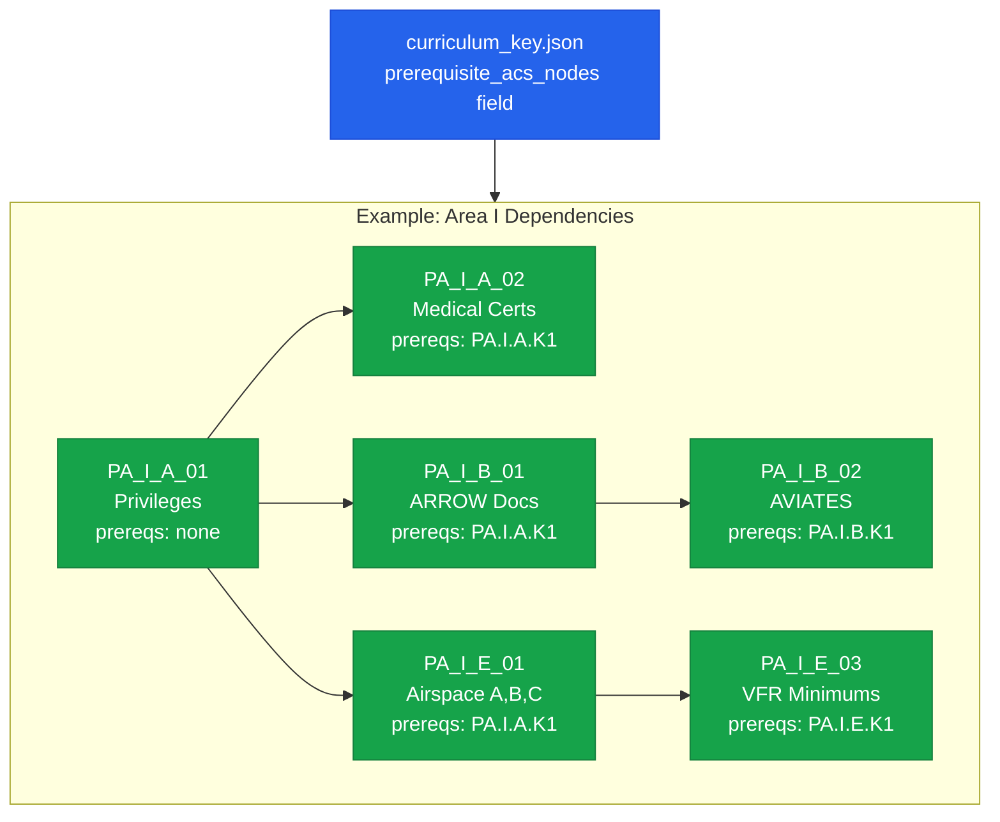
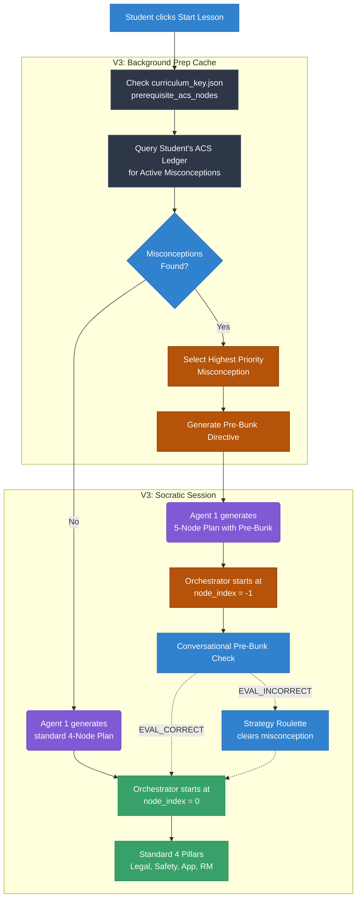

# Prerequisite DAG & Pre-Bunking Directive

## The Problem: The "House of Cards" Failure Mode

In aviation training, concepts build sequentially upon each other. A student cannot effectively learn **Airspace Cloud Clearances (Concept B)** if they harbor a fundamental misunderstanding of **Airspace Classes (Concept A)**.

If an AI instructor tries to teach Concept B while the student's foundation is broken, the student will experience cognitive overload, frustration, and failure. We call this the "House of Cards" failure mode.

---

## What We Have Today (V2)

### ✅ The Data Layer — Prerequisite DAG in `curriculum_key.json`

The Directed Acyclic Graph (DAG) of concept dependencies is **fully authored** in the curriculum data. Every lesson in `curriculum_key.json` declares a `prerequisite_acs_nodes` array listing the ACS codes a student must understand before starting.

**Status:** ✅ All 33+ Area I lessons have their `prerequisite_acs_nodes` authored. The DAG is complete and machine-readable.

### ✅ The Study Queue — Implicit Ordering

The Study Queue service already uses lesson ordering from the curriculum to present lessons in dependency order. This means a student will *naturally* encounter prerequisites before dependent topics in the standard learning path.

---

## What's Coming (V3): Active Pre-Bunking

> [!IMPORTANT]
> **V3 Feature — Not Yet Implemented.** The sections below describe the planned runtime pre-bunking system. The data layer (DAG) is ready; the execution layer (checking + clearing) needs to be built.

### The Vision: Pre-Bunking

**Pre-Bunking** is the act of proactively identifying and clearing a foundational misconception *before* teaching a new, dependent concept. This transforms the Socratic pipeline from a reactive system (fixing mistakes as they happen) into a **proactive** pedagogical engine.

### V3 Architectural Flow

### V3 Implementation Requirements

#### 1. The Prerequisite Check (Data Layer)
When the background prep task builds the lesson plan, it cross-references `prerequisite_acs_nodes` with the student's **ACS Knowledge Ledger** (Tier 2 dossier). If a severe, unresolved misconception exists on a prerequisite ACS code, it generates a **[PRE-BUNK DIRECTIVE]**.

#### 2. The Clearing Node (Execution Layer)
Agent 1 receives the directive and constructs a **Pre-Bunk Node** (`node_index = -1`). This node is injected at the very beginning of the lesson plan. The Orchestrator processes this first. If the student answers correctly, the lesson proceeds normally. If they struggle, Strategy Roulette engages to resolve the historical misconception.

#### 3. The Student Experience (UX)
The student never sees a clinical alert. The pre-bunk check is **completely conversational**:

> **Specialist:** *"Hey Daniel, before we dive into cloud clearances today, I just want to make sure we're squared away on something from last time. Remind me, what are the dimensions of Class C airspace?"*
>
> **Daniel:** *"Uh, it's a 5nm inner circle and 10nm outer shelf, right?"*
>
> **Specialist:** *"Spot on. Okay, so with that in mind, let's look at cloud clearances..."*

If Daniel gets it wrong, the Specialist tutors him until it clicks. Once resolved, the seamless transition into the primary lesson occurs.

### V3 Dependencies

| Dependency | Status | Notes |
|-----------|--------|-------|
| `prerequisite_acs_nodes` in curriculum_key.json | ✅ Complete | All 33+ lessons authored |
| ACS Knowledge Ledger (Tier 2 dossier) | ✅ Built | Firestore per-student misconception tracking |
| Pre-Bunk Directive injection into Agent 1 | ❌ Not built | Needs prompt engineering + orchestrator logic |
| `node_index = -1` handling in Orchestrator | ❌ Not built | Needs routing logic for the clearing node |
| SAR telemetry for pre-bunk effectiveness | ❌ Not built | Track if pre-bunking reduces downstream failures |
