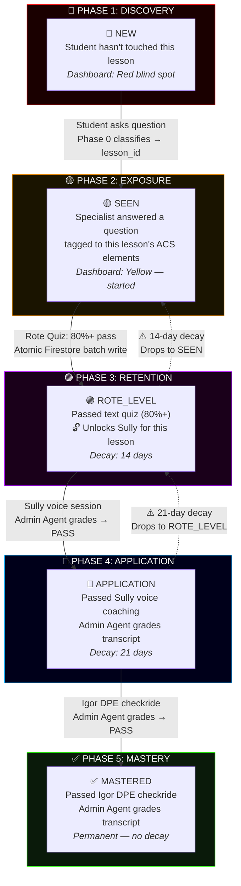
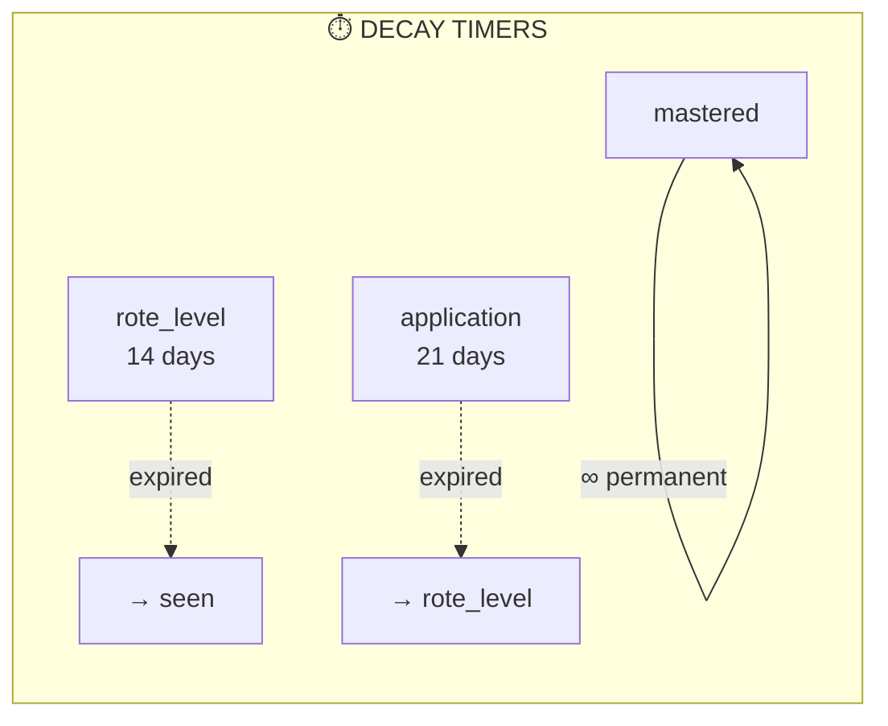
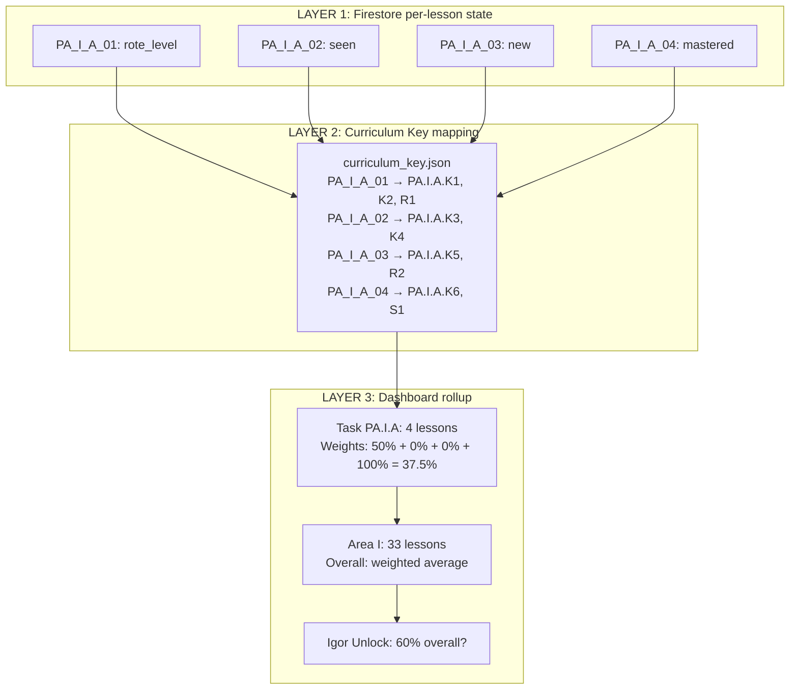

# 🎓 AviationChat Mastery Pipeline — Grading Progression Waterfall

## The Student Journey (One Micro-Lesson)

This chart shows how a single micro-lesson (e.g., `PA_I_A_01: Privileges & Limitations`) progresses from first contact to permanent mastery.

---

## Who Does What at Each Gate

| Gate | Trigger | Who Teaches | Who Grades | Mastery Write |
|------|---------|-------------|------------|---------------|
| `new` → `seen` | Student asks a question | **Specialist** (Talker) | *None — exposure only* | `mastery_service.transition(lesson_id, "seen")` |
| `seen` → `rote_level` | Student passes quiz (80%+) | **Socratic Teacher** | **Quiz Engine** (auto-graded) | `mastery_service.transition(lesson_id, "rote_level")` |
| `rote_level` → `application` | Student completes Sully voice session | **Sully** (CFI Voice) | **Admin Agent** (transcript) | `mastery_service.transition(lesson_id, "application")` |
| `application` → `mastered` | Student passes Igor checkride | **Igor** (DPE Voice) | **Admin Agent** (transcript) | `mastery_service.transition(lesson_id, "mastered")` |

> [!IMPORTANT]
> **Teaching agents NEVER grade.** Sully teaches, Igor examines — but the Admin Agent is the sole grading authority for all voice sessions. This prevents personality bias from affecting mastery transitions.

---

## Decay Cascade (The Vault Keeper)

**Study Queue Priority (FR15-A):**
1. 🔴 **Review** — Expired/failed lessons (FIRST)
2. 🟡 **New** — Untouched lessons (SECOND)
3. 🟢 **Maintenance** — Safe zone lessons (LAST)

---

## The Dual-Layer Rollup (Lesson → Dashboard)

**Weight Table:**

| State | Dashboard Weight | Dashboard Color |
|-------|-----------------|-----------------|
| `new` | 0% | 🔴 Red |
| `seen` | 0% | 🟡 Yellow |
| `rote_level` | 50% | 🟣 Purple |
| `application` | 75% | 🔵 Blue |
| `mastered` | 100% | ✅ Green + checkmark |

**Igor unlocks at 60% overall** — meaning most lessons need at least `rote_level` (50% each) to cross the threshold.

---

## Full Example: Student Alex Studies "Privileges & Limitations"

| Step | What Happens | State Change | Dashboard |
|------|-------------|--------------|-----------|
| 1 | Alex types: "Can I fly with an expired medical?" | `PA_I_A_01`: `new` → `seen` | Yellow dot appears |
| 2 | Specialist answers with citations, Socratic Teacher asks follow-ups | *No change* | Still yellow |
| 3 | Alex clicks "Ready to lock this in?" → Quiz appears in Drawer | *No change* | Still yellow |
| 4 | Alex scores 90% on the quiz | `PA_I_A_01`: `seen` → `rote_level` | 🟣 Purple, 🔔 "Sully unlocked for Privileges & Limitations!" |
| 5 | ⏳ *14 days pass without review* | `PA_I_A_01`: `rote_level` → `seen` (decay) | ⚠️ Back to yellow, prioritized for review |
| 6 | Alex retakes quiz, scores 85% | `PA_I_A_01`: `seen` → `rote_level` | 🟣 Purple again, timer resets |
| 7 | Alex does Sully voice session, Admin grades PASS | `PA_I_A_01`: `rote_level` → `application` | 🔵 Blue |
| 8 | Alex reaches 60% overall → Igor unlocks | *Global threshold crossed* | 🔔 "Igor DPE Mock Checkride is now available!" |
| 9 | Alex does Igor checkride, Admin grades PASS | `PA_I_A_01`: `application` → `mastered` | ✅ Permanent checkmark |
