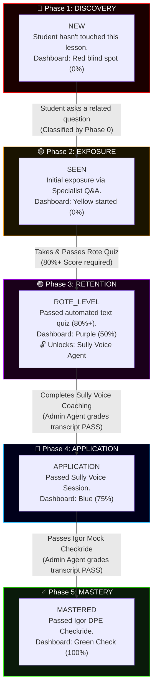
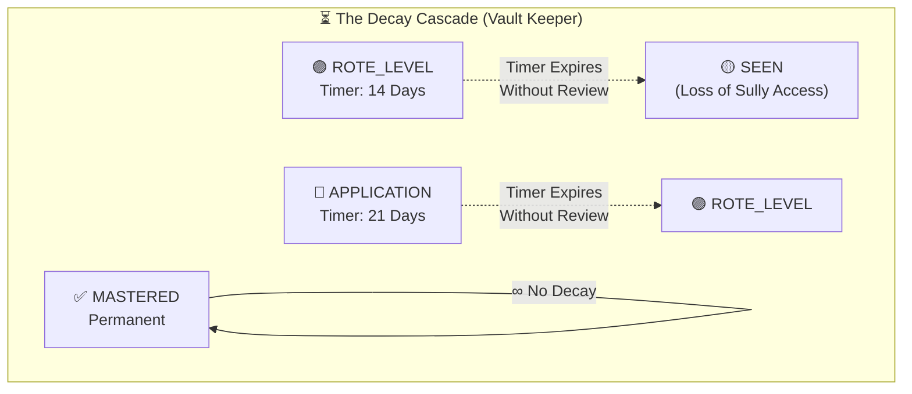
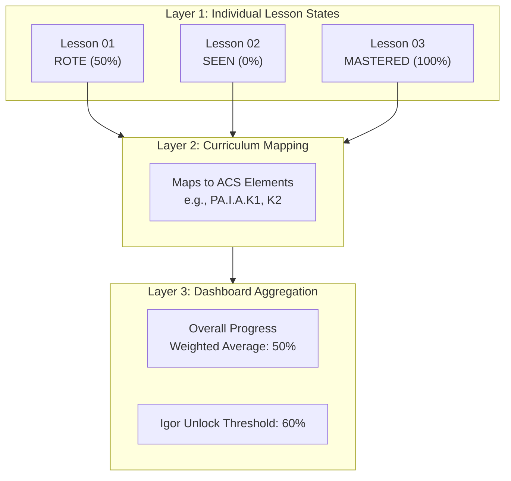

# AviationChat: Learning Progression & Decay Mechanics

This document provides a detailed, comprehensive breakdown of the **AviationChat Mastery Pipeline**, specifically focusing on the 5-phase Grading Progression Waterfall and the Learning Decay (spaced repetition) system.

---

## 1. The Grading Progression Waterfall

The AviationChat platform tracks student progress at the granular level of "micro-lessons" (e.g., `PA_I_A_01: Privileges & Limitations`). Instead of a simple pass/fail, a lesson moves through five distinct cognitive phases, mirroring the FAA's learning model (Rote → Understanding → Application → Correlation).

### Detailed Phase Breakdown

*   **Phase 1: Discovery (`new`)**: The baseline state. The student is unaware of or hasn't yet interacted with the material. It contributes 0% to their overall mastery score.
*   **Phase 2: Exposure (`seen`)**: Triggered when the student asks the Specialist agent a question that maps to this lesson's ACS (Airman Certification Standards) elements. The student has been exposed to the knowledge, but hasn't proven retention.
*   **Phase 3: Retention (`rote_level`)**: The first major hurdle. The student must pass an automated text quiz generated by the Socratic Teacher with a score of 80% or higher. Achieving this proves baseline memorization and **unlocks Sully** (the CFI Voice Agent) for this specific lesson.
*   **Phase 4: Application (`application`)**: The student participates in an interactive voice session with Sully, applying their rote knowledge in a simulated scenario.
*   **Phase 5: Mastery (`mastered`)**: The final stage. The student successfully defends their knowledge under pressure in a mock checkride with Igor (the DPE Voice Agent).

> [!IMPORTANT]
> **Separation of Teaching and Grading**
> To prevent AI personality bias, the agents that *teach* (Sully, Igor) are completely separated from the agent that *grades*. The **Admin Agent** is the sole authority that evaluates the transcripts of voice sessions and authorizes transitions to `application` or `mastered`.

---

## 2. Learning Decay (The Vault Keeper)

Human memory fades. If a student learns about Airspace rules today but doesn't review them for a month, their knowledge degrades. AviationChat models this using **Learning Decay Timers** to enforce spaced repetition.

### How Decay Works
*   **The 14-Day Cliff (`rote_level` → `seen`)**: If a student passes a quiz (`rote_level`) but does not either review the material or progress to a Sully voice session (`application`) within 14 days, their mastery level decays back to `seen`. They will lose access to Sully for that lesson until they re-pass the quiz.
*   **The 21-Day Cliff (`application` → `rote_level`)**: If a student passes a Sully session but waits too long (21 days) to solidify it via an Igor checkride or a refresher, they drop back to `rote_level`.
*   **Permanent Mastery**: Once a student passes the Igor checkride, the lesson state is locked to `mastered` permanently.

### Impact on the Study Queue
Decay is what drives the user's daily curriculum. When a lesson decays, it immediately shifts priority in the student's Study Queue:

1.  **Priority 1: Review (First)**: Lessons that have decayed or quizzes the student recently failed. The system forces the student to plug these "leaks" before learning new material.
2.  **Priority 2: New (Second)**: Untouched (`new`) lessons.
3.  **Priority 3: Maintenance (Last)**: Lessons currently sitting safely in `rote_level` or `application` with active timers.

---

## 3. The Dashboard Rollup

The grading pipeline ensures that the student's dashboard accurately reflects their true, current capability, rather than an artificially inflated score.

### Unlocking the Final Boss (Igor)
To unlock Igor for a mock checkride covering an entire Area of Operation, the student's overall dashboard score must reach **60%**. Because `rote_level` is worth 50% and `application` is worth 75%, a student must have the majority of their micro-lessons sitting securely in `rote_level` or higher (without having decayed) to be allowed to take the checkride.
