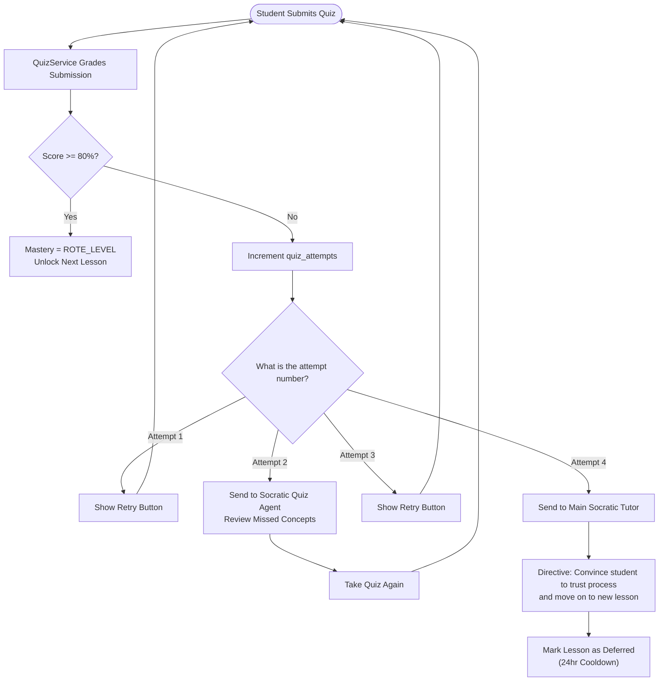

# Multiple Choice Quiz Loop & 4-Strike Failsafe Architecture

The multiple-choice quiz system employs a strict penalty loop for failure, but instead of forcing hard resets of the lesson, it uses a progressive escalation model to prevent guessing while preserving the student's morale.

## 1. The Progressive Escalation Loop

Every time a student takes a quiz, their lifetime `quiz_attempts` counter for that lesson increments. The system routes the student based on this exact attempt number:

- **Attempt 1 (Fail): Standard Retry**
  - No AI intervention. The student simply gets a "Retry" button to take the quiz again immediately.
  
- **Attempt 2 (Fail): Socratic Quiz Agent**
  - The system detects a pattern of failure. The student is sent to the **Socratic Quiz Agent** (the brother agent of the Socratic Tutor).
  - This agent reviews the specific concepts they missed.
  - After the conversational review, they are permitted to retake the quiz.

- **Attempt 3 (Fail): Standard Retry**
  - No AI intervention. The student gets a "Retry" button to take the quiz again.

- **Attempt 4 (Fail): The 4-Strike Failsafe (Main Socratic Tutor)**
  - The student is caught by the 4-strike failsafe.
  - They are sent back to the **Main Socratic Tutor**.
  - The tutor is given a strict system prompt directive: *The student has failed 4 times and needs to move on to a new lesson.*
  - The agent must use the AviationChat Socratic Method to convince the student to trust the process, explain that their brain needs time to absorb the material, and firmly end the session on that lesson so they can move forward.

## 2. Deferred Lesson Management

When Attempt 4 is hit, the backend also flags the lesson with `deferred = True` and records a `deferred_at` timestamp. This allows us to re-introduce the lesson later without stalling their progress.

### Strategy 1: "Cool Down" (Currently Implemented)
- **Implementation:** Once 24 hours have passed since the lesson was deferred, the system automatically injects the lesson back into the `review` bucket of their daily Study Queue. 
- **Advantage:** Gives the brain time to rest and process (spaced repetition). It ensures they aren't presented with the exact same frustrating questions immediately.

### V3 Feature: Micro-Dosing
- **Concept:** Add a "Daily Challenge" widget to the dashboard. The system feeds them 1 question from a deferred lesson every day. If they get it right, the lesson slowly moves back towards mastery.

---

## 3. Flow Diagram: The Progressive Escalation State Machine

