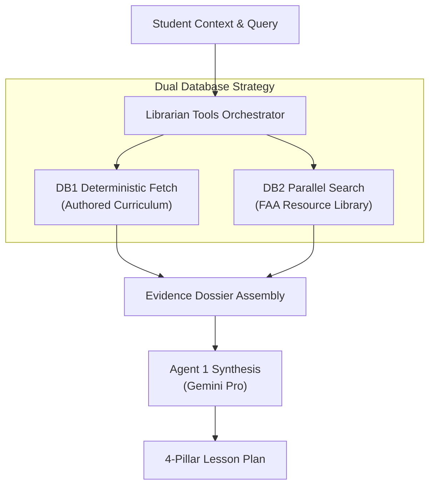
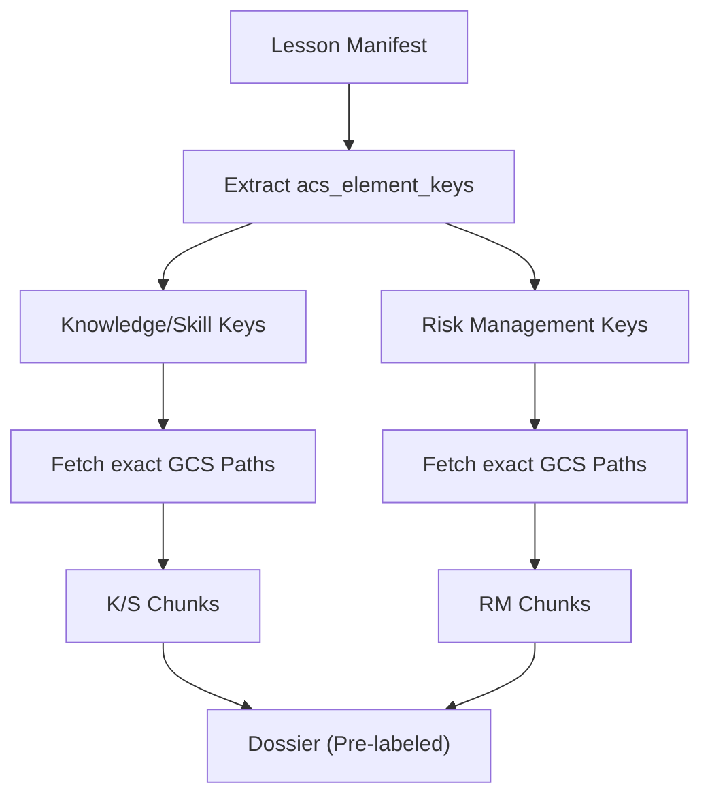
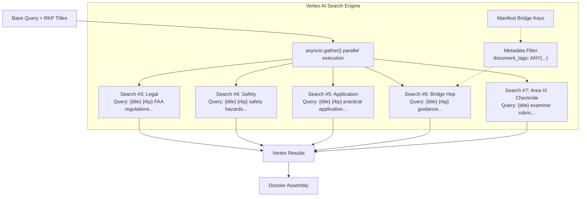
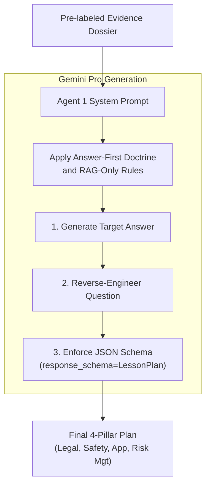

# RAG Pipeline Architecture V2

> Visual and technical documentation of the Dual-DB Librarian pipeline and Agent 1 synthesis.
> **Status:** Production-ready (Updated post-Epic 12 V2.8)

---

## Executive Summary

The AviationChat Specialist Agent relies on a highly resilient Dual-DB Librarian pipeline. This architecture ensures that the Agent is deeply grounded in deterministic, authored curriculum data while seamlessly enriching its knowledge with precise semantic searches across FAA resources, including the **Vertex RAG Area IX Bridge (Epic 12.2)** for checkride context.

This document visualizes the complete data flow, breaking it down into four key components to clarify the technology and logic behind the system.

---

## 1. High-Level Dual-DB Architecture

The pipeline strictly separates deterministic curriculum fetching (DB1) from semantic knowledge retrieval (DB2). This split guarantees that your authored curriculum is never "lost" in search rankings or noise, while still providing dynamic enrichment from external regulatory sources.

---

## 2. DB1: Deterministic Fetch Pattern

DB1 does not use vector search. Instead, it deterministically fetches exact Markdown files from Google Cloud Storage (GCS) based on the `acs_element_keys` present in the current curriculum manifest.

### Tech & Logic:
- **Exact Pathing:** A key like `PA.I.A.K1` maps directly to `gs://aviationchat-curriculum-cms/v2/elements/lesson_pa_i_a_k1.md`. There is no ranking or relevance gambling—if the file exists, the entire content is pulled.
- **Pre-Labeling at Retrieval:** Fetched content is split immediately into Knowledge/Skill elements versus Risk Management elements. This pre-labels the data so the agent doesn't have to guess what constitutes a risk factor during generation.

---

## 3. DB2: Parallel Semantic Search

DB2 handles the heavy lifting of semantic enrichment using Vertex AI Search. It runs four parallel searches mapped directly to the pedagogical pillars. If one search times out or hits a quota limit, the pipeline degrades gracefully and continues with whatever evidence has arrived.

### Tech & Logic:
- **Async Execution:** Uses `asyncio.gather()` for parallel, non-blocking execution across the four searches.
- **Query Enrichment:** Queries are dynamically injected with RKP (Representative Knowledge Parameter) titles. This forces the Vertex AI semantic engine to retrieve highly targeted documents.
- **Strict Metadata Filtering:** The Bridge Hop search relies on a strict `document_tags: ANY(...)` filter constructed from the manifest's bridge keys (e.g., specific Advisory Circulars or handbooks), completely eliminating irrelevant coincidental text matches.

---

## 4. Agent 1 Synthesis (Answer-First Doctrine)

Once the Evidence Dossier is assembled (combining DB1 and DB2 results), it is injected into Agent 1. Agent 1 operates under strict schema enforcement and our "Answer-First" prompting doctrine.

### Tech & Logic:
- **Answer-First:** The prompt forces the model to construct the `target_answer` first, and then reverse-engineer the Socratic question from that answer. This prevents wandering logic.
- **RAG-Only Rule:** The model is strictly instructed to hallucinate nothing. It must ground all target answers against the explicitly retrieved RKP statements and FAA sources in the dossier.
- **Native Schema Enforcement:** We utilize Gemini's native `response_schema=LessonPlan` JSON mode. This guarantees structural compliance at the API level, completely removing the need for brittle backend regex parsing or formatting hacks.

---

### Architectural Highlights Summary

1. **Graceful Degradation:** Parallel `asyncio.gather` ensures a single dropped API call does not crash the session.
2. **Zero Hallucination:** The combination of Answer-First generation, explicit RAG-only instruction, and DB1 deterministic fetching drastically limits the LLM's ability to invent facts.
3. **Absolute Schema Safety:** Passing a structured schema object directly to Gemini's API ensures that the pipeline's output is consistently parseable and strictly typed.
