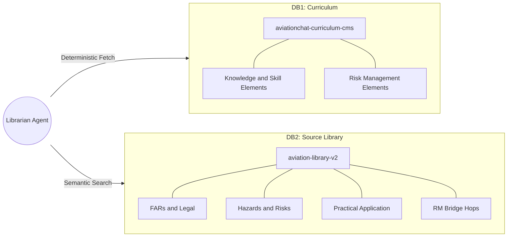
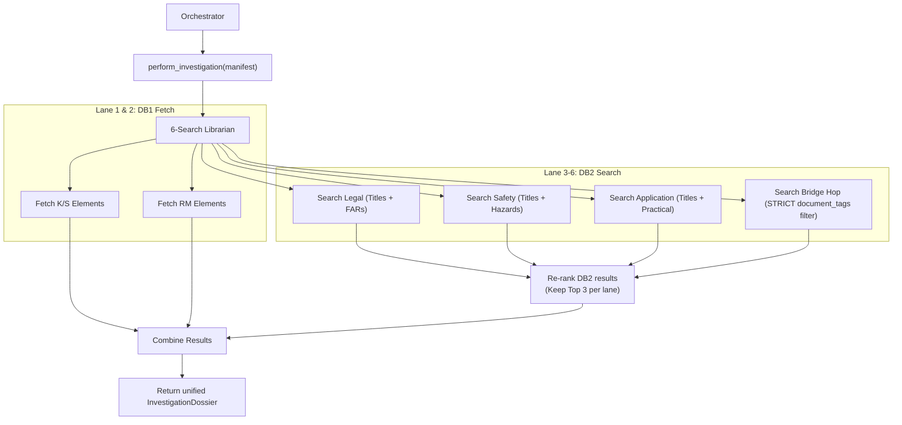
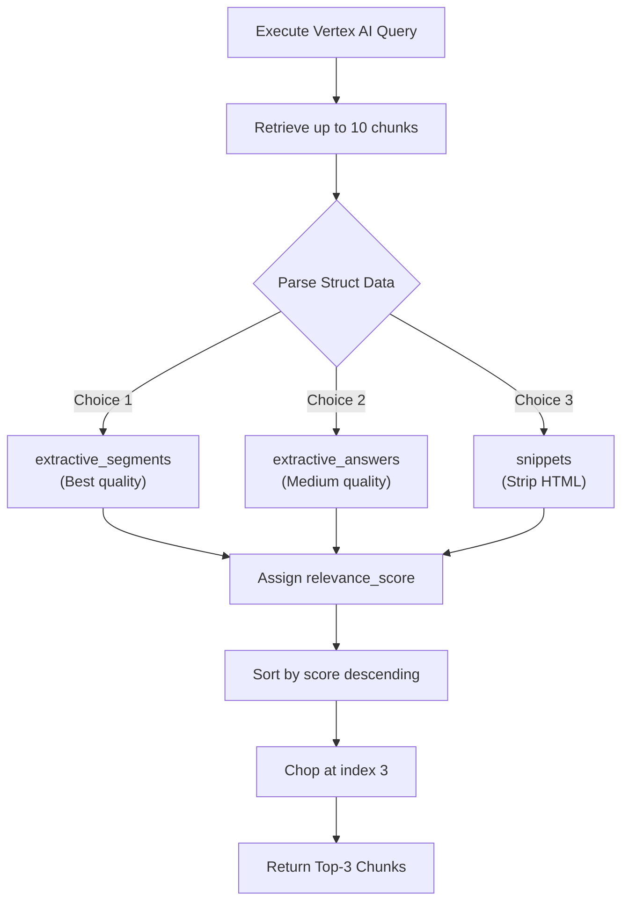

# 6-Search Librarian Architecture (Dual-DB Topology)

The Librarian Agent’s Search Engine has been heavily refactored. We retired the old monolithic 3-lane swarm in favor of a **Dual-DB Topology** that executes up to 6 parallel search lanes. This guarantees deterministic access to our core curriculum while dynamically retrieving edge-case knowledge from the broader FAA library.

---

## 1. High-Level Dual-DB Topology

The "brain" is split into two distinct datastores. DB1 is our curated, deterministic curriculum. DB2 is the massive Enterprise Search engine containing raw FAA documentation.

---

## 2. The 6-Lane Parallel Execution

When the Orchestrator requests an investigation (via `perform_investigation`), the Librarian simultaneously fires off 6 async requests.

1. **DB1 Lesson (K/S Types):** Directly fetches `.md` files from GCS matching the lesson's ACS elements.
2. **DB1 RM (R Types):** Directly fetches Risk Management `.md` files from GCS.
3. **DB2 Legal:** Queries Vertex AI using RKP titles + FAR references to pull regulations.
4. **DB2 Safety:** Queries Vertex AI adding "safety hazards risks accidents" to the titles.
5. **DB2 Application:** Queries Vertex AI focusing on practical application.
6. **DB2 Bridge Hop:** Uses strict array metadata filtering (`document_tags: ANY(...)`) to find cross-disciplinary risk management bridging logic.

---

## 3. DB2 Re-ranking & Extractive Segments

Because DB2 is a massive Enterprise Search engine, we pull a wider net and then algorithmically narrow it down before feeding it to the LLM to save context window tokens.

- **Extraction:** The system attempts to parse `extractive_segments` (multi-paragraph high-relevance chunks). If not found, it falls back to `extractive_answers` or raw HTML `snippets`.
- **Re-ranking:** For the DB2 lanes, the librarian requests **5 to 10 chunks per lane**, but locally sorts them by `relevance_score` and **only keeps the Top 3**. This ensures the LLM only reads the absolute highest quality matches.

---

## 4. RKP-First & Off-Syllabus Fallbacks

The 6-Search Librarian has been updated to dynamically shape itself based on what the student is doing.

### Mode A: Full Curriculum (6-Lane)
- Used during the main Socratic Teacher flow.
- Requires a full `RKPManifest`.
- Executes all DB1 and DB2 lanes.

### Mode B: RKP-First Q&A (4-Lane)
- Used when answering student questions mid-lesson.
- The `include_db1=False` flag is passed.
- **Why?** The LLM already has the core curriculum loaded in its prompt (the RKP Ground Truth). Fetching the raw GCS files would be redundant token waste. It only fires the 4 DB2 lanes to grab supplementary edge-case data to answer the student's specific question.

### Mode C: Complete Off-Syllabus (6-Search)
- Used when a student asks a random aviation question not tied to any lesson.
- No manifest exists.
- The librarian executes `_query_based_investigation()`. It skips DB1 entirely, and drops the strict Bridge Hop filter. It executes a pure 6-search DB2 search (Legal, Safety, Application) using the raw user query.
