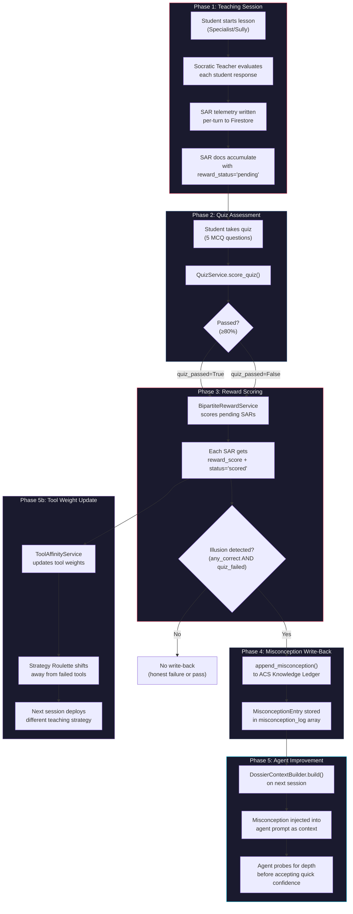
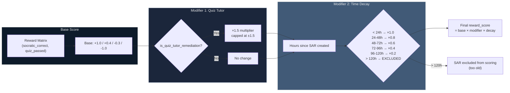
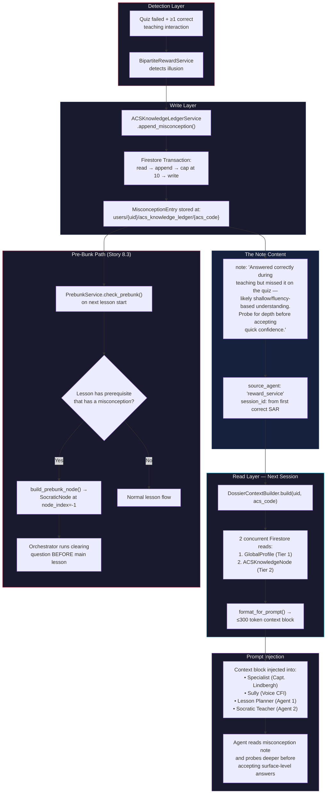
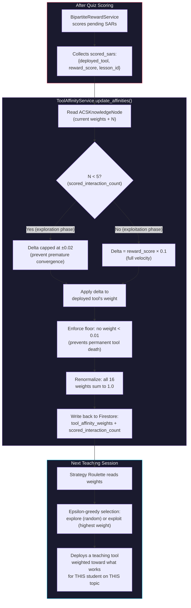
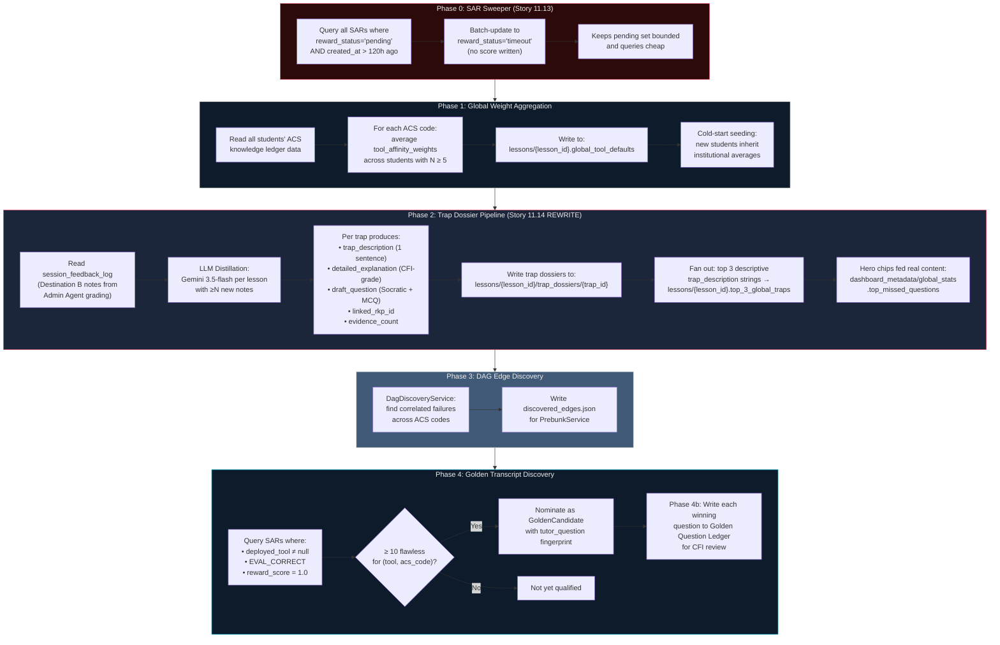
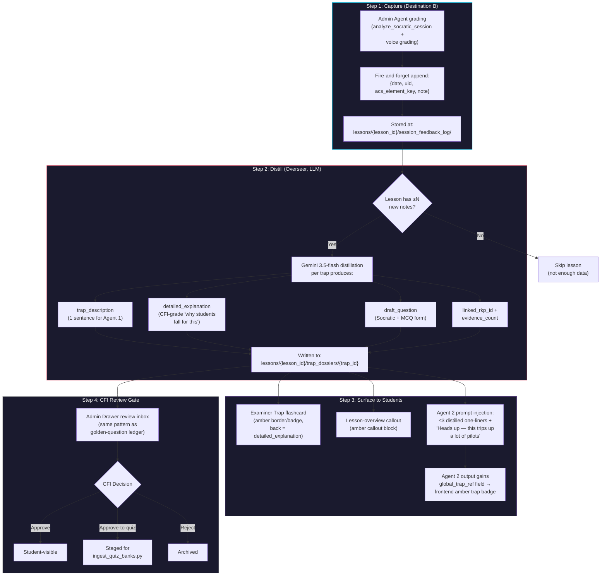
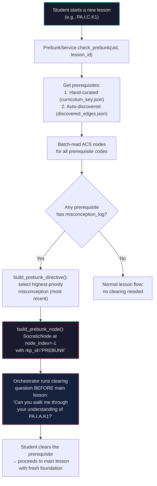
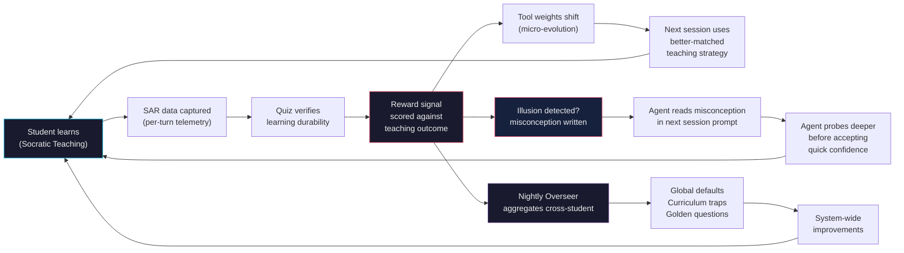
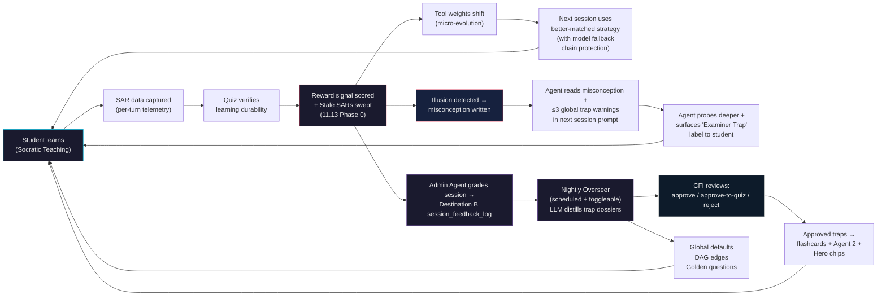

# Self-Learning Tracking Metrics — PRP

## Product Reference Package: Illusion of Competence Detection & Misconception Write-Back

**Author:** Steve Wozniak (Woz)
**Created:** 2026-06-10
**Status:** Reference — Living Document
**Scope:** Evolution Engine (Epic 8) + Dossier Feedback (Story 10.2) + Production Remediation (Epic 11)
**Epic 11 Source:** [implementation_plan.md](file:///c:/Users/dlohn/.gemini/antigravity/scratch/AGY_AVIATIONCHAT/_claude_artifacts/2026-06-10_production-readiness-audit/implementation_plan.md)
**Primary Files:**

| File | Purpose |
|------|---------|
| [`reward_service.py`](file:///c:/Users/dlohn/.gemini/antigravity/scratch/AGY_AVIATIONCHAT/backend/services/evolution/reward_service.py) | Bipartite reward matrix + illusion detection + misconception write |
| [`affinity_service.py`](file:///c:/Users/dlohn/.gemini/antigravity/scratch/AGY_AVIATIONCHAT/backend/services/evolution/affinity_service.py) | Tool weight updates from scored SARs |
| [`acs_ledger_service.py`](file:///c:/Users/dlohn/.gemini/antigravity/scratch/AGY_AVIATIONCHAT/backend/services/acs_ledger_service.py) | ACS knowledge ledger CRUD + transactional misconception append |
| [`dossier_context_builder.py`](file:///c:/Users/dlohn/.gemini/antigravity/scratch/AGY_AVIATIONCHAT/backend/services/dossier_context_builder.py) | JIT context assembler — injects dossier into agent prompts |
| [`prebunk_service.py`](file:///c:/Users/dlohn/.gemini/antigravity/scratch/AGY_AVIATIONCHAT/backend/services/prebunk_service.py) | Prerequisite misconception detection + clearing node construction |
| [`nightly_overseer.py`](file:///c:/Users/dlohn/.gemini/antigravity/scratch/AGY_AVIATIONCHAT/backend/services/evolution/nightly_overseer.py) | Cross-student batch aggregation (4 phases) |
| [`cognitive_dossier.py`](file:///c:/Users/dlohn/.gemini/antigravity/scratch/AGY_AVIATIONCHAT/backend/schemas/cognitive_dossier.py) | ACSKnowledgeNode + MisconceptionEntry + tool weight schemas |
| [`evolution.py`](file:///c:/Users/dlohn/.gemini/antigravity/scratch/AGY_AVIATIONCHAT/backend/schemas/evolution.py) | OverseerReport + GoldenCandidate + CurriculumTrap schemas |
| [`quiz_service.py`](file:///c:/Users/dlohn/.gemini/antigravity/scratch/AGY_AVIATIONCHAT/backend/services/quiz_service.py) | Quiz scoring trigger for reward computation |
| [`agent.py` (Specialist)](file:///c:/Users/dlohn/.gemini/antigravity/scratch/AGY_AVIATIONCHAT/backend/agents/specialist/agent.py) | SAR telemetry write on every Socratic eval turn |

---

## 1. Executive Summary

AviationChat has a **self-improving teaching system** built on three interlocking feedback loops:

1. **Illusion of Competence Detection** — Identifies students who *appear* to understand during teaching but fail the quiz (the most dangerous learning outcome).
2. **Misconception Write-Back** — When an illusion is detected, a misconception note is written to the student's permanent ACS Knowledge Ledger, which directly alters the next teaching session's prompts.
3. **Tool Affinity Evolution** — Every teaching interaction's outcome is scored against the quiz, producing a reward signal that shifts which teaching strategies (tools) are deployed for that student on that topic.

Together, these form a **closed-loop micro-evolution engine** where agents measurably improve their teaching effectiveness per-student, per-ACS-topic, with zero human intervention.

---

## 2. The Illusion of Competence — What It Is

> **Definition:** A student who answers correctly during the Socratic teaching session but fails the quiz on the same material. The teaching *appeared* effective but did not produce durable knowledge.

This is the single worst outcome in the reward matrix — worse than honest failure — because:
- It consumes teaching time with a false signal
- It tells the AI "this worked" when it didn't
- The student believes they understood, reducing motivation to restudy

### 2.1 The Canonical Reward Matrix (PRD FR30)

The 2×2 reward matrix maps every SAR (Student-Agent-Response) interaction to a reward score:

```
                     ┌──────────────────────────────────────────────────┐
                     │             QUIZ OUTCOME                        │
                     │         Passed            Failed                │
          ┌──────────┼────────────────────┬───────────────────────────┤
TEACHING  │ Correct  │  +1.0              │  -1.0                     │
OUTCOME   │ (EVAL_   │  "Validated"       │  "ILLUSION OF             │
(Socratic)│ CORRECT) │  AI taught well,   │  COMPETENCE"              │
          │          │  student proved it  │  Looked competent,        │
          │          │                     │  failed quiz (WORST)      │
          ├──────────┼────────────────────┼───────────────────────────┤
          │ Incorrect│  +0.4              │  -0.3                     │
          │ (EVAL_   │  "Hidden Learner"  │  "Honest Failure"         │
          │ INCORRECT│  Struggled but     │  Tool didn't land,        │
          │ / MERCY) │  quiz proved       │  fooled no one            │
          │          │  learning anyway   │                           │
          └──────────┴────────────────────┴───────────────────────────┘
```

> [!IMPORTANT]
> The illusion cell `(True, False)` carries **-1.0** — the maximum penalty. The old code (pre-Story 10.2) had these values inverted, penalizing honest failure (-1.0) and barely penalizing the illusion (-0.3). This was corrected in Story 10.2. No historical data was invalidated because the reward system was pre-data at that time.

**Source:** [reward_service.py:33-40](file:///c:/Users/dlohn/.gemini/antigravity/scratch/AGY_AVIATIONCHAT/backend/services/evolution/reward_service.py#L33-L40)

---

## 3. How the Illusion Is Measured

### 3.1 Data Collection — SAR Telemetry

Every Socratic teaching turn writes a **SAR (Student-Agent-Response) interaction** document to Firestore:

```
Firestore Path: users/{uid}/sar_interactions/{auto_id}
```

Each SAR doc captures:

| Field | Value | Purpose |
|-------|-------|---------|
| `evaluation` | `EVAL_CORRECT`, `EVAL_INCORRECT`, `EVAL_MERCY`, etc. | Teaching outcome classification |
| `deployed_tool` | `BROKEN_MACHINE`, `FIRST_PRINCIPLES`, etc. (or null) | Which Strategy Roulette tool was used |
| `reward_status` | `"pending"` → `"scored"` | Lifecycle state |
| `reward_score` | `null` → computed float | Written by BipartiteRewardService |
| `lesson_id` | ACS code (e.g., `PA.I.A.K1`) | Links to curriculum |
| `is_quiz_tutor_remediation` | bool | Post-quiz-failure remediation flag |
| `tutor_question` | string (or null) | The winning Socratic question (Story 8.11) |
| `student_response` | string (or null) | The student's winning answer |

**Source:** [agent.py:2828-2911](file:///c:/Users/dlohn/.gemini/antigravity/scratch/AGY_AVIATIONCHAT/backend/agents/specialist/agent.py#L2828-L2911)

### 3.2 The Eval Tag Classification

SAR eval tags are classified into three buckets for reward scoring:

```
┌─────────────────────────────────────────────────────────────────┐
│  EVAL TAG CLASSIFICATION (reward_service.py)                    │
├─────────────────────┬───────────────────────┬───────────────────┤
│ CORRECT (→ True)    │ INCORRECT (→ False)   │ SKIP (→ None)     │
├─────────────────────┼───────────────────────┼───────────────────┤
│ EVAL_CORRECT        │ EVAL_INCORRECT        │ EVAL_PARTIAL      │
│ EVAL_MCQ_CORRECT    │ EVAL_MCQ_INCORRECT    │ EVAL_RESOLVED     │
│                     │ EVAL_MERCY            │ EVAL_CLOSE        │
└─────────────────────┴───────────────────────┴───────────────────┘
     socratic_correct       socratic_correct       Skipped from
         = True                 = False             scoring
```

Unknown tags trigger a warning log and are excluded from scoring. **This is an exhaustiveness guard** — if a new eval tag is introduced but not added to a classification set, it will be logged and skipped rather than silently scored.

**Source:** [reward_service.py:42-100](file:///c:/Users/dlohn/.gemini/antigravity/scratch/AGY_AVIATIONCHAT/backend/services/evolution/reward_service.py#L42-L100)

### 3.3 The Scoring Trigger

The entire reward pipeline is triggered by **quiz submission** in the `QuizService`:

```python
# quiz_service.py — fire-and-forget after scoring
reward_service = BipartiteRewardService(self.db)
asyncio.create_task(
    reward_service.score_pending_interactions(
        uid=uid,
        lesson_id=quiz.lesson_id,
        quiz_score=score,
        quiz_passed=passed,
        quiz_scored_at=datetime.now(timezone.utc),
    )
)
```

**Source:** [quiz_service.py:266-279](file:///c:/Users/dlohn/.gemini/antigravity/scratch/AGY_AVIATIONCHAT/backend/services/quiz_service.py#L266-L279)

### 3.4 Illusion Detection Logic

Inside `_score_pending_impl()`, the illusion is detected at the **lesson level**, not per-SAR:

```python
# Track across all SAR interactions for this lesson:
any_socratic_correct = False  # Did the student look competent at least once?

for doc in pending_docs:
    socratic_correct = self._classify_eval(eval_tag)
    if socratic_correct:
        any_socratic_correct = True  # At least one "correct" teaching interaction

# AFTER scoring loop:
# Illusion = student appeared competent (≥1 correct) BUT failed the quiz
if (not quiz_passed) and any_socratic_correct and self._ledger is not None:
    → Write misconception note  # THE WRITE-BACK
```

> [!NOTE]
> The illusion detection is **pre-decay** — it runs before time decay exclusions are applied. This means even if a teaching interaction is older than 5 days (and therefore excluded from reward scoring), it still counts toward illusion detection. The rationale: a student who showed competence at any point during the lesson lifecycle and then failed the quiz has an illusion, regardless of how long ago the teaching happened.

**Source:** [reward_service.py:207-315](file:///c:/Users/dlohn/.gemini/antigravity/scratch/AGY_AVIATIONCHAT/backend/services/evolution/reward_service.py#L207-L315)

---

## 4. End-to-End Data Flow Diagrams

### 4.1 Complete Lifecycle — From Teaching to Prompt Improvement



### 4.2 Reward Scoring Detail — Modifiers & Time Decay



### 4.3 Misconception Write-Back → Prompt Injection Path



---

## 5. What Gets Injected Into the Prompt

When a misconception note exists on the ACS node, `format_for_prompt()` produces:

```
[ACS LEDGER: PA.I.A.K1]
Mastery: seen | Interactions: 12
Misconceptions: Answered correctly during teaching but missed it on the quiz —
likely shallow/fluency-based understanding. Probe for depth before accepting quick confidence.
```

This is concatenated with the GlobalProfile (Tier 1) block:

```
[GLOBAL PROFILE]
Frustration Tolerance: 0.5 | Vocabulary: standard
Affective State: neutral | DPE Stress Resilience: 0.5
```

Total injected context: **≤300 tokens** (hard-budgeted, with truncation to 2 most recent misconceptions if over).

**Source:** [dossier_context_builder.py:48-96](file:///c:/Users/dlohn/.gemini/antigravity/scratch/AGY_AVIATIONCHAT/backend/services/dossier_context_builder.py#L48-L96), [acs_ledger_service.py:202-227](file:///c:/Users/dlohn/.gemini/antigravity/scratch/AGY_AVIATIONCHAT/backend/services/acs_ledger_service.py#L202-L227)

---

## 6. Tool Affinity Evolution — How Agents Improve Strategy Selection

### 6.1 The 16-Tool Strategy Roulette

AviationChat uses 16 teaching strategies (8 text + 8 voice):

| Text Tools (Specialist) | Voice Tools (Sully) |
|------------------------|---------------------|
| `ANALOGICAL_BRIDGING` | `CONSEQUENCE_ENGINE` |
| `FIRST_PRINCIPLES` | `DEVILS_ADVOCATE` |
| `BOUNDARY_TESTING` | `PROTEGE_EFFECT` |
| `CONTRASTING_CASES` | `COLLOQUIAL_VALIDATION` |
| `REVERSE_CHAINING` | `SCENARIO_EXTENSION` |
| `BROKEN_MACHINE` | `KNOWLEDGE_ANCHORING` |
| `MISSING_LINK` | `PERSPECTIVE_SHIFT` |
| `TRIAGE` | `CONFIDENCE_CALIBRATION` |

Each student has a **per-ACS-code weight distribution** over all 16 tools, stored in `ACSKnowledgeNode.tool_affinity_weights`. New students start with uniform weights (`0.0625` each = 1/16).

### 6.2 How Weights Update



### 6.3 Velocity Constraints

| Condition | Delta Behavior | Rationale |
|-----------|---------------|-----------|
| `scored_interaction_count < 5` | Capped at `±0.02` per SAR | Prevents a single quiz from swinging weights too far before enough data exists |
| `scored_interaction_count >= 5` | `reward_score × 0.1` | Full velocity — enough interactions to trust the signal |
| Any tool weight | Floor at `0.01` | A tool can never be completely eliminated (preserves exploration) |
| After all updates | Renormalized to sum = `1.0` | Ensures valid probability distribution |

**Source:** [affinity_service.py:37-40](file:///c:/Users/dlohn/.gemini/antigravity/scratch/AGY_AVIATIONCHAT/backend/services/evolution/affinity_service.py#L37-L40), [affinity_service.py:49-127](file:///c:/Users/dlohn/.gemini/antigravity/scratch/AGY_AVIATIONCHAT/backend/services/evolution/affinity_service.py#L49-L127)

---

## 7. Nightly Overseer — Cross-Student Pattern Aggregation

While the reward/affinity loop is **per-student**, the **Nightly Overseer** aggregates patterns **across students** to improve the system globally. It runs at 4:00 AM UTC via Cloud Scheduler.

> [!IMPORTANT]
> **Epic 11 Change (Story 11.13 + 11.14):** The Overseer is being upgraded with three major changes:
> 1. **Cloud Scheduler + Admin Toggle** (11.13) — Automated scheduling with an on/off switch
> 2. **SAR Sweeper** (11.13) — Phase 0 cleans stale pending SARs (>120h) before processing
> 3. **Trap Dossier Pipeline** (11.14) — Phase 2 is rewritten with LLM distillation, Destination B session_feedback_log, and Agent 2 trap injection

### 7.1 The Phases (Current + Epic 11 Upgrades)



### 7.2 Overseer Scheduler & Toggle (Story 11.13)

| Component | Design |
|-----------|--------|
| **Trigger** | Cloud Scheduler job (nightly, 04:00 ET) → `POST /internal/run-overseer` |
| **Auth** | OIDC service-account token (standard Cloud Run pattern); admin-JWT route stays for manual button |
| **Toggle** | `dashboard_metadata/overseer_config.enabled` — `false` → log + exit (scheduler fires regardless; off state costs nothing) |
| **Admin UI** | On/off switch next to the existing "Run now" button in Admin Overview |
| **SAR Sweeper** | Phase 0: query `reward_status == "pending"` older than 120h → batch-update to `reward_status: "timeout"` (no score written — honors Lock #8 "never 0.0" doctrine) |

### 7.3 Trap Dossier Pipeline — The Mid-Level Evolution Loop (Story 11.14)

Story 11.14 replaces the raw Overseer Phase 2 with a full **capture → distill → surface → review** pipeline. This is the actual "Mid-Level Evolution" the PRD promised.



> [!WARNING]
> **Doctrine Override (11.14):** Story 11.14 consciously overrides PRD FR35's "MUST NOT be wired to Agent 2" guardrail. That guardrail protected against injecting the *raw unbounded feedback log*; injecting ≤3 distilled one-liners is bounded and serves the transparency goal. `PRD_stale_finding.md` F6 captures this ruling.

### 7.4 Firestore Output Locations

| Phase | Firestore Path | Read By |
|-------|---------------|---------|
| Phase 0 | `users/{uid}/sar_interactions/{id}.reward_status → "timeout"` | (cleanup only) |
| Phase 1 | `lessons/{lesson_id}.global_tool_defaults` | `ACSKnowledgeLedgerService._cold_start_seed()` |
| Phase 2 (input) | `lessons/{lesson_id}/session_feedback_log/` | NightlyOverseer distillation |
| Phase 2 (output) | `lessons/{lesson_id}/trap_dossiers/{trap_id}` | Admin Drawer, Flashcards, Agent 2 |
| Phase 2 | `lessons/{lesson_id}.top_3_global_traps` | Agent 1 (Lesson Planner) — descriptive strings |
| Phase 2 | `dashboard_metadata/global_stats.top_missed_questions` | Hero chips (HeroSection.tsx) |
| Phase 3 | `data/discovered_edges.json` (local file) | `PrebunkService._get_all_prerequisites()` |
| Phase 4 | `dashboard_metadata/golden_candidates/candidates/{id}` | Admin Dashboard |
| Phase 4b | `dashboard_metadata/golden_questions/questions/{sar_id}` | Admin Dashboard (CFI review) |
| Config | `dashboard_metadata/overseer_config.enabled` | Overseer (toggle gate) |
| Report | `dashboard_metadata/overseer_reports/reports/{date}` | Admin Dashboard |

**Source:** [nightly_overseer.py:56-143](file:///c:/Users/dlohn/.gemini/antigravity/scratch/AGY_AVIATIONCHAT/backend/services/evolution/nightly_overseer.py#L56-L143)

---

## 8. The Pre-Bunk System — Proactive Misconception Clearing

The **PrebunkService** (Story 8.3) is the *proactive* counterpart to the *reactive* dossier injection. Instead of waiting for the agent to encounter the misconception mid-lesson, it catches it **before the lesson starts**.

### 8.1 How Pre-Bunking Works



**Key Design Decision:** The prebunk node uses `node_index=-1` so the orchestrator can reuse the existing Socratic evaluation machinery without any new infrastructure.

**Source:** [prebunk_service.py:44-135](file:///c:/Users/dlohn/.gemini/antigravity/scratch/AGY_AVIATIONCHAT/backend/services/prebunk_service.py#L44-L135)

---

## 9. Safety Guardrails

### 9.1 Igor Isolation

**Igor (DPE Voice Agent) is FORBIDDEN from writing misconception entries.**

DPE stress-testing data is adversarial by design — Igor deliberately pushes students past their comfort zone. If Igor's evaluations contaminated the ACS Knowledge Ledger, every student would appear to have misconceptions on every topic.

Enforcement is **dual-layer**:
1. `ACSKnowledgeLedgerService.append_misconception()` — raises `IgorWriteForbiddenError` if `source_agent == "igor"`
2. `MisconceptionEntry` Pydantic validator — `reject_igor()` field validator on `source_agent`

Igor writes to `igor_telemetry/{uid}/sessions/{session_id}` instead.

### 9.2 Fire-and-Forget Safety

Every side-effect in the reward/misconception pipeline is wrapped in try/except:
- Reward scoring failure → logged, returns 0 (quiz scoring unaffected)
- Misconception write failure → logged (scoring still commits)
- Affinity update failure → logged (reward scores still written)
- Pre-bunk failure → returns `[]` (lesson proceeds normally)

### 9.3 Data Integrity

- **Misconception append is transactional** — uses `@firestore.transactional` to prevent race conditions between concurrent writers
- **10-entry rolling window** — caps misconception_log at 10 entries (most recent kept)
- **Token budget enforcement** — DossierContextBuilder truncates to 2 most recent misconceptions if combined output exceeds 300 tokens
- **Weight floor at 0.01** — no teaching tool can be permanently eliminated

---

## 10. Tracking & Observability

### 10.1 What's Tracked in Firestore

| Metric | Location | Updated By |
|--------|----------|-----------|
| Per-SAR reward score | `users/{uid}/sar_interactions/{id}.reward_score` | `BipartiteRewardService` |
| Per-SAR reward status | `users/{uid}/sar_interactions/{id}.reward_status` | `BipartiteRewardService` |
| Misconception notes | `users/{uid}/acs_knowledge_ledger/{acs}.misconception_log[]` | `ACSKnowledgeLedgerService` |
| Tool affinity weights | `users/{uid}/acs_knowledge_ledger/{acs}.tool_affinity_weights` | `ToolAffinityService` |
| Scored interaction count | `users/{uid}/acs_knowledge_ledger/{acs}.scored_interaction_count` | `ToolAffinityService` |
| Global tool defaults | `lessons/{id}.global_tool_defaults` | `NightlyOverseer` Phase 1 |
| Curriculum traps | `lessons/{id}.curriculum_traps` | `NightlyOverseer` Phase 2 |
| Top 3 global traps | `dashboard_metadata/global_traps.top_3_codes` | `NightlyOverseer` Phase 2 |
| Golden candidates | `dashboard_metadata/golden_candidates/candidates/{id}` | `NightlyOverseer` Phase 4 |
| Golden questions | `dashboard_metadata/golden_questions/questions/{sar_id}` | `NightlyOverseer` Phase 4b |
| Overseer run reports | `dashboard_metadata/overseer_reports/reports/{date}` | `NightlyOverseer` |
| Quiz attempts | `users/{uid}/mastery/{lesson_id}.quiz_attempts` | `MasteryService` |
| Quiz results (permanent) | `users/{uid}/quiz_results/{quiz_id}` | `QuizService` |

### 10.2 Structured Logging

All services emit structured logs via Python `logging`:

```
INFO  - SAR: Written for PA.I.A.K1 node=2 eval=EVAL_CORRECT mercy=False
INFO  - Scored 5 SAR interactions for uid=abc lesson=PA.I.A.K1 (quiz_passed=False, quiz_score=60%)
INFO  - Dossier: wrote illusion-of-competence note for uid=abc lesson=PA.I.A.K1
INFO  - AFFINITY: Updated 5 weights for abc/PA.I.A.K1 (N=3→8)
INFO  - ACS Ledger: Appended misconception for abc/PA.I.A.K1 from reward_service (session: sess_123)
INFO  - NightlyOverseer: Completed nightly run. Defaults=45, Traps=2, Edges=7, Golden=3, Errors=0
```

In production (Cloud Run), these are JSON-formatted via `K_SERVICE` gate and captured in Cloud Logging.

---

## 11. The Complete Feedback Loop — How Agents Keep Improving

### 11.1 Per-Student Micro-Evolution (Real-Time)

```
Teaching → SAR Write → Quiz → Reward Score → Weight Update → Better Tool Selection
                                    ↓
                            Illusion Detected?
                                    ↓ Yes
                            Misconception Note → Dossier Injection → Agent Probes Deeper
                                                         ↓
                                                 Pre-Bunk on Prerequisites
```

### 11.2 Cross-Student Macro-Evolution (Nightly)

```
All Students' Weights → Average → Global Defaults → New Students Start Smarter
All Students' Traps → Detect → Curriculum Trap Alerts → Content Review
All Students' SARs → Golden Discovery → Best Questions Surface → CFI Review
All Students' Misconceptions → Frequency → Top 3 Global Traps → Lesson Planner Awareness
```

### 11.3 The Self-Improvement Flywheel



---

## 12. Current State & Gaps

### 12.1 What's Shipped (Production-Ready)

- ✅ SAR telemetry on every Socratic turn (Story 8.1)
- ✅ Bipartite reward scoring on quiz completion (Story 8.1)
- ✅ Tool affinity weight updates with velocity constraints (Story 8.2)
- ✅ Pre-bunk clearing nodes for prerequisite misconceptions (Story 8.3)
- ✅ Nightly Overseer batch pipeline — all 4 phases (Story 8.4)
- ✅ Golden RAG fingerprint capture on EVAL_CORRECT wins (Story 8.11)
- ✅ Per-question review ledger (Story 8.11.1)
- ✅ Corrected reward matrix (illusion = -1.0, honest failure = -0.3) (Story 10.2)
- ✅ Illusion-of-competence dossier feedback write-back (Story 10.2)

### 12.2 Planned — Epic 11 Production Remediation (Approved)

| Story | What Changes | Impact on Self-Learning | Status |
|-------|-------------|------------------------|--------|
| **11.5** Alert Wiring | Sentry P1 alerts for RKP load failures → email | Ensures manifest failures that break lesson delivery are caught immediately | 🔜 Wave A |
| **11.7** Single Worker | `--workers 2` → `--workers 1` | Eliminates split-brain risk for in-memory caches (lesson plan cache, pending-lesson fast path) used by the evolution pipeline | 🔜 Wave A |
| **11.9** Cost Metering | Per-user usage tracking (tokens + audio seconds + cost) | Adds usage telemetry layer that sits alongside SAR telemetry — different purpose (billing vs. pedagogy) but same fire-and-forget pattern | 🔜 Wave B |
| **11.11** Model Fallbacks | Fallback chains + circuit breaker + deprecation probe | Directly affects which models power reward scoring, trap distillation, and Admin grading — fallback must support `response_schema` | 🔜 Wave C |
| **11.12** Eval Harness | Behavioral test suites (Agent 2 answer-leak, Igor neutrality, Mercy flow) | Adds the missing behavioral QA layer — model/prompt changes get validated before they can silently degrade teaching quality | 🔜 Wave C |
| **11.13** Overseer Scheduler | Cloud Scheduler + admin toggle + SAR sweeper (Phase 0) | **Closes the biggest gap:** Overseer can actually run nightly; stale pending SARs get cleaned up (→ `reward_status: "timeout"`) | 🔜 Wave D |
| **11.14** Trap Dossier Pipeline | Overseer Phase 2 rewrite: Destination B → LLM distillation → trap dossiers → Agent 2 injection → Hero chips → CFI review | **The core upgrade:** turns raw misconception signals into stored explanations, student-facing "Examiner Trap" cards, and Agent 2 conversational surfacing — the actual Mid-Level Evolution loop | 🔜 Wave D |

### 12.3 Deferred Items (Post-Epic 11)

| Item | Status | Notes |
|------|--------|-------|
| Quiz-Tutor ↔ Affinity Bridge | Deferred | Quiz Tutor remediation SARs update weights, but no direct bridge to the tutor's strategy selection |
| Teaching-Quality Grader (Story 8.14) | Future | Would use the labeled golden question corpus as training data |
| Pearce-Kelly Scale Prep (Story 8.18) | NO-GO | Spec contradictions need resolution before dev |
| Content Expansion (RKP no-holes) | Separate Epic | Own epic after Daniel's CFI validation pass — NOT in Epic 11 |
| Transparency UI (student "why" panel, CFI per-student dossier view) | Post-Epic 11 | Recommended as the epic after Epic 11 hardening |

---

## 13. Key Design Decisions (Locked)

| Decision | Rationale |
|----------|-----------|
| Illusion penalty is -1.0 (maximum) | False confidence is more dangerous than honest failure in aviation |
| Misconception write-back is fire-and-forget | Quiz scoring must never be blocked by dossier writes |
| Igor is forbidden from misconception writes | DPE adversarial data would contaminate the teaching signal |
| Tool weight floor at 0.01 | Preserves exploration — no strategy is permanently eliminated |
| Pre-bunk runs at node_index=-1 | Reuses existing Socratic machinery, no new infrastructure |
| Misconception log capped at 10 | Prevents unbounded growth; most recent entries are most relevant |
| Dossier context budget is 300 tokens | Prevents prompt bloat; truncates to 2 most recent misconceptions |
| Time decay window is 5 days | SARs older than 120h are excluded — too stale to be meaningful |
| Global defaults require N ≥ 5 scored interactions | Prevents noisy single-student data from seeding new students |
| Curriculum trap threshold is 60% of students with all weights < 0.15 | Balances sensitivity with false-positive prevention |
| Stale SARs get `"timeout"` not `0.0` (Story 11.13) | Lock #8: never write a 0.0 score — it would contaminate affinity weights with a false neutral signal |
| FR35 override for Agent 2 trap injection (Story 11.14) | Guardrail protected raw unbounded log; ≤3 distilled one-liners are bounded and serve transparency |
| No autonomous curriculum mutation (Story 11.14) | Draft quiz questions from trap distillation only enter the quiz bank through CFI review (Lock #4) |
| Cross-line model promotion is a human decision (Story 11.11) | Every prompt is tuned per-model (Epic 5 lesson); silent cross-version swaps = silent pedagogy drift |

---

## 14. Epic 11 Impact Map — How Remediation Changes the Flywheel

This section maps how the [Epic 11 production-readiness-audit](file:///c:/Users/dlohn/.gemini/antigravity/scratch/AGY_AVIATIONCHAT/_claude_artifacts/2026-06-10_production-readiness-audit/implementation_plan.md) stories specifically upgrade the self-learning system.

### 14.1 Before vs. After Epic 11

| Component | Before (Current) | After (Epic 11) |
|-----------|------------------|-----------------|
| **Overseer Scheduling** | Manual trigger only (`POST /api/admin/run-overseer`) | Cloud Scheduler (04:00 ET nightly) + admin toggle |
| **Stale SAR Handling** | Pending SARs accumulate forever (>120h = orphans) | Phase 0 sweeper: batch-update to `reward_status: "timeout"` |
| **Trap Detection** | Raw weight-based detection (all weights < 0.15) | LLM distillation from session_feedback_log → stored `trap_dossiers` with CFI-grade explanations |
| **Trap Student Visibility** | `top_3_global_traps` = ACS codes only (no meaning to students) | Descriptive `trap_description` strings + "Examiner Trap" flashcards + Agent 2 conversational surfacing |
| **Agent 2 Trap Awareness** | Agent 2 has NO trap context (FR35 blocked it) | ≤3 distilled one-liners injected with explicit "global trap" directive; `global_trap_ref` field enables amber badge styling |
| **Hero Chips** | Placeholder content | Fed real `top_missed_questions` from trap distillation |
| **CFI Review** | Golden questions only | Golden questions + trap dossier review inbox (approve / approve-to-quiz / reject) |
| **Model Resilience** | Single model per agent, hard failure on outage | Fallback chains + circuit breaker + daily deprecation probe + user-visible toast |
| **Behavioral QA** | No automated pedagogy testing | Eval harness: Agent 2 answer-leak, Igor neutrality, Mercy-flow, Reasoner citation suites |

### 14.2 The Upgraded Flywheel (Post-Epic 11)



### 14.3 New Firestore Paths Introduced by Epic 11

| Path | Story | Writer | Reader |
|------|-------|--------|--------|
| `lessons/{lesson_id}/session_feedback_log/` | 11.14 | Admin Agent (grading) | Overseer Phase 2 distillation |
| `lessons/{lesson_id}/trap_dossiers/{trap_id}` | 11.14 | Overseer distillation | Admin Drawer, Flashcards, Agent 2 |
| `dashboard_metadata/overseer_config.enabled` | 11.13 | Admin UI toggle | Overseer run gate |
| `users/{uid}/usage/{YYYY-MM-DD}` | 11.9 | Cost meter | Usage guard, Admin Overview |
| `dashboard_metadata/pricing_config` | 11.9 | Daniel (manual) | Cost meter (unit prices) |
| `dashboard_metadata/global_usage/{YYYY-MM}` | 11.9 | Cost meter (rollup) | Admin Overview |

### 14.4 Execution Sequencing

| Wave | Stories | Self-Learning Impact |
|------|---------|---------------------|
| **A** (Stop Silent Failures) | 11.5, 11.6, 11.7, 11.8 | Indirect: alert wiring catches broken lessons, single-worker fixes cache coherence, backups protect the data moat |
| **B** (Cost Control) | 11.9, 11.10 | Parallel: usage metering runs alongside SAR telemetry but serves billing, not pedagogy |
| **C** (Model Resilience) | 11.11, 11.12 | Direct: fallback chains protect the models that power reward scoring, trap distillation, and grading; eval harness catches behavioral regressions |
| **D** (Close the Flywheel) | 11.13, 11.14 | **Core:** Overseer scheduling + toggle + sweeper (11.13) + Trap Dossier Pipeline rewrite (11.14) — this is where the self-learning system gets its production-grade automation |
| **E** (Trust & Gates) | 11.15, 11.16, 11.17 | Indirect: ToS consent enables data-licensing ambitions that depend on the evolution data; load testing validates the telemetry pipeline under stress |

---

*Last Updated: 2026-06-10 — Updated with Epic 11 production-readiness-audit (Stories 11.5–11.17)*
