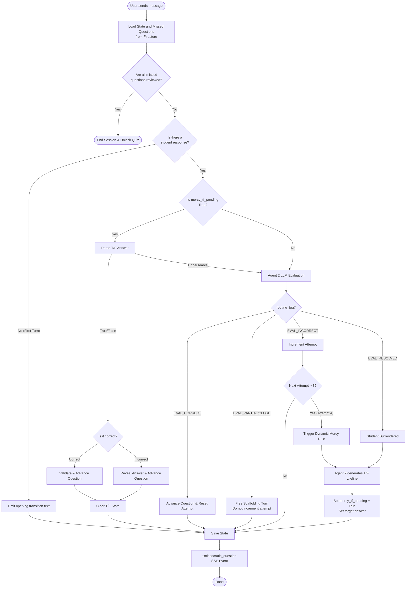
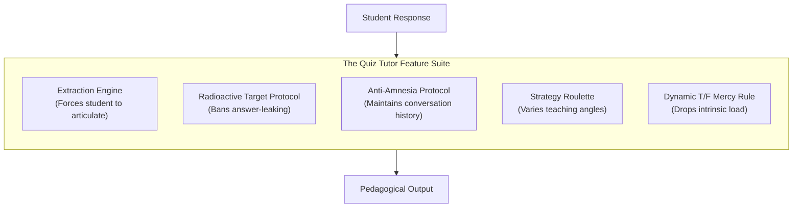
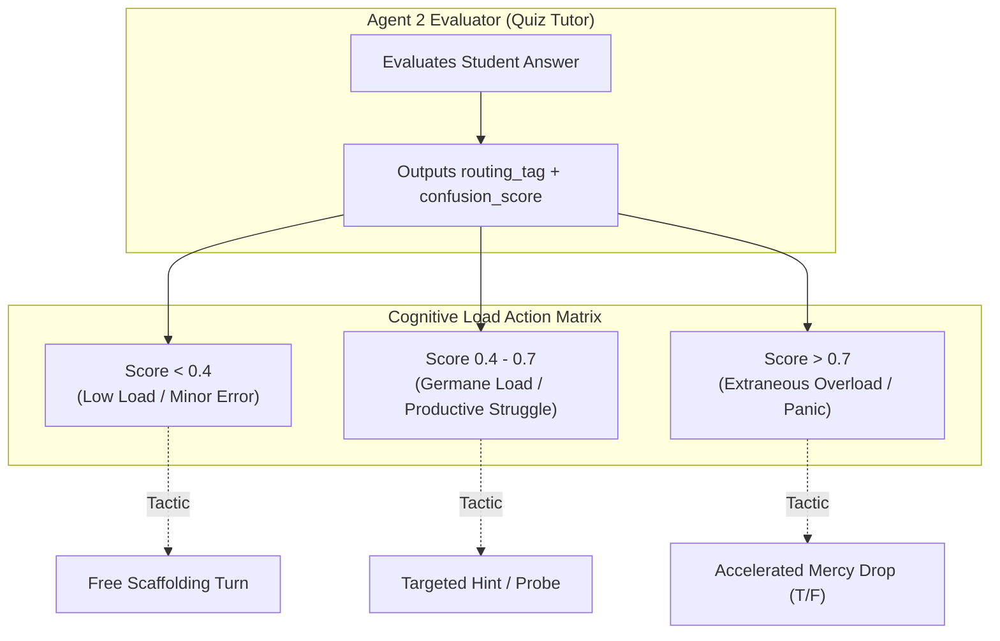
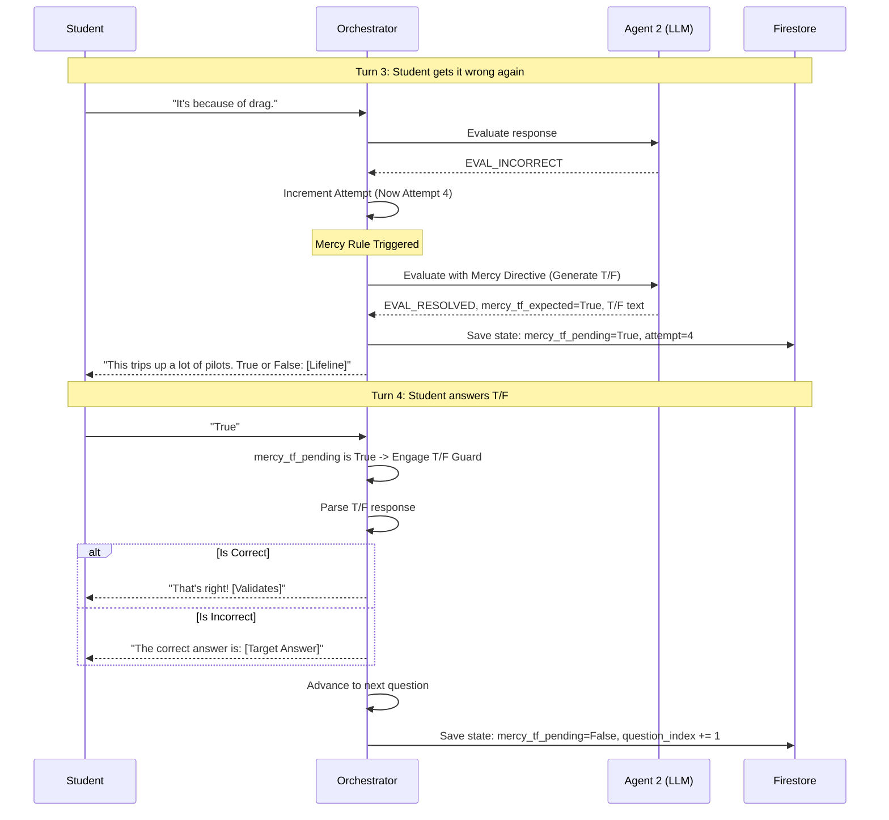
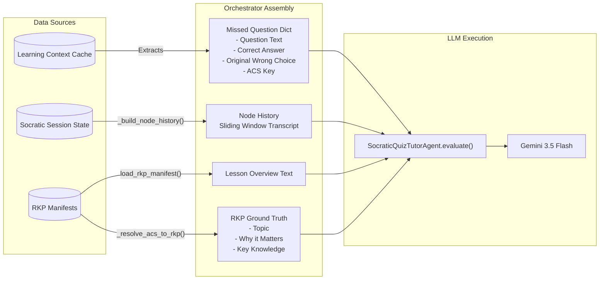

# Socratic Quiz Tutor Pipeline Analysis

The Socratic Quiz Tutor is a specialized post-quiz remediation agent designed to walk students through the questions they missed. It operates as a stateful orchestrator (`SpecialistOrchestrator`) coordinating with a stateless LLM executor (`SocraticQuizTutorAgent`).

## High-Level Architecture

The system operates using a **Webhook/Stateless Pattern**. The orchestrator wakes up, loads the state from Firestore, evaluates the current user message, updates the state, and goes back to sleep.

1. **Context Loading:** Reads the missed questions from `learning_context`.
2. **State Management:** Tracks progress via `quiz_tutor_sessions/{lesson_id}` (tracks `question_index`, `attempt`, and `mercy_tf_pending`).
3. **Evaluation:** Uses `gemini-3.5-flash` with a specific structured prompt (Capt. Lindbergh identity, Prime Directive, Radioactive Target Protocol) to classify the student's answer.
4. **Routing:** Depending on the LLM's classification (`routing_tag`), the orchestrator advances the node, gives a free turn, increments the attempt, or triggers the Mercy Rule.

---

## 1. Flow Diagram: Full Turn Lifecycle

This diagram illustrates what happens during a single invocation of `handle_quiz_tutor` when a student submits a message.

---

## 2. Core Pedagogical Features (The Agent Toolkit)

The Agent 2 Evaluator (`SocraticQuizTutorAgent`) is strictly stateless and serves to map natural language to a predefined routing tag. However, it is not a basic chatbot; it is equipped with the same powerful feature suite as the primary Socratic Teacher.

### 1. The Extraction Engine (Prime Directive)
It must extract the answer from the student. Instead of explaining why they failed the quiz question, it asks targeted questions that force the student to construct the explanation themselves.

### 2. Radioactive Target Protocol
The agent is strictly forbidden from using the core nouns/verbs of the `target_answer` in its hints. This prevents the student from simply parroting back words without understanding them.

### 3. Anti-Amnesia Protocol & Chain of Thought
The orchestrator maintains a `node_history` transcript of the remediation session. Before Agent 2 outputs a routing tag, it must write an `internal_reasoning_log` that compares the student's current answer against their past answers to accurately gauge progress.

### 4. Strategy Roulette
If the student struggles to understand the explanation for the missed quiz question, the system can pivot the teaching strategy (e.g., Devil's Advocate, Analogy) to approach the misconception from a different angle.

### 5. Dynamic Mercy Rule
As detailed below, if the student fails to grasp the concept after 3 attempts, the Orchestrator forces Agent 2 to generate a True/False lifeline to prevent them from getting permanently stuck in remediation.

### Evaluation Routing Tags
- `EVAL_CORRECT`: The student understands. The orchestrator will advance to the next missed question.
- `EVAL_PARTIAL` / `EVAL_CLOSE`: The student is on the right track but missing a piece (or ~80% close). The orchestrator provides a free scaffolding turn.
- `EVAL_INCORRECT`: The student is wrong. Increments the `attempt` counter.
- `EVAL_RESOLVED`: The student surrendered ("I don't know"). This triggers the Mercy Rule generation.

### Cognitive Load Monitoring (`confusion_score`)

Because the Quiz Tutor uses the exact same `SocraticExecutorResponse` Pydantic schema as the primary Socratic Teacher, every evaluation it makes inherently tracks the student's cognitive load via the `confusion_score` (a float between `0.0` and `1.0`).

In the context of the Quiz Tutor, this monitoring is especially critical. When a student fails a quiz and is sent to remediation, they are already entering the session with elevated Extraneous Load (stress from failing). The `confusion_score` allows the Orchestrator to monitor their emotional/cognitive state turn-by-turn:

- **Preventing Burnout:** If a student scores > 0.7 on consecutive turns while reviewing a missed quiz question, the orchestrator recognizes that further open-ended questioning will be unproductive.
- **Graceful Degradation:** A high `confusion_score` can trigger the T/F Mercy Guard sooner, or prompt the system to fallback to a plain-English explanation, ensuring the student doesn't get frustrated and abandon the platform during remediation.

---

## 3. The Mercy Rule & T/F Guard (V2.6 & V2.7)

This is a critical subsystem to prevent students from being caught in an infinite loop of failure. If a student fails 3 times (`attempt > 3`), the V2.7 Dynamic Mercy Rule kicks in.

### Potential Failure Points & Issues to Investigate
If you are seeing issues with the Socratic Quiz Tutor, it often stems from one of the following:

1. **State Desync (T/F Guard Bypassed):** If `mercy_tf_pending` gets stuck as True but the student types a long sentence, the system correctly clears the T/F guard (`mercy_tf_pending = False`) and drops them back into the standard evaluation. If the state write fails, they can get stuck.
2. **Context Bleed:** The `SocraticQuizTutorAgent` relies heavily on `node_history_text`. If the conversation history passed from the frontend gets truncated or doesn't reflect the actual turns, the Anti-Amnesia Protocol fails, and the agent might evaluate the current turn incorrectly.
3. **Radioactive Protocol Violations:** Sometimes `gemini-3.1-flash-lite` fails to adhere to the Radioactive Target Protocol and accidentally reveals the answer. When this happens, the student repeats the answer, but the system expects a full explanation.
4. **Agent 2 Mercy Failure:** If the LLM throws an exception when generating the T/F lifeline during Attempt 4, the orchestrator executes a graceful degradation fallback: it directly reveals the answer (`Let's clear this up. The correct answer is...`) and advances the node. 

---

## 4. Context Loading (How the Agent Gets its Information)

Before the LLM is invoked to evaluate the student's response, the Orchestrator assembles a highly specific contextual payload. Because the Quiz Tutor is stateless, it must be hydrated with the exact details of the student's failure and the curriculum ground truth on every turn.

The context is aggregated from three primary sources:
1. **The Learning Context Cache (LCC)**: Contains the exact quiz failure record.
2. **The Socratic Session State**: Contains the active chat history.
3. **The Curriculum Database (RKP Manifests)**: Contains the ground truth for the subject matter.

### Context Payload Details:
- **`missed_question` block**: Injects exactly what the question was, what the target answer is, and what the student originally guessed. This helps the LLM diagnose the student's core misconception.
- **`rkp_ground_truth`**: Instead of letting the LLM hallucinate the explanation, the orchestrator pulls the exact pedagogical explanation (*Why This Matters* and *Key Knowledge*) tied to the specific FAA ACS code of the missed question.
- **`node_history`**: A filtered transcript of the last 6 messages strictly bounded to the current missed question. This is required for the "Anti-Amnesia Protocol" so the LLM remembers its previous hints and can determine if the student's new answer shows progress.
- **`lesson_overview`**: Provides broader context in case the student asks a tangential question about how the topic fits into the overall lesson.
