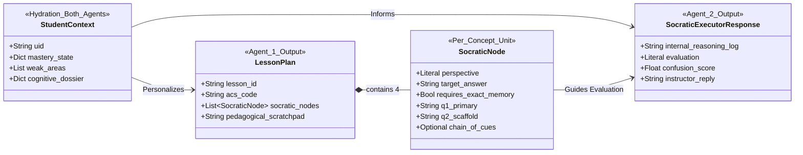
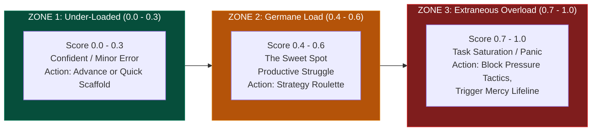
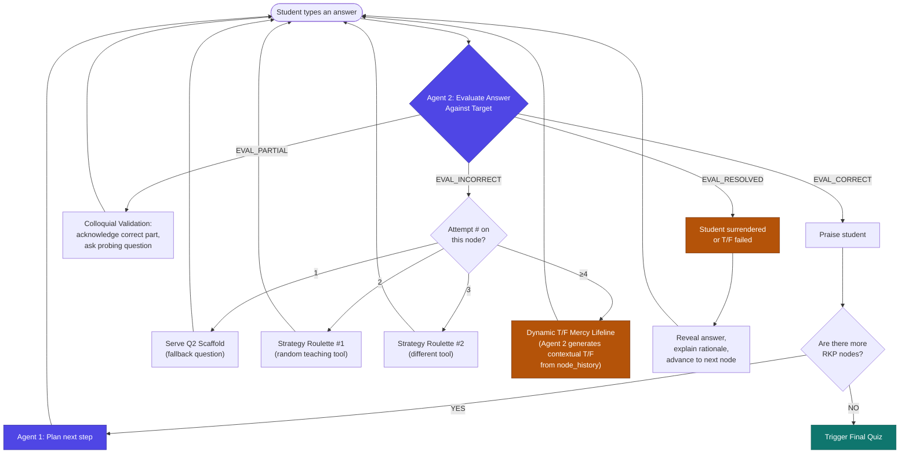
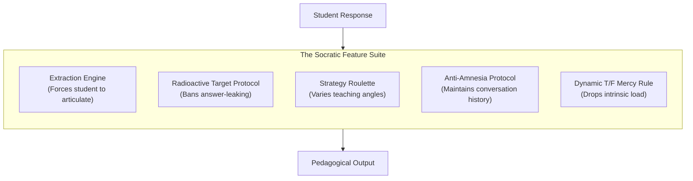
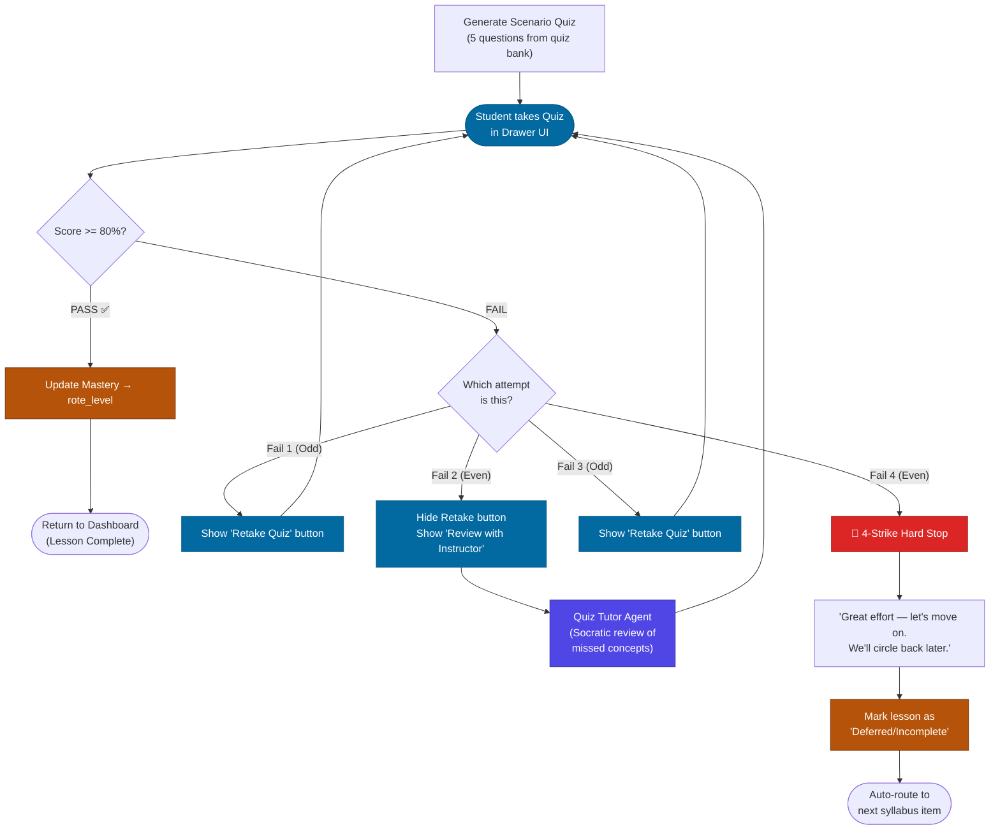
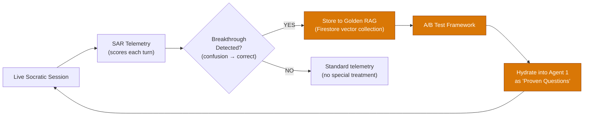

# Socratic Architecture: Teacher, Quiz, and Tutor Flows

This document details the complete end-to-end flow of the Socratic Teacher layer within AviationChat. It breaks down the agentic interactions, the strict Pydantic structured outputs that govern them, the transition into the testing phase, and the remediation loops when a student struggles.

---

## Theoretical Foundation: Sweller's Cognitive Load Theory (Germane Load)

AviationChat's Socratic architecture is built on **John Sweller's Cognitive Load Theory (CLT)**, specifically optimized around the concept of **Germane Load** — the productive cognitive effort a learner spends constructing durable mental models (schemas).

CLT identifies three types of load competing for a student's limited working memory:

| Load Type | What It Is | Our Design Goal |
|-----------|-----------|-----------------|
| **Intrinsic** | The inherent complexity of the material (e.g., airspace classes are just hard) | **Manage it** — chunk into atomic concepts, scaffold from broad to focused |
| **Extraneous** | Wasted effort from poor instructional design (confusing prompts, leaked answers, double-barreled questions) | **Minimize it** — strip all noise so working memory is free |
| **Germane** | The effort spent actually *building understanding* — connecting new knowledge to existing schemas | **Maximize it** — this IS learning. Every design choice serves this. |

**The entire system is a Germane Load maximization engine.** The Extraction Engine philosophy ("the student must articulate the answer, not receive it"), the Radioactive Target Protocol (preventing the AI from accidentally polluting working memory with the answer), and the Strategy Roulette (forcing the student to approach concepts from multiple angles to strengthen schema integration) all exist to keep the student in the zone of productive cognitive effort.

### How Each Component Maps to CLT

```mermaid
graph TD
    subgraph CLT["Cognitive Load Theory"]
        Intrinsic["🔵 Intrinsic Load\n(Manage)"]
        Extraneous["🔴 Extraneous Load\n(Minimize)"]
        Germane["🟢 Germane Load\n(MAXIMIZE)"]
    end
    
    subgraph System["AviationChat Implementation"]
        AtomicP["Atomic Principle\n(1 concept per node)"]
        RuleOf4["Rule of 4\n(Legal→Safety→App→Risk)"]
        Scaffold["Q1→Q2 Scaffold\n(broad→focused)"]
        MercyRule["Mercy Rule\n(prevent overload)"]
        Radioactive["Radioactive Target\n(can't leak the answer)"]
        DoubleBan["Double-Barrel Ban\n(one question at a time)"]
        Extraction["Extraction Engine\n(student must articulate)"]
        Roulette["Strategy Roulette\n(varied angles on same concept)"]
        AntiAmnesia["Anti-Amnesia Protocol\n(build on prior knowledge)"]
    end
    
    Intrinsic --> AtomicP
    Intrinsic --> RuleOf4
    Intrinsic --> Scaffold
    Intrinsic --> MercyRule
    
    Extraneous --> Radioactive
    Extraneous --> DoubleBan
    
    Germane --> Extraction
    Germane --> Roulette
    Germane --> AntiAmnesia
    
    classDef intrinsic fill:#2563EB,stroke:#1D4ED8,color:#fff
    classDef extraneous fill:#DC2626,stroke:#991B1B,color:#fff
    classDef germane fill:#16A34A,stroke:#15803D,color:#fff
    
    class Intrinsic,AtomicP,RuleOf4,Scaffold,MercyRule intrinsic
    class Extraneous,Radioactive,DoubleBan extraneous
    class Germane,Extraction,Roulette,AntiAmnesia germane
```

> **Prompt Design Rule:** CLT is the *rationale* for why these prompt patterns exist — it is NOT injected into the agent prompts themselves. The agents already implement the techniques; naming the academic theory in a system prompt would burn tokens and risk the LLM over-interpreting "maximize germane load" as "make questions harder."

---

## 1. The Pydantic Architecture (Agent 1 & Agent 2)

The Socratic Teacher is **not** a single LLM call. It is a strictly structured **two-agent pipeline** communicating via Pydantic models. This ensures the AI never goes off-script or gives away answers prematurely.

### The Agentic Roles
*   **Agent 1 (Lesson Planner):** Acts as the Curriculum Director. It reads the Required Knowledge Point (RKP) manifest, the RAG Investigation Dossier, and the student's `StudentContext` (mastery levels, weak areas, cognitive dossier) to decide *what* the student needs to learn next. It strictly follows the **Atomic Principle** (teaching only one concept at a time). Plans are generated **dynamically per student, per session** — never saved globally — to ensure personalization.
*   **Agent 2 (Socratic Executor):** Acts as the in-seat Flight Instructor. It receives the student's `StudentContext` along with the conversation history (`node_history`) and evaluates the student's response against the Lesson Planner's target. It decides *how* to respond — including generating dynamic mercy lifelines from chat context when the student is stuck.

### The Pydantic Data Contract

> **Key Decision (V2.6 State Persistence):** The `LessonPlan` is generated dynamically using `StudentContext` + RKP manifest + RAG dossier. It is cached in Firestore (`lesson_plan_cache/{lesson_id}`). While the volatile `socratic_sessions` document manages the step-by-step state and is purged upon session reset, the `lesson_plan_cache` is durable. Story 4.39 introduced the `socratic_completed_at` marker within the plan cache to serve as the permanent source-of-truth for session completion, allowing the UI to hydrate progress safely.

### Cognitive Load Monitoring (The `confusion_score`)

While Sweller's Germane Load theory forms the *rationale* for our design, the **actual mechanism for tracking cognitive load in real-time** is the `confusion_score` metric, which is strictly enforced in the Pydantic data contract.

Every time Agent 2 evaluates a student's response, it outputs a float between `0.0` and `1.0`. The Orchestrator uses this to dynamically adjust the system's pedagogy:

1. **The Devil's Advocate Constraint**: If `confusion_score` > 0.6 (Zone 3), the Orchestrator strictly forbids high-pressure tools like the Devil's Advocate. A student already overwhelmed needs a `CONFIDENCE_RESET`, not more pressure.
2. **Mercy Rule Pre-emption**: A rapid spike in the score across consecutive turns acts as an early warning system. Even before hitting the 4-attempt limit, high confusion signals the Orchestrator to pivot to the T/F Mercy Lifeline to immediately drop the Intrinsic Load.
3. **Prompting Optimization**: We deliberately do **not** write "Maximize Germane Load" in the raw LLM system prompt. Explicitly instructing an LLM to "maximize load" causes it to arbitrarily increase the difficulty. Instead, we enforce the *mechanics* of the theory via the `confusion_score` structured output.

---

## 2. Session Resumption & State Persistence (Story 4.39)

The Socratic Teacher incorporates a highly resilient state hydration mechanism to respect adult learners' time and prevent loss of progress. 

When a student navigates to a lesson, the frontend calls `GET /api/lessons/{lesson_id}/progress`. This endpoint computes the exact `resumed_step` (1-4) by resolving two systems:
1. **The Volatile Session Document:** (`socratic_sessions/{lesson_id}`) Tracks mid-session progression (`node_index`, `attempt`).
2. **The Durable Plan Cache:** (`lesson_plan_cache/{lesson_id}`) Holds the `socratic_completed_at` timestamp. This survives intentional resets (e.g., clicking "Retake Socratic") and prevents completed sessions from regressing the UI.

The React frontend uses a `STATE_RANK` merger pattern to guarantee that any incoming `/progress` hydration will NEVER downgrade a step the user has already unlocked locally. This architecture natively supports N-node RKP manifests without hardcoded `node_index < 4` caps.

---

## 3. The Socratic Teacher Flow (Conversational Loop)

This diagram shows how the student's input is evaluated by **Agent 2 (Executor)** and how the `evaluation` Literal dictates the flow. The Python Orchestrator (in `specialist/agent.py`) owns ALL state — Agent 2 is stateless and attempt-blind.

### The Mercy Rule — Dynamic T/F with Closest-Answer Acknowledgment (Story QA-7)

When a student is stuck (attempt ≥4 or explicitly says "I don't know"), the system uses a **dynamic, personalized** mercy mechanism powered by Agent 2:

1. **Closest-Answer Scan:** The orchestrator injects a mercy directive into Agent 2's evaluation call. Agent 2 scans the `node_history` to find the turn where the student was **closest** to correct — often the student was on the right track early but went off-course after receiving EVAL_INCORRECT feedback.
2. **Warm Acknowledgment:** Agent 2 references what they got right: *"You know, earlier you mentioned [X] — that was actually a really solid instinct."*
3. **Contextual T/F:** Agent 2 generates a True/False question that builds on what the student almost got right, isolating one testable fact from the `target_answer`.
4. **If T/F Correct:** Orchestrator marks `EVAL_CORRECT`, advance to next node.
5. **If T/F Incorrect:** Agent 2 outputs `EVAL_RESOLVED`, reveals the answer with rationale, and forces advance.

**CLT Justification:** This activates the student's **existing partial schema** (Germane Load) rather than presenting a disconnected statement. The closest-answer acknowledgment also reduces extraneous load by eliminating the student's confusion about whether their earlier thinking was completely wrong.

---

## 3. Core Pedagogical Features (The Agent Toolkit)

Agent 2 (The Socratic Executor) is equipped with a specific set of constrained tools and protocols. It does not act as a free-wheeling chatbot; it operates as a strict engine designed to execute the following core features:

### 1. The Extraction Engine
**The Rule:** The AI must never simply give the student the answer. 
**The Execution:** The system is explicitly prompted to act as a reverse-engineer of knowledge. Instead of explaining a concept, it asks targeted questions that force the student to construct the explanation themselves. *Saying the answer* is the actual learning event.

### 2. Radioactive Target Protocol
**The Rule:** The `target_answer` is "radioactive."
**The Execution:** To support the Extraction Engine, Agent 2 is strictly forbidden from using the core nouns and verbs found in the `target_answer` when giving hints. If the target is "The aircraft will stall," the agent cannot say "What happens to the aircraft, does it s...?" This prevents the "Illusion of Competence" where the student just parrots the AI's hint.

### 3. Strategy Roulette
**The Rule:** If a student fails to understand a concept after 2 attempts, pivot the teaching strategy.
**The Execution:** Instead of asking the same question louder, the Orchestrator injects a `roulette_directive` into Agent 2's prompt. This forces the LLM to adopt a specific, distinct teaching tool for that turn:
- **Devil's Advocate:** *"Are you sure? Because the FAA manual says [distractor]. Defend your answer."*
- **Socratic Analogy:** *"Think of the electrical system like a plumbing system..."*
- **Inverted Scenario:** *"Let's flip it. If you WANTED to cause this emergency, what would you do?"*
- **Explain Like I'm 5:** *"Simplify this. How would you explain it to a non-pilot passenger?"*

### 4. Anti-Amnesia Protocol
**The Rule:** The AI must remember what the student said earlier in the node.
**The Execution:** The orchestrator maintains a `node_history` transcript of the last 6 turns and injects it into Agent 2's prompt. This allows the agent to acknowledge partial progress (*"You're closer now than you were two minutes ago when you said X..."*) and prevents the AI from frustrating the student by repeating rejected hints.

### 5. Dynamic Mercy Rule
**The Rule:** Do not let a student enter an infinite failure loop.
**The Execution:** If `attempt >= 4` or the student reaches Zone 3 Cognitive Overload, the Orchestrator forces Agent 2 to generate a highly contextual True/False question based on the student's *closest* past answer.

---

## 4. The Quiz and Quiz Tutor Pipeline

Once the Socratic conversation completes, the system generates a Scenario-Based Judgment Test (SJT) from the static quiz bank. The quiz follows a **4-Strike Rule** for handling failures.

### Current State vs. Vision

| Behavior | Current Code | Daniel's Vision |
|----------|-------------|-----------------|
| Fail 1 (Odd) | Retake button shown ✅ | Retake button shown ✅ |
| Fail 2 (Even) | Forced tutor, caches wiped, reset to NEW ✅ | Forced tutor ✅ |
| Fail 3 (Odd) | Retake button shown ✅ | Retake button shown ✅ |
| Fail 4 (Even) | Forced tutor again (infinite loop ❌) | **Hard stop → move on to next lesson** |

> **Gap:** The backend has the `quiz_attempts` lifetime counter and the even/odd routing logic. What's missing is a **Fail 4 exit ramp** — when `quiz_attempts >= 4` on a fail, instead of resetting to NEW, we mark the lesson as "deferred" and route the student forward.

---

## 5. V3 Vision: Golden RAG Database & Breakthrough Questions

> [!IMPORTANT]
> **This section documents the strategic V3 vision. It is NOT part of the current implementation but MUST be considered when designing the Evolution Engine (Epic 8) and Admin Agent.**

### The Golden RAG Concept
Every Socratic session generates questions dynamically. Some of those questions — whether from Agent 1's Lesson Plans or Agent 2's follow-up probes — will produce **breakthrough moments** where a struggling student suddenly "gets it." These breakthrough interactions are incredibly valuable training data.

### The Pipeline (V3)

### Key Design Principles

1. **Dynamic Generation First:** Questions are always generated dynamically by Agent 1 (personalized via `StudentContext`). The Golden RAG provides *supplementary* proven tools, not replacements.
2. **Breakthrough Detection:** SAR telemetry already tracks `confusion_score` per turn. A "breakthrough" is defined as a transition from high confusion (≥0.7) to `EVAL_CORRECT` within 1-2 turns. The question/prompt that caused this transition is the golden artifact.
3. **A/B Testing Loop:** Golden questions are surfaced to Agent 1 as optional `<proven_breakthrough_tools>` in the prompt. We track whether students who receive these questions show faster time-to-correct vs. the control group (pure dynamic generation).
4. **Admin Agent Curation:** The Admin Agent (Epic 8.5 — Mission Control) will provide a dashboard for reviewing, approving, and retiring golden questions. Human-in-the-loop ensures quality.
5. **Never Static:** Golden questions augment the dynamic pipeline — they do NOT replace it. Agent 1 always generates fresh questions. The golden tools are additional arrows in the quiver.

### Correlation to Current Architecture

| Component | Current | V3 Enhancement |
|-----------|---------|----------------|
| Agent 1 Prompt | RKP + RAG Dossier + StudentContext | + `<proven_breakthrough_tools>` from Golden RAG |
| Agent 2 Prompt | Target + node_history + StudentContext | + Awareness of which golden tools were used (for A/B attribution) |
| SAR Telemetry | Logs `confusion_score`, `routing_tag` per turn | + Breakthrough detection trigger |
| Firestore | `lesson_plan_cache/` (durable) | + `golden_questions/` (permanent, vector-indexed) |
| Admin Agent | Not built yet (Epic 8.5) | Curation dashboard for golden question lifecycle |

> **Story 8.4 (Golden Transcripts & Firestore Vector Search)** in the Epic 8 backlog is the natural home for this work. This V3 vision should be incorporated into that story's requirements when it moves to `ready-for-dev`.
