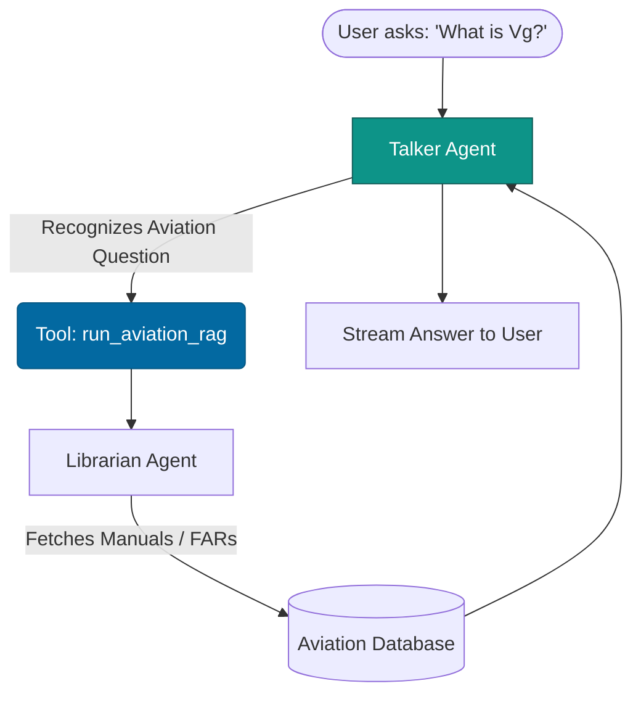
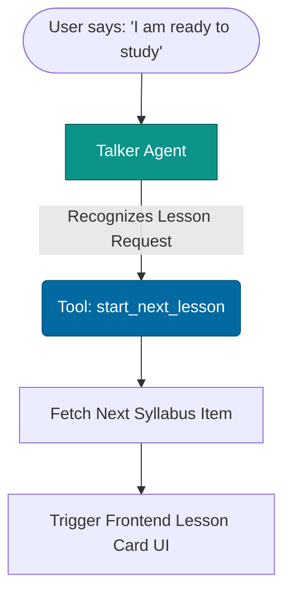
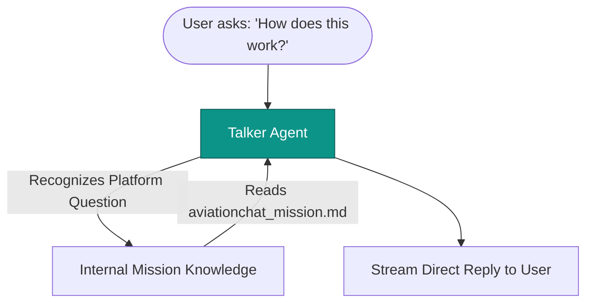
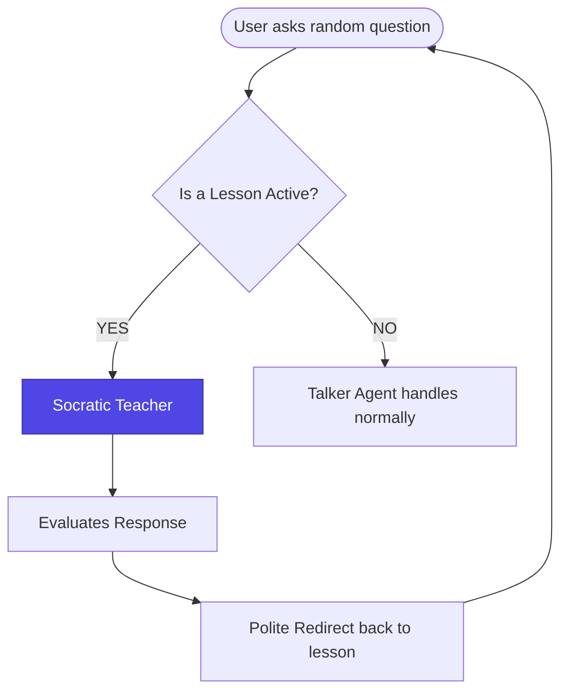

# Talker Agent: The Four Sub-Flows

Here are clean, separated diagrams for each of the specific actions the Talker handles. This breaks down exactly how the "3 calls" (plus the Socratic correction) work independently.

## 1. The RAG Flow (Aviation Questions)
This is how the system handles a student asking a technical aviation question.

## 2. The Next Lesson Flow
This is how the system handles starting a new study session.

## 3. The Platform Help Flow
This handles questions about AviationChat itself, requiring no external tools.

## 4. The Socratic Correction Flow
This is the override that happens if the student tries to change the subject *during* an active lesson.

