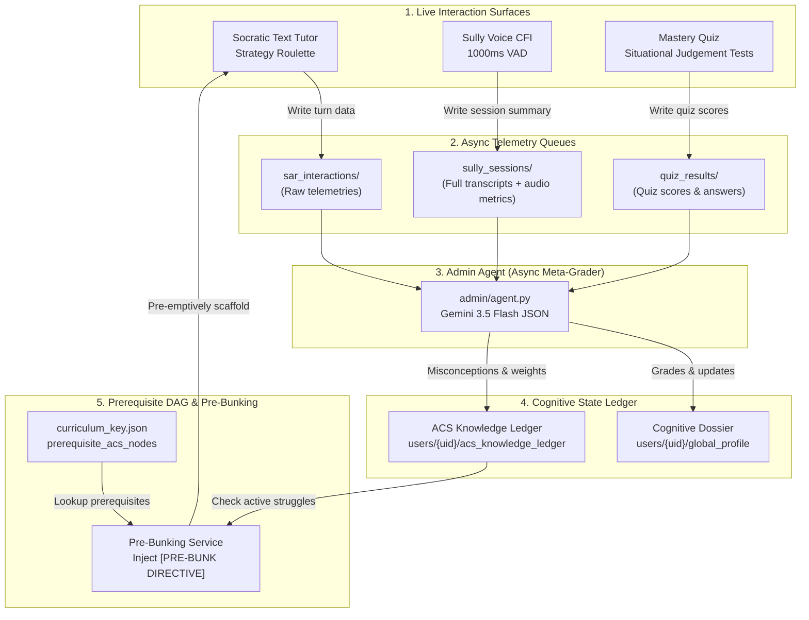
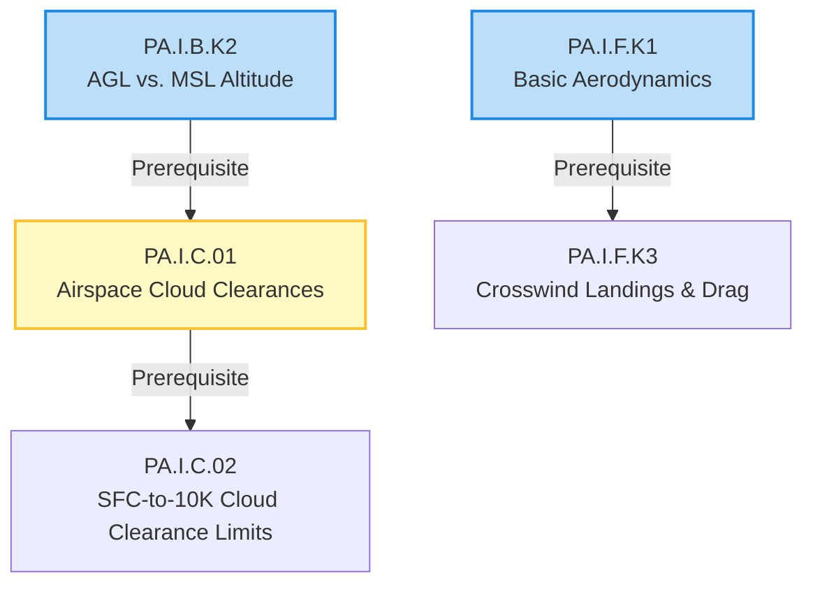
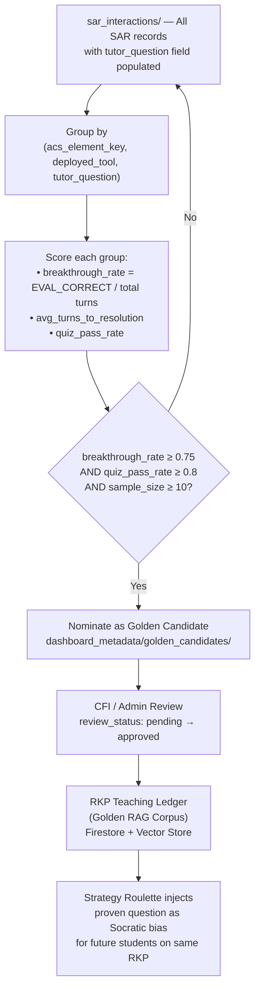
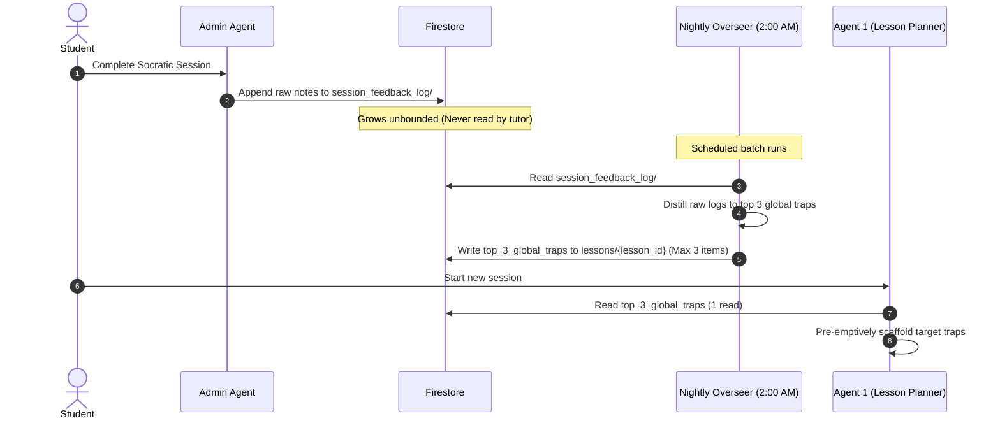

# Admin Agent & Prerequisite DAG — Product Reference Package (PRP)

> **Version:** V2.3 (RKP Teaching Ledger + Golden RAG)
> **Date:** 2026-05-22
> **Author:** Steve Wozniak (Dev Agent) + Steve Jobs (Daniel/PO)
> **Status:** Released — Design Invariant Reference

---

## 1. Executive Summary

The **Admin Agent** is the async, fire-and-forget meta-grader for AviationChat. It serves as the **sole authority** for student evaluation and mastery state transitions. To protect active dialogue latency, teaching agents (Socratic Tutor, Sully, Igor) are strictly forbidden from writing evaluations or updating permanent student records. Instead, they stream raw telemetry, and the Admin Agent processes it post-session.

This PRP documents the design of the **Prerequisite DAG (Directed Acyclic Graph)**, the **Pre-Bunking Service**, and the **RKP Teaching Ledger** — the core data engines that map FAA ACS prerequisites, detect student weaknesses, and continuously learn the most effective way to teach every specific knowledge point in the curriculum.

> **Core Innovation:** The platform maps the complete learning cycle for every RKP:
> `RKP → Teaching Tool → Tool-Restructured Question → Student Breakthrough → Quiz Validation`
> *Note: The "question" tracked is NOT the initial lesson-plan question (Q1/Q2 from Agent 1). It is the dynamic Socratic reformulation Agent 2 generates when the Strategy Roulette deploys a teaching tool after `EVAL_INCORRECT`.*
> Over time this builds a proprietary **Cognitive Breakthrough Database** — an empirical library of proven pedagogical fingerprints, organized by 8 universal `knowledge_type` tags (RECALL_FACTUAL, CONCEPTUAL_WHY, PROCEDURAL, APPLIED_JUDGMENT, REGULATORY, RISK_ASSESSMENT, SYSTEMS_INTEGRATION, HUMAN_FACTORS) that classify cognitive demand, not subject matter — making the engine portable across verticals. No competitor can replicate this.



---

## 2. Admin Agent Architecture & Grading Flow

The Admin Agent operates asynchronously in a fire-and-forget cycle. When a student completes a learning session, the backend calls the Admin Agent via `asyncio.create_task()`, immediately returning control to the frontend.

The grading pipeline is implemented in `[agent.py](file:///c:/Sudo_Hatter_Command/Projects/aviationChat-AGY/backend/agents/admin/agent.py)`:
- `analyze_socratic_session()`: Evaluates text-based Socratic transcripts using `SOCRATIC_EVALUATION_PROMPT`.
- `analyze_sully_session()`: Evaluates voice coaching sessions using `VOICE_EVALUATION_PROMPT`, assessing pause telemetry, hesitation, and filler word density.

### 2.1 Socratic Grading Model
The Admin Agent reads the Evidence Dossier (the ground truth answer key) and the conversation transcript. It passes these to Gemini 3.5 Flash, generating a structured JSON response containing:
1. **Evaluations:** Assigns `correct`, `partial`, or `incorrect` to each student response.
2. **Weak Points:** Logs precise knowledge gaps with ACS element keys to `[learning_context](file:///c:/Sudo_Hatter_Command/Projects/aviationChat-AGY/backend/schemas/learning_context.py)`.
3. **Cognitive Dossier Entry:** Appends a struggle/pass directive to `[cognitive_dossier.py](file:///c:/Sudo_Hatter_Command/Projects/aviationChat-AGY/backend/schemas/cognitive_dossier.py)`.
4. **Mastery Transition:** Attempts to transition the ACS code from `seen` to `rote_level` via the `[mastery_service.py](file:///c:/Sudo_Hatter_Command/Projects/aviationChat-AGY/backend/services/mastery_service.py)`.

### 2.2 Voice (Sully) Grading Model
Voice grading incorporates physical audio metrics along with transcript analysis:
- **Application Mastery Gate:** Requires all RKPs to pass with `EVAL_CORRECT` or `EVAL_CLOSE`, average student hesitation `< 2000ms`, and filler density `< 2.0` fillers per turn.
- **Fragile Knowledge Detection:** If the answer is correct but hesitation is `> 3000ms` or filler words `>= 3`, the knowledge is marked as "fragile." The student knows the fact but lacks oral communication confidence under cockpit pressure.
- **Technique Effectiveness:** Evaluates Sully's teaching tools (e.g., Consequence Engine, Devil's Advocate) as `effective`, `partially_effective`, or `ineffective`.

---

## 3. Prerequisite DAG & Pre-Bunking Service

Student pilot learning is not flat. Concepts build sequentially. The **Prerequisite DAG (Directed Acyclic Graph)** maps these dependencies.



### 3.1 Mapping Prerequisites
Dependencies are defined in `[curriculum_key.json](file:///c:/Sudo_Hatter_Command/Projects/aviationChat-AGY/backend/data/curriculum_key.json)`. Each lesson contains a `prerequisite_acs_nodes` array:

```json
{
  "lesson_id": "PPL_PA_I_C_01",
  "lesson_name": "Airspace Cloud Clearances",
  "prerequisite_acs_nodes": ["PA.I.B.K2"]
}
```

### 3.2 Pre-Bunking Flow
The Pre-Bunking Service operates at lesson initialization:
1. **Initialize Lesson:** A student starts Socratic dialogue on `lesson_id` (e.g., `PPL_PA_I_C_01`).
2. **Read Prerequisites:** The backend reads the `prerequisite_acs_nodes` for that lesson.
3. **Query Knowledge Ledger:** The system queries `[cognitive_dossier_service.py](file:///c:/Sudo_Hatter_Command/Projects/aviationChat-AGY/backend/services/cognitive_dossier_service.py)` to check the student's `ACSKnowledgeNode` for active misconceptions on the prerequisite ACS codes.
4. **Inject Directive:** If active misconceptions are found, the backend generates a `[PRE-BUNK DIRECTIVE]` and injects it into Agent 1 (Lesson Planner).
5. **Conversational Scaffold:** Agent 1 inserts a clearing question before the lesson's RKP content. The student experiences a natural review callback:
   > *"Before we get into Cloud Clearances, let's review altitudes. Explain the practical difference between AGL and MSL when planning your cruise altitude."*

---

## 4. The Epsilon-Greedy RL Loop (Self-Improving Pedagogy)

The platform utilizes a Reinforcement Learning (RL) loop to optimize Strategy Roulette tool selection.

### 4.1 Bipartite Reward Signal
The Admin Agent correlates the Socratic tool deployed during a session with the student's subsequent quiz score. This reward is written to the SAR telemetry record in Firestore:

| Outcome | Reward | Interpretation |
|---|---|---|
| 🟢 Socratic Pass + Quiz Pass | `+1.0` | **Clear Success.** The tool efficiently generated mastery. |
| 🟡 Socratic Fail/Slow + Quiz Pass | `+0.4` | **Socratic Recovery.** The tool guided the student out of a deep misconception. |
| 🔴 Socratic Pass + Quiz Fail | `-0.3` | **Illusion of Competence.** The tool was dangerously easy or misleading. |
| ⚫ Socratic Fail + Quiz Fail | `-1.0` | **Complete Miss.** The tool completely failed to teach the concept. |

The reward score updates the student's `tool_affinity_weights` for the active ACS code within their `[cognitive_dossier.py](file:///c:/Sudo_Hatter_Command/Projects/aviationChat-AGY/backend/schemas/cognitive_dossier.py)` ledger:

```python
tool_affinity_weights: Dict[str, float] = {
    "tool_1_analogical": 0.125,
    "tool_2_first_principles": 0.125,
    "tool_3_boundary": 0.125,
    "tool_4_contrasting_cases": 0.125,
    "tool_5_reverse_chaining": 0.125,
    "tool_6_broken_machine": 0.125,
    "tool_7_missing_link": 0.125,
    "tool_8_triage": 0.125,
}
```

### 4.2 Exploit vs. Explore (Epsilon-Greedy)
During a Socratic session, the `[strategy_roulette.py](file:///c:/Sudo_Hatter_Command/Projects/aviationChat-AGY/backend/services/strategy_roulette.py)` reads the student's ledger:
- **Exploitation (80→90% of turns):** Deploys the tool with the highest affinity weight for the student. Two-stage epsilon: 80% exploit below 50 scored interactions, 90% at ≥50.
- **Exploration (15% of turns):** Selects a random alternative tool to refine the model's weights and prevent local minima.

---

## 5. RKP Teaching Ledger & Golden RAG Feedback Loop

The most defensible intellectual property in AviationChat is not the AI model — it is the **empirical database of what actually works** to teach every specific knowledge point to a real student pilot.

### 5.1 The Problem: Strategy Without Execution

The Bipartite Reward Signal (§4.1) tells us *which tool category* worked for a given ACS code (e.g., `BROKEN_MACHINE` for `PA.I.A.K1`). But it does not tell us *how* the question was phrased — and phrasing is everything in the Socratic method.

Two tutors can both use the `BROKEN_MACHINE` tool on the same concept and get completely different results based on their exact wording. The platform must capture **both dimensions**:

| Dimension | Field | Example |
|---|---|---|
| **Strategy** | `deployed_tool` | `BROKEN_MACHINE` |
| **Execution** | `tutor_question` | *"If your VSI reads zero in a climb but your pitot tube is clear, what other port could be blocked?"* ← This is the **tool-restructured** question (Strategy Roulette intervention), NOT the initial Q1/Q2 lesson-plan question |

### 5.2 The Full Learning Cycle (Pedagogical Fingerprint)

Every Socratic interaction is captured as a complete atomic unit — a **Pedagogical Fingerprint** — stored in the SAR telemetry record:

```python
# Complete SAR record — Pedagogical Fingerprint
{
    # === Identity (The 'What') ===
    "lesson_id":        "PA_I_A_01",
    "acs_element_key": "PA.I.A.K1",       # The RKP — the atomic teaching unit
    "node_index":       2,
    "mode":             "text",             # text | voice

    # === Strategy (The 'How — Category') ===
    "deployed_tool":   "BROKEN_MACHINE",   # Which Socratic tool was used

    # === Execution (The 'How — Exact Wording') ===
    "tutor_question":      "If your VSI reads zero in a climb but pitot is clear, what else could be blocked?",
    "tutor_question_mode": "text",          # text | voice (Sully questions differ in length and register)

    # === Outcome (The 'Result') ===
    "evaluation":       "EVAL_CORRECT",    # Did the student have the breakthrough?
    "student_response": "The static port!",
    "student_word_count": 4,

    # === Reward (The 'Proof') ===
    "reward_status":   "pending",          # → scored by BipartiteRewardService post-quiz
    "reward_score":    None,               # → +1.0 if quiz also passed
}
```

> **Key Invariant:** `tutor_question` is logged at **every** Strategy Roulette turn (when the agent deploys a teaching tool after `EVAL_INCORRECT`), regardless of whether the student subsequently gets it right or wrong. It captures the **tool-restructured question** — the dynamic Socratic reformulation, NOT the initial lesson-plan question (Q1/Q2 from Agent 1). Negative examples (wrong tool, confusing phrasing) are as valuable as positive ones — they define what NOT to ask for a given RKP.

> [!WARNING]
> **Implementation status (2026-06-01): DESIGNED, NOT YET CAPTURED.** This Pedagogical
> Fingerprint is the *intended* schema. The running code does **not** persist it: `tutor_question`
> appears in **zero** Python files, and the SAR write at
> [`agent.py:2769`](file:///c:/Sudo_Hatter_Command/Projects/aviationChat-AGY/backend/agents/specialist/agent.py)
> stores `deployed_tool` + `evaluation` + `reward_score` but **not** the question text, and only
> `response_length` (an integer) rather than the student's words. The system therefore knows
> *which tool* worked but never recorded *the actual question that worked*. **Closing in Story 8.11
> (Golden RAG Pedagogical Fingerprint Capture).** Capture is forward-looking — only sessions after
> 8.11 ships will carry the fingerprint.

### 5.3 Universal Knowledge Type Taxonomy (Approved 2026-05-22)

Different types of cognitive demand respond to fundamentally different teaching approaches. The RKP Teaching Ledger classifies every RKP and SAR record by **what the student's brain is being asked to DO** — not the subject matter. This makes the taxonomy portable across verticals (Tier 4 monetization unlock).

| `knowledge_type` | What The Brain Does | Aviation Example | Expected Best Tools |
|---|---|---|---|
| `RECALL_FACTUAL` | Retrieve a number/limit/definition | "Class B minimums?" | MCQ, SOCRATIC_DIRECT |
| `CONCEPTUAL_WHY` | Explain WHY a principle works | "Why does DA reduce performance?" | BROKEN_MACHINE, BOUNDARY |
| `PROCEDURAL` | Execute ordered steps correctly | "Engine failure checklist" | REVERSE_CHAINING, MISSING_LINK |
| `APPLIED_JUDGMENT` | Decide under competing pressures | "Engine out 500 AGL — now what?" | SCENARIO, TRIAGE |
| `REGULATORY` | Know the rule, cite the source | "14 CFR 61.113" | MCQ, SOCRATIC_DIRECT |
| `RISK_ASSESSMENT` | Identify what could go wrong | "Hazards in this METAR" | SCENARIO, TRIAGE |
| `SYSTEMS_INTEGRATION` | Connect how parts interact | "Pitot-static → instruments" | BROKEN_MACHINE, BOUNDARY |
| `HUMAN_FACTORS` | Recognize how humans fail | "ADM, CRM, attitudes" | CONTRASTING_CASES, PROTEGE_EFFECT |

Over time, the Nightly Overseer will validate or invalidate these cognitive-demand→tool mappings with real data — replacing theory with empirical truth. Because these tags classify cognitive demand (not aviation topics), they transfer directly to Medical Board prep, Bar Exams, and any knowledge domain.

### 5.4 Golden RAG Discovery Pipeline

The **Nightly Overseer** (Story 8.4) runs the following pipeline to identify the best pedagogical fingerprints:



### 5.5 Golden Candidate Schema

```python
{
    "acs_element_key":  "PA.I.A.K1",
    "knowledge_type":    "SYSTEMS_INTEGRATION", # RECALL_FACTUAL | CONCEPTUAL_WHY | PROCEDURAL | APPLIED_JUDGMENT | REGULATORY | RISK_ASSESSMENT | SYSTEMS_INTEGRATION | HUMAN_FACTORS
    "deployed_tool":    "BROKEN_MACHINE",
    "tutor_question":   "If your VSI reads zero in a climb but pitot is clear, what else could be blocked?",
    "tutor_question_mode": "text",
    "flawless_count":   14,                    # Times this fingerprint yielded EVAL_CORRECT + quiz pass
    "breakthrough_rate": 0.87,
    "avg_turns_to_resolution": 1.4,
    "sample_transcripts": ["sar_id_1", "sar_id_2", "sar_id_3"],  # Top 3 examples
    "nominated_at":     "2026-05-22T04:00:00Z",
    "review_status":    "pending",             # pending | approved | rejected
    "reviewed_by":      None,                  # CFI uid on approval
}
```

> [!WARNING]
> **Implementation status (2026-06-01): PARTIAL.** The shipped `GoldenCandidate`
> ([`backend/schemas/evolution.py`](file:///c:/Sudo_Hatter_Command/Projects/aviationChat-AGY/backend/schemas/evolution.py))
> stores `tool` + `acs_code` + `flawless_count` + `sample_transcripts` (SAR **IDs**) — it does
> **not** carry `tutor_question`, `tutor_question_mode`, `knowledge_type`, or `breakthrough_rate`.
> The Nightly Overseer's golden discovery groups by `(deployed_tool, acs_element_key)` **only** —
> not by question text (because the field isn't captured upstream). Story 8.11 widens this:
> capture the fingerprint, then group by `(acs, tool, tutor_question)` and compute
> `breakthrough_rate` as specified above. Retrieval/injection (§5.4 → INJECT) remains a separate
> follow-on track.

### 5.6 Voice vs. Text Question Isolation

Sully (voice CFI) and the Specialist (text tutor) operate in fundamentally different registers. A `tutor_question_mode` tag ensures Golden RAG never injects a long, structured text question into Sully's voice pipeline:

- **Text questions:** Can be long, complex, multi-clause. Up to 2-3 sentences.
- **Voice questions:** Must be short, natural, conversational. Maximum 1 sentence. No parenthetical clauses.

The Golden RAG query always filters by `tutor_question_mode` before injecting.

---

## 6. Institutional Memory & Nightly Overseer (FR35)

To prevent every student from falling into the same trap on the same lesson, the Admin Agent and the **Nightly Overseer** maintain a global loop.



1. **Log SAR with Pedagogical Fingerprint:** Post-session, every SAR record includes `tutor_question` (the tool-restructured question from the Strategy Roulette intervention, not the initial Q1/Q2), `tutor_question_mode`, and `acs_element_key`. The Admin Agent appends raw grading notes to `lessons/{lesson_id}/session_feedback_log/`.
2. **Nightly Batch Processing:** At 4:00 AM, the Nightly Overseer (a) reads the session logs to distill `top_3_global_traps`, (b) runs the Golden RAG discovery pipeline to nominate breakthrough candidates, and (c) aggregates global tool affinity defaults for cold-start seeding.
3. **Preemptive Scaffolding:** When a new student starts a lesson, Agent 1 (Lesson Planner) reads `top_3_global_traps` AND queries the RKP Teaching Ledger for any approved Golden Candidates on that ACS code — injecting proven question phrasings as a Socratic bias.

---

## 7. Document Map & Reference

All Admin, DAG, and Teaching Ledger development must align with the following specifications:

- **Curriculum Config:** `[curriculum_key.json](file:///c:/Sudo_Hatter_Command/Projects/aviationChat-AGY/backend/data/curriculum_key.json)`
- **Admin Agent Grading Engine:** `[agent.py](file:///c:/Sudo_Hatter_Command/Projects/aviationChat-AGY/backend/agents/admin/agent.py)`
- **Admin Agent Prompts:** `[prompts.py](file:///c:/Sudo_Hatter_Command/Projects/aviationChat-AGY/backend/agents/admin/prompts.py)`
- **Cognitive Dossier Schema:** `[cognitive_dossier.py](file:///c:/Sudo_Hatter_Command/Projects/aviationChat-AGY/backend/schemas/cognitive_dossier.py)`
- **Strategy Roulette:** `[strategy_roulette.py](file:///c:/Sudo_Hatter_Command/Projects/aviationChat-AGY/backend/services/strategy_roulette.py)`
- **BipartiteRewardService:** `[reward_service.py](file:///c:/Sudo_Hatter_Command/Projects/aviationChat-AGY/backend/services/evolution/reward_service.py)`
- **Nightly Overseer Story:** `[story-8.4-nightly-overseer-golden-transcripts.md](file:///c:/Sudo_Hatter_Command/Projects/aviationChat-AGY/_bmad/bmm/stories/story-8.4-nightly-overseer-golden-transcripts.md)`
- **Pre-Bunking Story Spec:** `[story-4.20-prerequisite-dag-prebunking.md](file:///c:/Sudo_Hatter_Command/Projects/aviationChat-AGY/_bmad/bmm/stories/story-4.20-prerequisite-dag-prebunking.md)`
- **Aviation V2 Ingestion Architecture:** `[dual_store_bridge_pattern.md](file:///C:/Users/dlohn/.gemini/antigravity/knowledge/aviation_v2_ingestion_and_search/artifacts/architecture/dual_store_bridge_pattern.md)`
