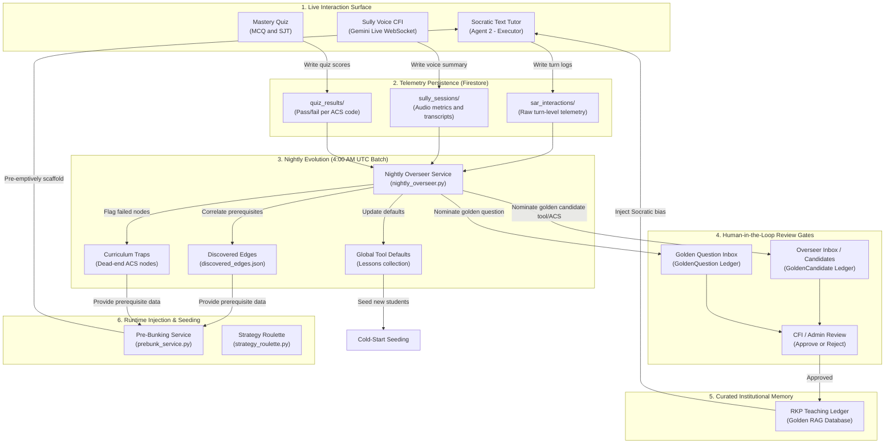
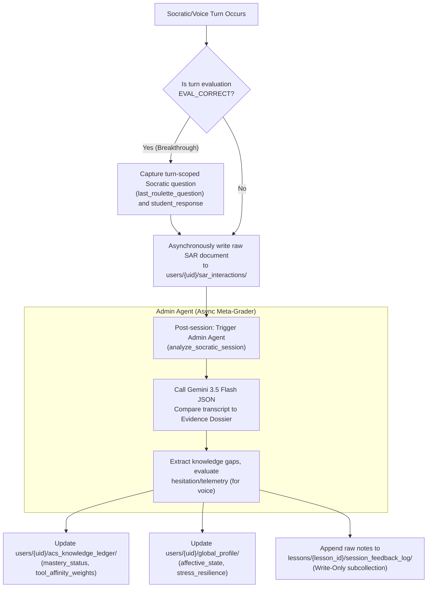
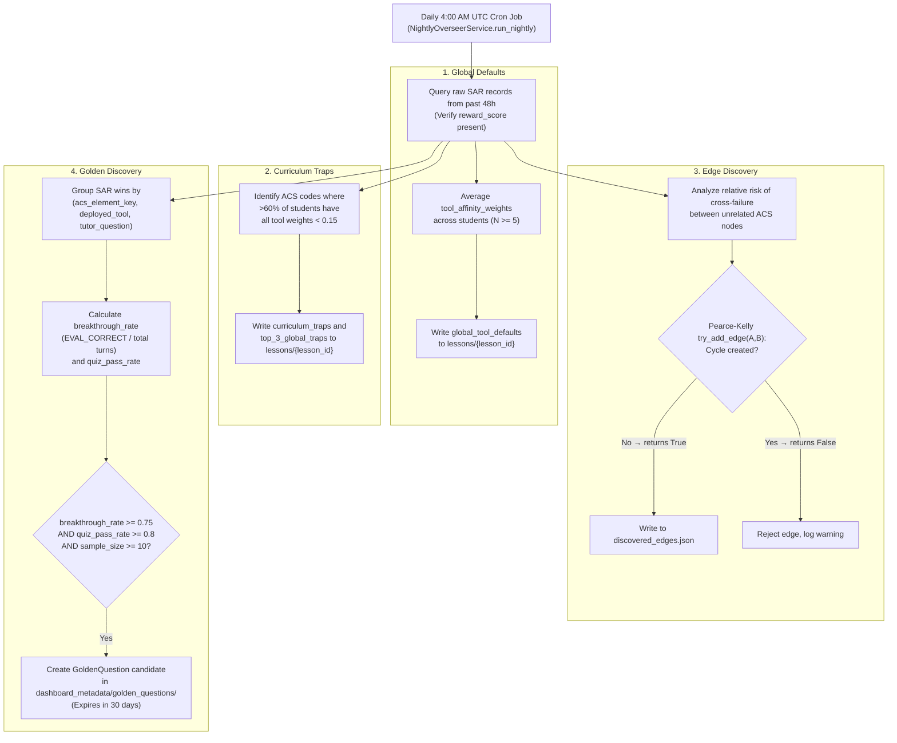
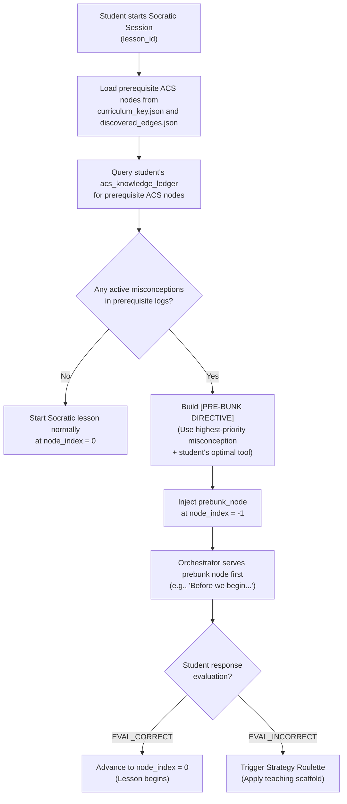
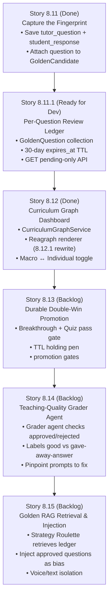

# Mission Control Admin Dashboard — Product Reference Package (PRP)

> **Version:** V1.0 (Evolution Engine & 3D Brain Map Integrated)  
> **Date:** 2026-06-01  
> **Author:** Steve Wozniak (Technical Architect) + Steve Jobs (Daniel/PO)  
> **Epic:** Epic 8 — The Self-Evolving Pedagogical Engine  
> **Status:** Released — Design Invariant Reference  

---

## 1. Executive Summary

The **Mission Control Admin Dashboard** is the command center for the self-evolving pedagogical engine. It is an internal tool built exclusively for Daniel (Product Owner) and designated Chief Flight Instructor (CFI) reviewers. It enables monitoring the student fleet, analyzing pedagogical performance, and curating the **Golden Transcript RAG Database** that feeds institutional knowledge back into our Socratic agents.

### Design Mandate
- **NASA Mission Control Ethos:** A shift from the student app's "cockpit flying" feeling to an "operator surveying the fleet from above" look.
- **Glassmorphism Theme:** Inherits the premium visual style from [ux-design-specification.md](file:///c:/Sudo_Hatter_Command/Projects/aviationChat-AGY/_bmad-output/planning-artifacts/ux-design-specification.md) (radial glows, high backdrop blur, HUD colors).
- **Expert Density:** Focuses on power, telemetry precision, and data-dense dashboards, avoiding simplified consumer-grade layouts.
- **Desktop-Primary:** Built strictly for viewports $\ge 1024\text{px}$; mobile is out of scope for V1.

---

## 2. System Overview & Core Data Flows

AviationChat tracks student progress through a deterministic curriculum engine, capturing Socratic turn-level telemetry, post-session evaluations, and nightly evolutionary batch runs. This data feeds back into the student Socratic sessions to pre-emptively scaffold weaknesses and select highly effective teaching tools.



---

## 3. Interactive Views (Operator Interface)

### View 1: Overview (Mission Control Home)
**URL:** `/admin`  
A single-glance diagnostic summary of the entire student fleet. 

#### KPI Banner Row
Four glassmorphic cards displaying core fleet health statistics:
- **Active Pilots:** Distinct students with active sessions within the past 30 days. Uses HUD Cyan radial glow.
- **Avg Fleet Mastery:** Average overall mastery percentage across the active fleet. Uses HUD Green radial glow.
- **DPE Unlock Rate:** Percentage of active pilots who reached $\ge 60\%$ ACS completion, unlocking the evaluation agent (Igor). Uses HUD Purple radial glow.
- **Regulatory Accuracy:** Ratio of verified citations to total citations issued by the Specialist agent over the past 7 days. Uses HUD Green radial glow.

#### Overview Layout Sketch
```
+-----------------------------------------------------------------------------------+
|  SIDEBAR (220px)      |   [KPI 1: ACTIVE PILOTS]  [KPI 2: AVG MASTERY]  ...       |
|                       |  -------------------------------------------------------  |
|  AviationChat MC      |   [FLEET RISK BOARD]         |  [OVERSEER INBOX]          |
|  * Overview           |   (Mini list - top 5)        |  (Count + top 1 preview)   |
|  - Fleet Risk Board   |   ---------------------------+--------------------------  |
|  - Telemetry Matrix   |   [CURRICULUM GRAPH MAP]     |  [TRANSCRIPT VAULT]        |
|  - Overseer Inbox     |   (Mini Obsidian Graph)      |  (Count + top 1 pending)   |
+-----------------------------------------------------------------------------------+
```

---

### View 2: Fleet Risk Board (Deferred to Sprint 6 / Phase B)
**URL:** `/admin/fleet`  
Designed as a pilot health ranking tool for B2B flight school administrators, sorting students by their Checkride Readiness Score (CRS) to enable early instructor intervention.

- **Student Table Columns:** Pilot Callsign and Avatar, Certificate Badge (`PPL`, `IR`), ACS Progress (5-state segmented bar), Mastery %, Readiness Score (0–100, color-coded), Last Active, Decay Alerts (expired lessons).
- **High-Risk Row Highlights (CRS < 40):** Card gets a left border of `3px solid #FF1E1E` and a subtle red radial glow.
- **Drill-down Drawer:** Clicking a row slides open an 800px profile drawer displaying the student's cognitive dossier (vocabulary level, stress resilience), ACS progress ledger, and their last 10 session transcripts.

---

### View 3: Telemetry Matrix (ACS x Tool Heatmap)
**URL:** `/admin/telemetry`  
Displays turns-to-mastery telemetry to map which Socratic tool gets students to a breakthrough fastest for each ACS code.

- **Grid Layout:** Y-Axis lists ACS lessons (34 nodes); X-Axis shows the 8 Socratic tools (Analogical, First Principles, Boundary, Contrasting Cases, Reverse Chaining, Broken Machine, Missing Link, Triage).
- **Cell Value:** Represents the average turns to mastery for that specific topic + tool pairing.
- **Cell Hover and Click:** Hovering raises a scaling neon card with a shadow glow, displaying sample size and confidence interval. Clicking pulls up a detail drawer containing historical trends over 90 days.

#### Color Scale (Turns-to-Mastery)
| Avg Turns | Color Code | Status | Meaning |
|---|---|---|---|
| **1.0 – 1.5** | `#24FF00` | HUD Green | Elite — Roulette defaults to 80→90% exploit bias (two-stage ε) |
| **1.5 – 2.5** | `#00C2FF` | HUD Blue | Good — Active in random exploration |
| **2.5 – 4.0** | `#FF9900` | HUD Amber | Below average — Candidate for Overseer check |
| **> 4.0** | `#FF1E1E` | HUD Red | Bottleneck — Pedagogy failing for this concept |
| **N < 20** | `rgba(255,255,255,0.08)` | Muted | Insufficient data threshold |

---

### View 4: Curriculum Graph Dashboard
**URL:** `/admin/map` (Story 8.12)  
An Obsidian-style 3D force graph representing the curriculum graph's structure, allowing manual selection between Macro (cohort) and Individual (single student) views.

```
       [Macro ↔ Individual]    [Select Student v]
       
               ( PA.I.C.01 )
              *             *
            *                 *
      ( PA.I.B.02 ) ──────── ( PA.I.C.02 )   <-- 3D Neon Nodes
            *                 *
              *             *
               ( PA.I.A.01 )
               
  +-------------------------------------------------------+
  | BOTTLENECK STRIP (WORST FIRST COHORT FAILURES)         |
  | 1. Cloud Clearances (32% pass)   2. Airspace (44% pass)|
  +-------------------------------------------------------+
```

#### Graph UI Interactions
1. **The Graph Canvas:** Powered by **Reagraph** (`GraphCanvas` with `hierarchicalTd` DAG layout) — client-side WebGL via three.js + @react-three/fiber, dynamic-imported with `ssr: false` behind a lightweight `WebGLErrorBoundary` (Story 8.12.1 replaced the broken `react-force-graph-3d` + Three.js-bloom stack). Displays nodes (lessons) and edges (prerequisites) with interactive pan and zoom. Node dragging is disabled (`draggable={false}`) to preserve structure.
2. **Neon Node Status Logic:**
   - **Macro Mode:** Nodes colored by cohort pass rate. Below $N = 5$ attempts, nodes stay neutral blue to prevent noise from registering as bottlenecks.
     - 🔴 `red` (`#FF1E1E`): Pass rate $< 50\%$.
     - 🔵 `blue` (`#00C2FF`): Pass rate $50\% - 80\%$ or under the $N$-floor.
     - 🟢 `green` (`#24FF00`): Pass rate $\ge 80\%$.
   - **Individual Mode:** Nodes colored by the selected student's mastery status.
     - 🔴 `red` (`#FF1E1E`): Failing.
     - 🟡 `yellow` (`#FAFF00`): In progress (seen/rote, not mastered).
     - 🟢 `green` (`#24FF00`): Mastered (application level).
     - 🔵 `blue` (`#00C2FF`): Not yet attempted.
3. **Bottleneck Strip:** Pinned to the top or bottom, displaying the 5 worst-performing nodes (lowest pass rates) first. Clicking a card refocuses the 3D camera onto that node.
4. **Node Detail Panel:** Clicking a node slides open a side panel that lazy-fetches `/api/admin/curriculum-graph/lesson/{lesson_id}`. This panel details:
   - Topic statistics (attempts, pass rates, average turns).
   - **What worked / What didn't:** Displays the exact Socratic tool + the captured question text for successful breakthrough turns vs. failed turns.
   - **Golden Candidates:** CFI-approved questions promoted for reuse on this node.

---

### View 5: Overseer Inbox
**URL:** `/admin/overseer`  
A review queue containing pending evolutionary recommendations generated by the Nightly Overseer. Daniel or a CFI reviews and merges/rejects changes before they affect the live curriculum.

#### Recommendation Card Schema
- **Header:** Stamps the run date, status (`PENDING`, `MERGED`, `REJECTED`), and source (`NIGHTLY OVERSEER`).
- **Trigger Summary:** Plain-English description of the anomaly. (e.g., *"Tool 3 (Boundary Testing) shows average 4.6 turns-to-mastery for Airspace Class B, 32% above fleet average. Recommend Roulette bias adjustment."*)
- **Proposed Diff Block:**
  ```diff
  - Current: Tool 1: 25%, Tool 2: 25%, Tool 3: 25%, Tool 4: 25%
  + Proposed: Tool 1: 40%, Tool 2: 10%, Tool 3: 35%, Tool 4: 15%
  ```
- **Actions:** Includes a `[MERGE]` button (triggers a confirmation modal warning of active student impact) and a `[REJECT]` button (dims card opacity to 50% and prompts for an audit note).

---

### View 6: Golden Transcript Vault
**URL:** `/admin/vault`  
The human-curated RAG corpus interface. It acts as an inbox for Socratic sessions flagged by the Admin Agent as "Miracle Sessions" (extremely high efficiency and low turn counts).
- **Miracle Session Card:** Lists the student callsign, topic, efficiency score, and deployed strategy. Includes a collapsible accordion containing the raw transcript.
- **Action Section:** Contains `[APPROVE FOR RAG]` (triggers the Firestore Vector DB embedding job, saving it as verified training memory) and `[REJECT]`.

---

## 4. Underlying Evolution Mechanisms (How It Works)

### 4.1 Socratic Telemetry & Grader Pipeline
Whenever a student responds to a Socratic node or Sully voice session, turn-level data is streamed to Firestore. Post-session, the Admin Agent runs asynchronously to evaluate the student's mastery transitions.



---

### 4.2 The Epsilon-Greedy RL Loop & Bipartite Reward Matrix
The Strategy Roulette dynamically selects the pedagogical tool used to guide the student.
- **Exploitation (80→90%):** Deploys the tool with the highest affinity weight in the student's dossier for this ACS code. Two-stage epsilon: 80% exploit below 50 interactions, 90% at ≥50.
- **Exploration (15%):** Randomly selects a tool from the pool to discover alternative affinities and avoid local minima.
- **Epsilon Decay:** Once the student accumulates $N \ge 50$ scored interactions, exploration drops to 10% (exploitation increases to 90%).

#### Bipartite Reward Matrix
The Admin Agent calculates the reward score post-quiz, updating the dossier's weights:
- 🟢 **Socratic Pass + Quiz Pass (`+1.0`):** Success. The tool generated durable competence.
- 🟡 **Socratic Fail/Slow + Quiz Pass (`+0.4`):** Recovery. The tool guided the student out of a major misconception.
- 🔴 **Socratic Pass + Quiz Fail (`-0.3`):** Illusion of Competence. The tool was too easy or misleading.
- ⚫ **Socratic Fail + Quiz Fail (`-1.0`):** Failure. The tool failed to resolve the concept.

---

### 4.3 Nightly Overseer Macro-Evolution
Running automatically at 4:00 AM UTC, the Nightly Overseer distills student telemetry into global curriculum updates.



#### The Labeled Question Review Ledger & Expiry TTL
Story 8.11.1 implements a dedicated question-grain ledger. Candidates nominated by the Golden Discovery pipeline land in the database as `pending` with an `expires_at` timestamp set to 30 days in the future.
- **Approved Questions:** The admin clears `expires_at` (sets to `None`). The question is kept permanently in the **RKP Teaching Ledger** for Socratic injection.
- **Rejected Questions:** The admin marks the status as `rejected`. The 30-day `expires_at` timestamp stands. Firestore's TTL policy automatically deletes the rejected document when the expiry date passes.
- **Why We Retain Rejected Items for 30 Days:** Retaining both approved and rejected items provides a labeled dataset for the **Teaching-Quality Grader Agent** (Story 8.14) to study, learning which prompts generate poor questions that give away answers.

---

### 4.4 Pre-Bunking Service Flow
Pre-bunking intercepts a student at lesson start, checking if they have active misconceptions on prerequisite nodes before serving new material.



---

## 5. Technical Invariants & Design System Extensions

### 5.1 Access Control UX Pattern (Firebase Custom Claims)
The Admin Dashboard resides inside the main Next.js app but is protected by Role-Based Access Control (RBAC) via **Firebase Custom Claims** within the same Firebase project.
- **Token Claims:** Admin accounts carry `"role": "admin"`. Student accounts default to no claim.
- **Backend Route Guard:** All `/api/v1/admin/*` endpoints use middleware that decodes the Firebase ID token and raises a 403 unless the admin claim is verified.
- **Frontend Route Guard:** Next.js middleware blocks the `(admin)` route group, redirecting unauthorized users to a restricted landing page.
- **Student View Switcher:** Pinned to the bottom of the sidebar, allowing Daniel to switch back to the cockpit-themed student view without logging out.

### 5.2 Performance & Telemetry Guards
- **Data Refresh via Polling:** To prevent cost runaways from real-time database listeners (e.g., `onSnapshot`), the dashboard uses a manual `[Refresh Data]` button combined with 60-second polling.
- **Write-Only Telemetry:** The `session_feedback_log` is write-only for Socratic agents. Agents never read it directly, protecting prompt context limits. The Socratic Planner (Agent 1) only reads the distilled `top_3_global_traps` on lesson start.

### 5.3 Privacy & PII Masking
To preserve privacy while enabling Socratic reviews, all Personally Identifiable Information is stripped at the API response layer.
- **Pseudonymous IDs:** Students are displayed as stable hash-based IDs (`Student_1049`).
- **Callsigns:** Selected callsigns (e.g., `MESA-7`) are displayed since they are non-PII and represent student identities.
- **API Isolation:** The real `uid` is never exposed to the frontend. CSV exports translate the pseudonymous ID on the backend.

### 5.4 B2B Multi-Tenancy UI Extensions (Epic 8.19.x)
To support the institutional B2B portal, the Dashboard integrates the Epic 8 Tenancy features:
- **Schools Registry & JWT Claims**: Render views specific to the flight school code embedded in the current user's JWT token.
- **Sudo-Operator Shell (`/sudoadmin`)**: A protected global state layer allowing Daniel and top-level admins to oversee all tenants, manage the global RAG ledger, and execute cross-tenant curriculum evolution.
- **Read-Only School Portal**: Flight School CFIs view a stripped-down version of the Fleet Risk Board isolated strictly to their own student cohort, with write-actions (like Golden RAG approvals) disabled via the Tenancy Gate Choke middleware.

### 5.5 Admin Design System Tokens
Extends [ux-design-specification.md](file:///c:/Sudo_Hatter_Command/Projects/aviationChat-AGY/_bmad-output/planning-artifacts/ux-design-specification.md):

```css
:root {
  --admin-sidebar-bg: rgba(10, 11, 16, 0.95);
  --admin-row-risk-high: rgba(255, 30, 30, 0.08);
  --admin-row-risk-mid: rgba(255, 153, 0, 0.08);
  --admin-merge-green: #24FF00;
  --admin-reject-red: rgba(255, 60, 60, 0.6);
  --admin-pending-amber: #FF9900;
  --admin-vault-cyan: #00C2FF;
}

.diff-block {
  background: rgba(0, 0, 0, 0.4);
  border: 1px solid rgba(255, 255, 255, 0.08);
  border-radius: 8px;
  padding: 12px 16px;
  font-family: 'JetBrains Mono', monospace;
  font-size: 12px;
  line-height: 1.6;
}
.diff-add    { color: var(--admin-merge-green); }
.diff-remove { color: var(--admin-reject-red); opacity: 0.7; }
```

---

## 6. Epic 8 Story Map & Implementation Sequence

The Self-Evolving Curriculum Engine is built incrementally across Epic 8:



---

## 7. Source-of-Truth References & Key Files

### Configuration and Data Structures
- **Curriculum Prerequisite Mapping:** [curriculum_key.json](file:///c:/Sudo_Hatter_Command/Projects/aviationChat-AGY/backend/data/curriculum_key.json)
- **Auto-Discovered Prerequisites:** [discovered_edges.json](file:///c:/Sudo_Hatter_Command/Projects/aviationChat-AGY/backend/data/discovered_edges.json)
- **Master Evolution Schemas:** [evolution.py](file:///c:/Sudo_Hatter_Command/Projects/aviationChat-AGY/backend/schemas/evolution.py)
- **Cognitive Dossier Models:** [cognitive_dossier.py](file:///c:/Sudo_Hatter_Command/Projects/aviationChat-AGY/backend/schemas/cognitive_dossier.py)

### Backend Logic & Services
- **Telemetry Extraction & Evaluator:** [agent.py](file:///c:/Sudo_Hatter_Command/Projects/aviationChat-AGY/backend/agents/admin/agent.py)
- **Telemetry Prompts:** [prompts.py](file:///c:/Sudo_Hatter_Command/Projects/aviationChat-AGY/backend/agents/admin/prompts.py)
- **Pre-Bunking Engine:** [prebunk_service.py](file:///c:/Sudo_Hatter_Command/Projects/aviationChat-AGY/backend/services/prebunk_service.py)
- **Bipartite Scoring:** [reward_service.py](file:///c:/Sudo_Hatter_Command/Projects/aviationChat-AGY/backend/services/evolution/reward_service.py)
- **Epsilon-Greedy Weights Service:** [affinity_service.py](file:///c:/Sudo_Hatter_Command/Projects/aviationChat-AGY/backend/services/evolution/affinity_service.py)
- **Nightly Aggregation Batch:** `backend/services/evolution/nightly_overseer.py`
- **Admin Evolution API Router:** [admin_evolution.py](file:///c:/Sudo_Hatter_Command/Projects/aviationChat-AGY/backend/routers/admin_evolution.py)
- **Graph Telemetry Service:** `backend/services/curriculum_graph_service.py`
- **Graph API Router:** `backend/routers/admin_dashboard.py`

### Frontend Components
- **Dashboard Overview Entry:** `frontend/src/app/admin/page.tsx`
- **3D Curriculum Canvas wrapper:** [CurriculumBrainGraph.tsx](file:///c:/Sudo_Hatter_Command/Projects/aviationChat-AGY/frontend/src/components/admin/CurriculumBrainGraph.tsx)
- **Curriculum Dashboard container:** [CurriculumMap.tsx](file:///c:/Sudo_Hatter_Command/Projects/aviationChat-AGY/frontend/src/components/admin/CurriculumMap.tsx)
- **Drill-down Panel:** [CurriculumNodeDetail.tsx](file:///c:/Sudo_Hatter_Command/Projects/aviationChat-AGY/frontend/src/components/admin/CurriculumNodeDetail.tsx)
