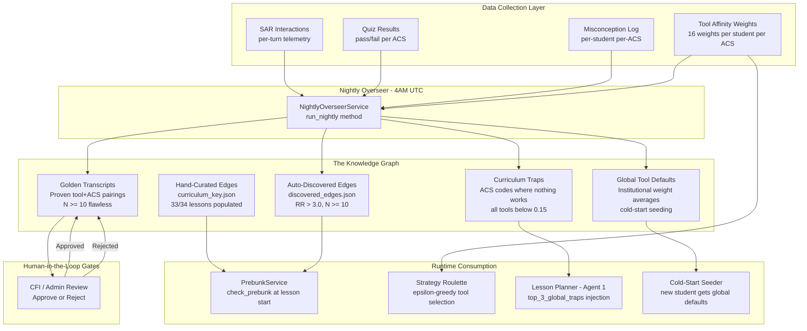
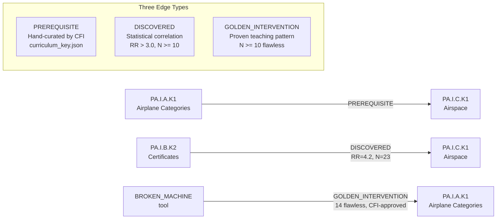
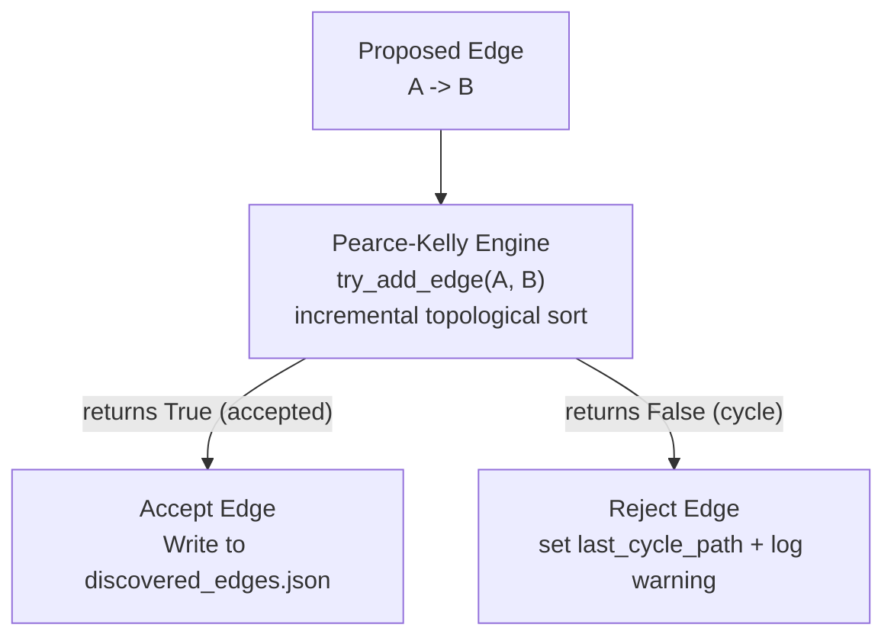
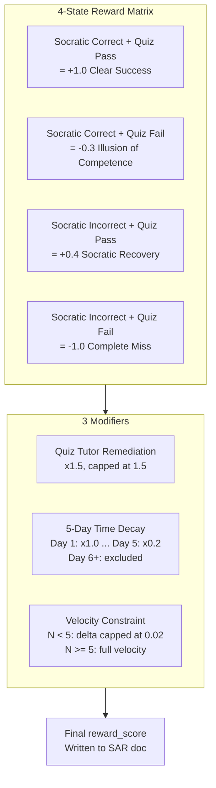
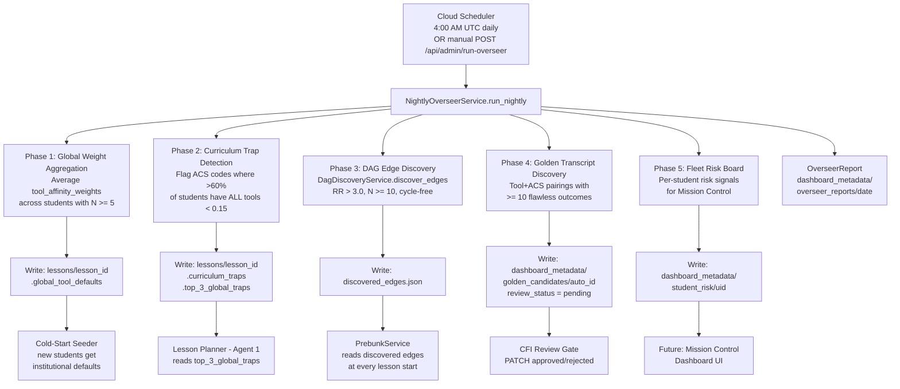
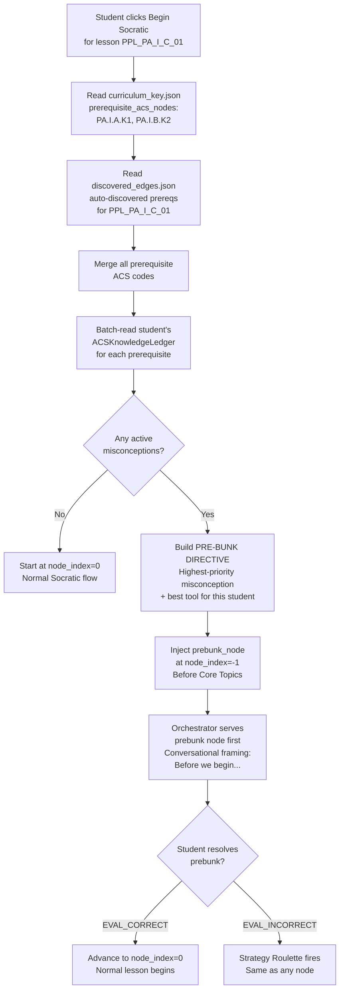
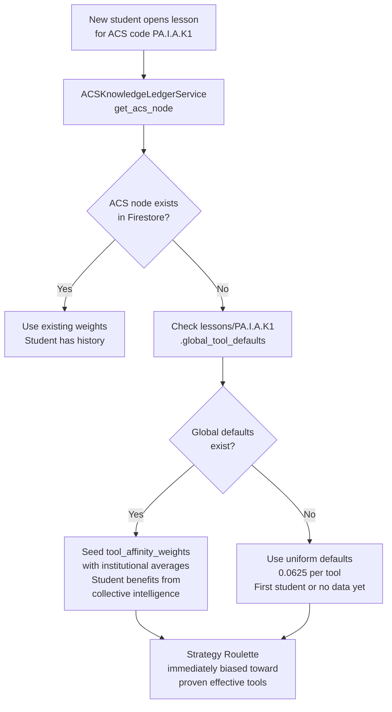
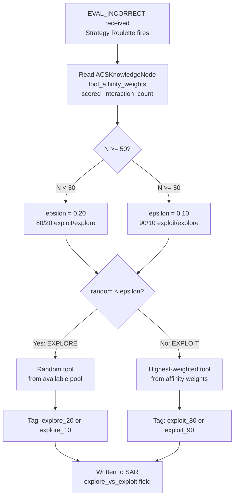
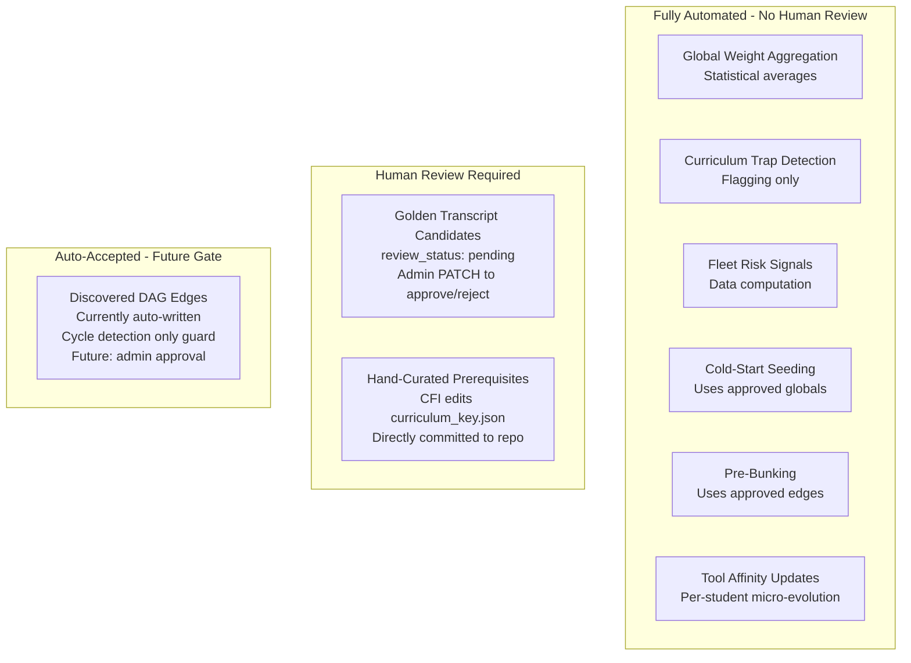
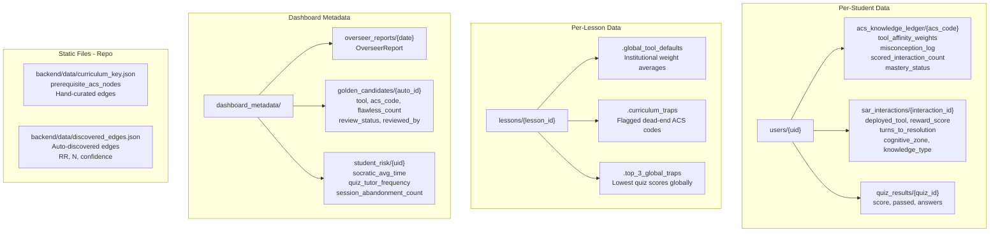

# AviationChat Graph RAG Architecture — Product Requirements Package

**Version:** 1.0
**Date:** 2026-05-27
**Author:** Steve Wozniak (Architecture)
**Status:** 📋 Draft for Review

---

## 1. Executive Summary

The AviationChat Graph RAG is a **self-improving prerequisite knowledge graph** that connects ACS concepts through empirically discovered pedagogical relationships. Unlike traditional Graph RAG (which uses Neo4j/vector stores for retrieval), our graph is a **curriculum intelligence layer** — it doesn't retrieve documents, it **routes students through corrective interventions** before they hit known knowledge gaps.

The graph has three growth channels:
1. **Hand-Curated Edges** — CFI-authored prerequisite relationships in `curriculum_key.json`
2. **Auto-Discovered Edges** — Statistical correlations from cross-student failure data
3. **Golden Transcripts** — Proven teaching strategies promoted to permanent intervention nodes

All automated growth is gated by **human-in-the-loop review** before affecting the live curriculum.

---

## 2. System Overview

---

## 3. The Graph Topology

### 3.1 Nodes (ACS Concepts)

Every node in the graph is an **ACS Knowledge Point** — one of the ~100 knowledge elements tracked across the 34 PPL lessons.

| Field | Source | Example |
|---|---|---|
| `acs_code` | `curriculum_key.json` | `PA.I.A.K1` |
| `lesson_id` | `curriculum_key.json` | `PPL_PA_I_A_01` |
| `knowledge_type` | **NEW — Universal Taxonomy** | `RECALL_FACTUAL` |
| `mastery_status` | Per-student ledger | `seen`, `rote_level`, etc. |
| `tool_affinity_weights` | Per-student, 16 tools | `{ANALOGICAL_BRIDGING: 0.12, ...}` |
| `misconception_log` | Per-student, rolling 10 | Recent knowledge gaps |
| `scored_interaction_count` | Per-student | Drives epsilon decay |

### 3.2 Edge Types

| Edge Type | Source | Trust Level | Growth Channel |
|---|---|---|---|
| `PREREQUISITE` | `prerequisite_acs_nodes` in `curriculum_key.json` | **High** — human authored | Manual (CFI edits JSON) |
| `DISCOVERED` | `DagDiscoveryService` — relative risk analysis | **Medium** — statistical | Nightly batch, cycle-checked |
| `GOLDEN_INTERVENTION` | `NightlyOverseerService` — reward aggregation | **High after approval** | Nightly batch + **CFI review gate** |

### 3.3 Cycle Prevention

Every new edge — whether auto-discovered or manually added — passes through the **incremental
Pearce-Kelly** topological sort (`PearceKellyEngine.try_add_edge`, Story 8.18), which keeps the graph
a **Directed Acyclic Graph** at all times. The engine bootstraps from `PREREQ_MAP` +
`discovered_edges.json`, accepts forward edges in O(1), and **returns `False` on a cycle — it never
raises in the hot path** (the un-guarded `_filter_cycles` call site relies on this). At small scale
this is equivalent to the original batch Kahn's sort; at multi-certificate scale (IR/CPL/ATP →
thousands of nodes) the incremental approach is what scales.

---

## 4. Data Collection Layer — What We Capture

### 4.1 SAR Interactions (per-turn)

Written by `_write_sar_telemetry()` in the Specialist orchestrator on every Socratic turn.

| Field | Type | Purpose | Story |
|---|---|---|---|
| `user_id` | string | Student identifier | 8.1 |
| `session_id` | string | Session correlation | 8.1 |
| `lesson_id` | string | Which lesson | 8.1 |
| `acs_element_key` | string | Which ACS concept | 8.1 |
| `deployed_tool` | string | Which teaching tool was used | 8.1 |
| `evaluation` | string | `EVAL_CORRECT`, `EVAL_INCORRECT`, etc. | 8.1 |
| `confusion_score` | float | How confused the student seemed | 8.1 |
| `turns_to_resolution` | int | How many turns to resolve | 8.1 |
| `reward_score` | float | Bipartite reward (-1.0 to +1.5) | 8.1 |
| `reward_status` | string | `pending` / `scored` | 8.1 |
| `explore_vs_exploit` | string | `explore_20` / `exploit_80` / `exploit_90` | 8.2 |
| `is_quiz_tutor_remediation` | bool | Was this a retry teaching session | 8.1 |
| `pre_bunk_active` | bool | Auto-derived from `node_index == -1` | 8.3 |
| `cognitive_zone` | string | `zone_1` / `zone_2` / `zone_3` | 4.32 |
| `wall_clock_response_ms` | int | Student response latency | 8.1 |
| `created_at` | datetime | SAR creation timestamp | 8.1 |

**Firestore path:** `users/{uid}/sar_interactions/{interaction_id}`

### 4.2 Bipartite Reward Matrix

The reward connects teaching effectiveness to quiz outcomes:

### 4.3 Tool Affinity Weights (per-student, per-ACS)

16 normalized weights on `ACSKnowledgeNode.tool_affinity_weights`:

| Tool Pool | Tools | Count |
|---|---|---|
| **Text** (Specialist Socratic) | `ANALOGICAL_BRIDGING`, `FIRST_PRINCIPLES`, `BOUNDARY_TESTING`, `CONTRASTING_CASES`, `REVERSE_CHAINING`, `BROKEN_MACHINE`, `MISSING_LINK`, `TRIAGE` | 8 |
| **Voice** (Sully CFI) | `CONSEQUENCE_ENGINE`, `DEVILS_ADVOCATE`, `PROTEGE_EFFECT`, `COLLOQUIAL_VALIDATION`, `SCENARIO_EXTENSION`, `KNOWLEDGE_ANCHORING`, `PERSPECTIVE_SHIFT`, `CONFIDENCE_CALIBRATION` | 8 |

**Invariants:** Sum = 1.0 | Floor = 0.01 (no permanent tool death) | Renormalized after every update

---

## 5. Nightly Overseer — The Macro-Evolution Engine

---

## 6. Runtime Consumption — How the Graph Serves Students

### 6.1 Pre-Bunking Pipeline (Lesson Start)

### 6.2 Cold-Start Seeding (New Student)

### 6.3 Epsilon-Greedy Tool Selection

---

## 7. Human-in-the-Loop Review Gates

### Review Workflow — Golden Transcripts

| Step | Actor | Action |
|---|---|---|
| 1 | **Nightly Overseer** | Discovers tool+ACS pairing with >= 10 flawless outcomes (reward=1.0, turns<=3) |
| 2 | **System** | Writes to `dashboard_metadata/golden_candidates/{id}` with `review_status: "pending"` |
| 3 | **Admin/CFI** | `GET /api/admin/golden-candidates` — reviews pending list |
| 4 | **Admin/CFI** | `PATCH /api/admin/golden-candidates/{id}` — approves or rejects |
| 5 | **System** | Approved candidates become permanent institutional knowledge |

> [!IMPORTANT]
> **No automated curriculum changes fire without human review.** The Overseer produces recommendations. Humans decide.

---

## 8. Universal Knowledge Type Taxonomy

Every node, edge, and SAR record carries a `knowledge_type` field classifying the **cognitive demand** — NOT the subject matter.

| `knowledge_type` | What The Brain Does | Aviation Example | Portable To |
|---|---|---|---|
| `RECALL_FACTUAL` | Retrieve a number, limit, or definition | "Class B visibility minimums?" | Medical licensing, Bar exam |
| `CONCEPTUAL_WHY` | Explain WHY a principle works | "Why does density altitude reduce performance?" | Engineering, Physics |
| `PROCEDURAL` | Execute ordered steps correctly | "Engine failure on takeoff checklist" | Nursing protocols, IT ops |
| `APPLIED_JUDGMENT` | Decide under competing pressures | "Engine out at 500 AGL — what do you do?" | Emergency medicine, Law |
| `REGULATORY` | Know the rule, cite the source | "14 CFR 61.113 limitations" | Legal compliance, Finance |
| `RISK_ASSESSMENT` | Identify what could go wrong | "Hazards in this METAR" | Cybersecurity, Construction |
| `SYSTEMS_INTEGRATION` | Connect how parts interact | "How pitot-static feeds instruments" | Software architecture |
| `HUMAN_FACTORS` | Recognize how humans fail | "Hazardous attitudes, ADM, CRM" | Healthcare, Military |

### Why This Matters (Tier 4 Monetization Unlock)

A student who struggles with `REGULATORY` recall in PPL will struggle with it in medical licensing. The affinity weights can be seeded from cross-domain `knowledge_type` performance — making the **entire Evolution Engine portable across verticals**.

---

## 9. Firestore Data Model

---

## 10. File Inventory — Current State

| File | Status | Role in Graph RAG |
|---|---|---|
| [curriculum_resolver.py](file:///c:/Sudo_Hatter_Command/Projects/aviationChat-AGY/backend/utils/curriculum_resolver.py) | ✅ Built | Loads `PREREQ_MAP` from `curriculum_key.json` at import time |
| [prebunk_service.py](file:///c:/Sudo_Hatter_Command/Projects/aviationChat-AGY/backend/services/prebunk_service.py) | ✅ Built (8.3) | Runtime pre-bunk check — reads both edge sources |
| [dag_discovery_service.py](file:///c:/Sudo_Hatter_Command/Projects/aviationChat-AGY/backend/services/evolution/dag_discovery_service.py) | ✅ Built (8.3) | Auto edge discovery — RR analysis + Pearce-Kelly incremental cycle detection (8.18; `try_add_edge` returns `False` on cycle, bootstraps from `PREREQ_MAP`) |
| [reward_service.py](file:///c:/Sudo_Hatter_Command/Projects/aviationChat-AGY/backend/services/evolution/reward_service.py) | ✅ Built (8.1) | Bipartite reward scoring — feeds affinity updates |
| [affinity_service.py](file:///c:/Sudo_Hatter_Command/Projects/aviationChat-AGY/backend/services/evolution/affinity_service.py) | ✅ Built (8.2) | Per-student tool weight updates with velocity constraints |
| [cognitive_dossier.py](file:///c:/Sudo_Hatter_Command/Projects/aviationChat-AGY/backend/schemas/cognitive_dossier.py) | ✅ Built | `ACSKnowledgeNode` with 16-tool weights, migration validators |
| [lesson_plan.py](file:///c:/Sudo_Hatter_Command/Projects/aviationChat-AGY/backend/schemas/lesson_plan.py) | ✅ Built | `prebunk_node` field on `LessonPlan` |
| [lesson_planner/agent.py](file:///c:/Sudo_Hatter_Command/Projects/aviationChat-AGY/backend/agents/specialist/sub_agents/lesson_planner/agent.py) | ✅ Built | Reads `top_3_global_traps` at plan generation |
| `backend/services/evolution/nightly_overseer.py` | 🔜 Story 8.4 | Batch aggregation — the macro-evolution brain |
| `backend/schemas/evolution.py` | 🔜 Story 8.4 | `OverseerReport`, `GoldenCandidate`, `StudentRisk` schemas |
| `backend/routers/admin_evolution.py` | 🔜 Story 8.4 | Admin API for manual trigger + Golden Transcript review |

---

## 11. What Story 8.4 Completes

| Capability | Without 8.4 | With 8.4 |
|---|---|---|
| Pre-bunking | ✅ Works with hand-curated edges only | ✅ Works with hand-curated + auto-discovered |
| Edge discovery | Code exists, never called | ✅ Called nightly at 4AM |
| Golden Transcripts | Not tracked | ✅ Discovered, nominated, gated by CFI review |
| Cold-start seeding | Uniform 0.0625 for all new students | ✅ Global institutional defaults |
| Curriculum traps | Unknown | ✅ Flagged and written to `top_3_global_traps` |
| Fleet risk | No data | ✅ Per-student risk signals computed |
| Admin visibility | None | ✅ 4 REST endpoints for oversight |

---

## 12. Future Extensions (Not in Story 8.4)

| Extension | Description | Dependency |
|---|---|---|
| `knowledge_type` taxonomy | Add cognitive demand tags to `SocraticNode`, SAR, edges | Schema migration story |
| **Curriculum Graph Dashboard** | 3D neon "brain" graph of the 34-lesson DAG + macro↔individual toggle + click-to-read panel showing the tools & questions that worked vs. didn't | **Story 8.12** (depends on 8.11) |
| Cross-vertical seeding | Port `knowledge_type` affinities across certificates | Multi-certificate architecture |
| Neo4j / graph DB | Move from JSON edges to a proper graph database | Scale trigger (~10K students) |
| Discovered edge review gate | Admin approval before auto-edges go live | Admin UI story |

> [!IMPORTANT]
> **Known capture gap (2026-06-01) — Story 8.11.** The Golden RAG's core unit, the Pedagogical
> Fingerprint (`tool` + **`tutor_question`** + outcome), is **designed but not captured in code**.
> SAR persists `deployed_tool` and `reward_score` but **not** the question text or the student's
> words; `GoldenCandidate` groups by `(tool, acs)` only. So today the graph can show *which tools*
> worked, but not *the questions that worked*. **Story 8.11 (Golden RAG Pedagogical Fingerprint
> Capture)** fixes the capture + widens the Overseer grouping; **Story 8.12** renders it. See
> `admin_agent_dag_prp.md` §5.2 / §5.5 for the corrected implementation status.

### Epic 8 — Golden RAG Story Map (2026-06-01)

| Story | Scope | Status |
|---|---|---|
| **8.11** | Capture the winning fingerprint (tool + question + student response) on breakthrough turns — *start small* | ready-for-dev |
| **8.12** | Admin Curriculum Graph Dashboard — 3D neon "brain" map, macro↔individual toggle, click-to-read worked/didn't panel | ready-for-dev |
| **8.13** | Durable **"double win"** promotion (turn breakthrough **+** quiz-confirmed +1.0) — TTL holding-pen, loss-count denominators, `breakthrough_rate` gate | backlog |
| **8.14** | **Automated Teaching-Quality Grader** — agent grades winning questions (good Socratic vs. gave-away-answer), records verdicts → which prompts/tools to fix | backlog |
| **8.15** | **Golden RAG retrieval & injection** — reuse CFI-approved proven questions as Socratic bias; `knowledge_type` tagging; voice/text isolation; optional vector store | backlog |
