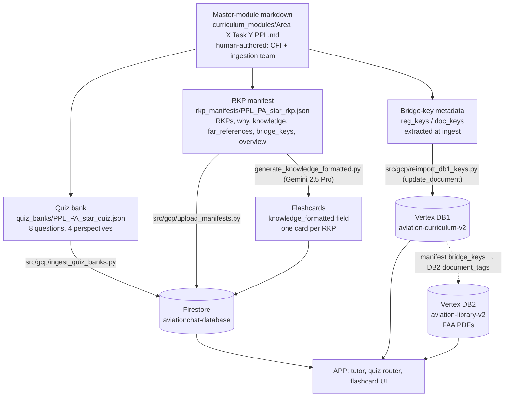
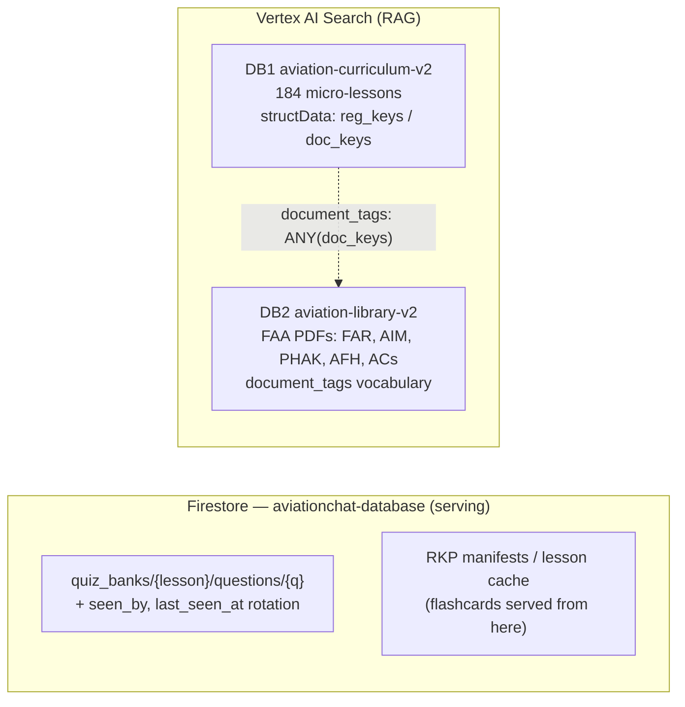
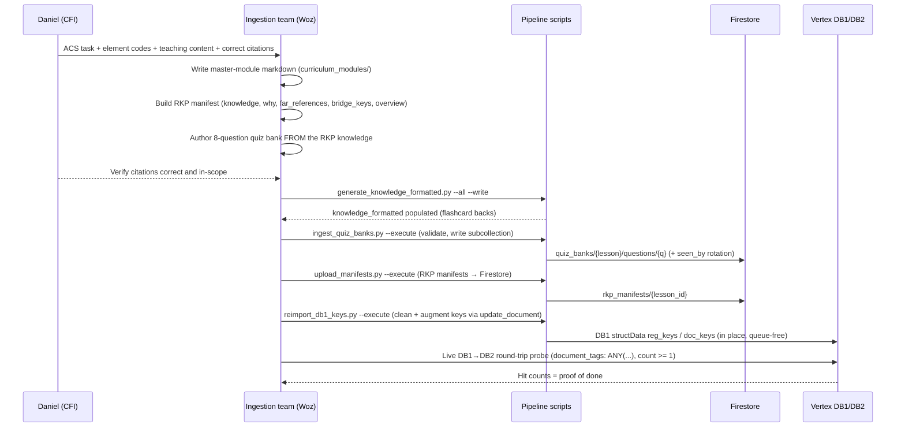
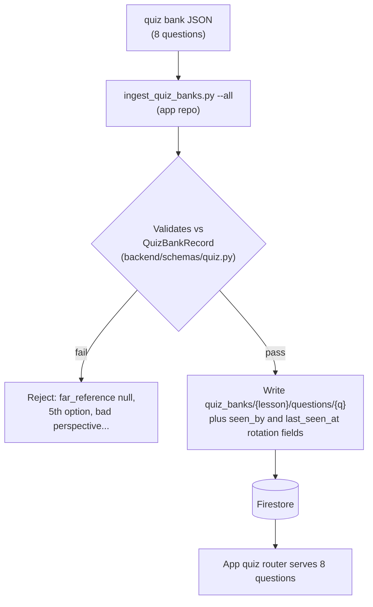
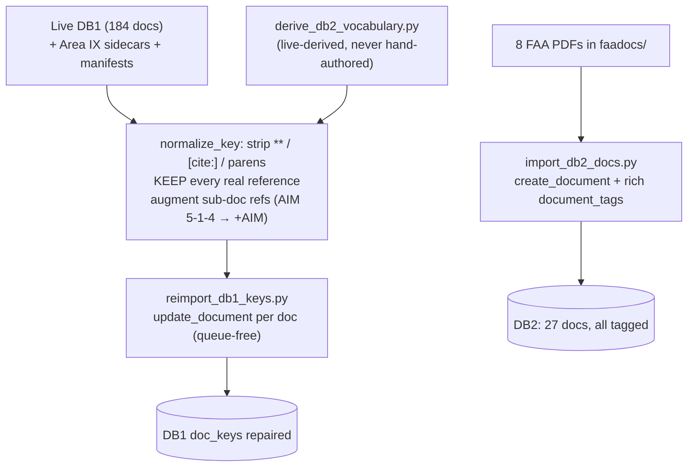
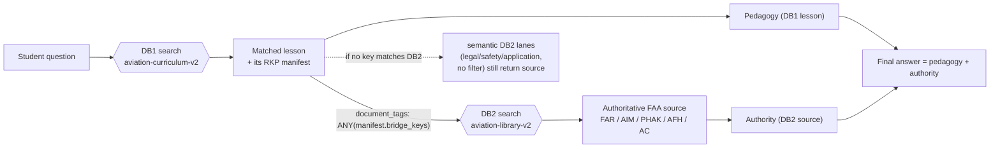
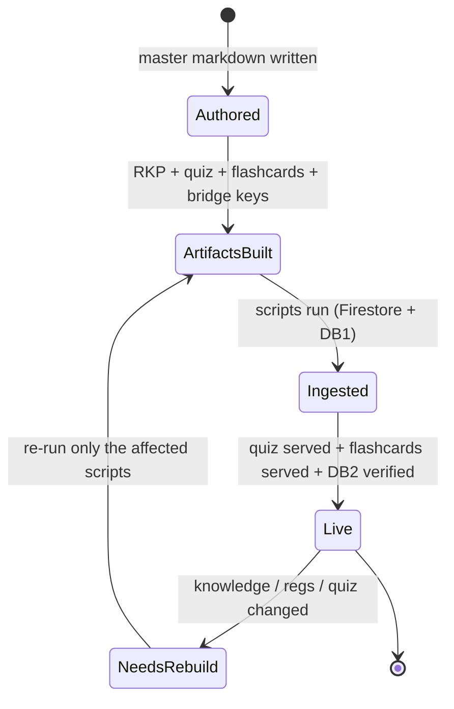
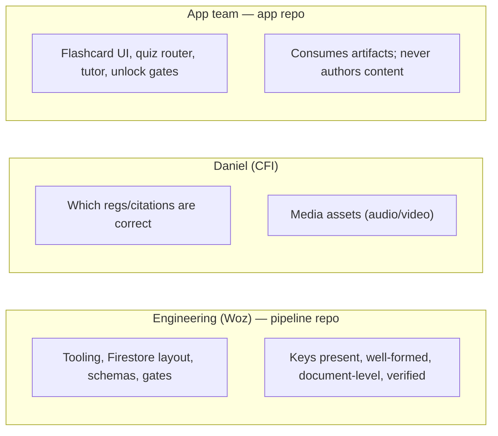

# Master Curriculum & Ingestion Pipeline — PRD

> **What this is.** One authoritative document that explains *how a PPL lesson is made, ingested, and
> consumed* — the artifacts, the tools, the data stores, the flow, and the contracts. It is both a product
> requirements doc and a visual walkthrough (mermaid diagrams throughout) so the whole system can be
> understood end to end.
>
> **v2.8 (2026-06-19): the RAG layer is wired and the bridge is live — 48/48 lessons return DB2 hits.**
> Everything below was measured against the **live** Vertex/Firestore stores. This corrects the earlier
> 2026-06-16 v2.8 draft, which described a phantom production tool, an in-progress remediation, and a hard DB2-vocab gate — none of which
> match reality. See §13 for the verified current state and the operational gotchas that cost us hours.
>
> **How to read it:** §1–§3 are the mental model. §4–§7 are the full walkthrough (make a lesson → ingest →
> how it connects at runtime) with diagrams. §8–§12 are the reference (tools, schemas, ownership, current
> state, gates). If you read nothing else, read §3 (the big picture diagram) and §6 (making a lesson).

---

## 1. Vision & purpose

We are building the **knowledge spine** for an AI flight instructor. Every PPL lesson must be:

- **Teachable** — a student studies flashcards (from RKPs) and a narrative overview, then proves mastery
  on a quiz.
- **Verifiable** — when the AI tutor answers a question, it grounds the answer in the *actual FAA source*
  (FAR/AIM/PHAK/AFH/AC), not just the lesson prose. That grounding is the **bridge-key / DB1→DB2** hop.
- **Maintainable** — one canonical source (this pipeline repo) that multiple app branches pull from, with
  every derived artifact rebuildable from the master module by a script.

The pipeline's job is to turn a CFI's teaching content into the machine artifacts the app consumes, and to
**guarantee** (with schema gates and live probes) that nothing ships dark or unverifiable.

### Goals
1. Every lesson serves a valid **8-question quiz** from the per-lesson Firestore subcollection.
2. Every lesson carries non-empty, document-level **bridge keys** that return real DB2 hits.
3. Every lesson renders **flashcards** from its RKP `knowledge`.
4. The pipeline is **idempotent, gated, and provable** — re-runs are safe, bad data fails loud, and "done"
   means measured hit counts, not "no error."

### Non-goals
- The app's UI/serving (flashcard flip, quiz router, tutor, unlock gates) — owned by the app team.
- Media production (audio/video) — a separate process owned by Daniel; the manifest only references the
  filenames.
- Deciding *which* citation is correct — that's the CFI's call; engineering owns that the key is present,
  well-formed, and verified.

---

## 2. Key concepts in 60 seconds

| Term | Meaning |
|---|---|
| **Master-module markdown** | The human-authored lesson source (`curriculum_modules/Area X Task Y PPL.md`). Everything derives from it. |
| **RKP** | "Required Knowledge Point" — one atomic teaching fact. A lesson's RKP manifest holds 3–5 RKPs + a narrative overview. One RKP → one flashcard. |
| **Quiz bank** | 8 questions per lesson (2 legal / 2 safety / 2 application / 2 risk_management-SJT), authored *from* the RKP `knowledge`. |
| **Bridge keys** | `reg_keys` + `doc_keys` — document-level tokens (`14 CFR 91`, `FAA-H-8083-25C`, `AIM`, `AC 61-98D`) that link a DB1 lesson to its DB2 FAA source. |
| **DB1** | Vertex AI Search store `aviation-curriculum-v2` — the 184 teaching micro-lessons. |
| **DB2** | Vertex AI Search store `aviation-library-v2` — the FAA PDF library (verification). |
| **Firestore** | `aviationchat-database` — serves quizzes (`quiz_banks/{lesson}/questions/{q}`) and RKP/flashcard data. |
| **Pipeline repo** | THIS repo — canonical authoring + ingestion tooling. |
| **App repo** | `AGY_AVIATIONCHAT` — consumes our artifacts; owns the real quiz schema + quiz-ingest tool. |

---

## 3. System overview (the big picture)

Everything flows from the master module into three machine artifacts, then into two data stores the app
reads.

**Read it as:** one source (top) → three artifacts (RKP, quiz, bridge keys) → flashcards are a 4th derived
from the RKP → two stores (Firestore for serving, Vertex DB1/DB2 for RAG) → the app consumes all three.

---

## 4. Data store topology — what lives where

- **Firestore** answers "give me this lesson's quiz / flashcards" — fast, per-lesson reads.
- **DB1** answers "which lesson is this student question about?" and carries the bridge keys.
- **DB2** answers "what does the FAA actually say?" — filtered by the matched lesson's `doc_keys`.

---

## 5. The seven artifacts per lesson

| # | Artifact | Lives in | Built by | Governing guide |
|---|---|---|---|---|
| 1 | Master-module markdown | `curriculum_modules/` | Human (CFI + team) | `rkp_creation_guide.md` §4 |
| 2 | RKP manifest | `rkp_manifests/*_rkp.json` | Team (hand) | `rkp_creation_guide.md` |
| 3 | Flashcards (`knowledge_formatted`) | field in the RKP manifest | `generate_knowledge_formatted.py` (Gemini 2.5 Pro) | `flashcard_creation_guide.md` |
| 4 | Quiz bank | `quiz_banks/*_quiz.json` | Team (hand, from RKP knowledge) | `quiz_authoring_guide.md` |
| 5 | Bridge keys | DB1 `structData.doc_keys` (display refs) + DB2 `document_tags` (match target) + manifest `bridge_keys` (what the app filters on) | `reimport_db1_keys.py` / `import_db2_docs.py` / `upload_manifests.py` | `bridge_key_guide.md` (v2.8) |
| 6 | Media (audio/video/notes) | referenced in manifest | separate process / Daniel | — (out of team scope) |
| 7 | Curriculum Key (ACS entries) | curriculum key | Team (manual) | — |

---

## 6. WALKTHROUGH — how we make a lesson

This is the authoring loop, start to finish.

### 6.1 The narrative

1. **Daniel (CFI) provides the inputs:** which ACS Area/Task and element codes the lesson covers, the raw
   teaching content per knowledge point, the correct FAA citations, and a lesson title. (He can hand full
   content, or just topic + codes and let the team draft from the existing module markdown.)
2. **The team writes the master-module markdown** in `curriculum_modules/` — the single source. It names
   the regs and FAA documents explicitly (in a clean `Bridge Keys` block) because the metadata extractor
   reads that.
3. **The team builds the RKP manifest** (`*_rkp.json`): 3–5 RKPs, each with `title`, `why`, `knowledge`
   (the textbook-complete source of truth — *never* auto-modified), `acs_elements`, `far_references`, and
   document-level `bridge_keys`; plus a 500–1000 word `lesson_overview`. `knowledge_formatted` is left
   empty.
4. **The team authors the 8-question quiz bank** *from the RKP `knowledge`* (the two-way contract): every
   correct answer must trace to a sentence the student actually studied. 2 legal / 2 safety / 2 application
   / 2 risk_management (SJT). Citations must be in-scope.
5. **Daniel verifies the citations** are correct and in-scope (the one human gate — engineering never
   guesses a reg).
6. **Run the flashcard formatter:** `generate_knowledge_formatted.py` turns each `knowledge` field into
   scannable card-back markdown with Gemini 2.5 Pro. It writes only `knowledge_formatted`.
7. **Ingest** (see §7): quizzes → Firestore; bridge keys → DB1.
8. **Prove it:** quiz serves 8 questions in the app; the DB1→DB2 round-trip returns real hits. Only then is
   the lesson "done."

### 6.2 The authoring sequence

### 6.3 The reverse contract (why order matters)

The quiz is authored *from* the RKP, so a testable fact must live in a `knowledge` field, **not** only in
the `lesson_overview`. If you want a question and the supporting fact isn't in `knowledge`, you **enrich the
RKP**, you don't invent the test. Likewise, editing a `knowledge` fact ripples to both the flashcard back
(re-run the formatter) and the quiz (re-check the answers/distractors). See §9.

---

## 7. WALKTHROUGH — ingestion (the two paths)

Two artifacts get ingested by two different tools into two different stores.

### 7.1 Quiz ingestion → Firestore

The app reads quiz questions from a **per-question subcollection**. The correct tool validates against the
real Pydantic schema and writes that layout, idempotently (keyed by question id).

**Schema gates (the real ones):** `far_reference` is a required string (so `null` fails, `""` passes);
`options` is 3–4 (a 5th option fails); `perspective` is one of `legal/safety/application/risk_management`;
`correct_answer` is normalized to a `correct` flag with **no positional rule** (the old "SJT answer must be
D" was a wrong tool's invention — retired). The deprecated `upload_quiz_banks.py` wrote the wrong layout and
is **deleted**.

### 7.2 Bridge keys → DB1 / DB2 (the verified mechanism)

The bridge has three key-bearing layers; getting them aligned is the whole job. The live DB1 was built by
the LLM extractor (`generate_metadata.py`), so its `structData` carries `type`/`ancestral_context` —
we **repair its keys in place** rather than rebuild.

**Why direct writes, not import:** Vertex `ImportDocuments` runs serially per store, and a failed op jams
the queue (cancel is not honored). `update_document` (DB1 key fix — metadata-only) and `create_document`
(new DB2 docs) bypass that queue entirely. (See §13 gotchas.)

**Edition bridging (no app change):** the app filters DB2 with an **exact** `document_tags: ANY(...)`, so
`AC 61-98D` ≠ `AC 61-98E`. `import_db2_docs.py` solves it by **rich-tagging** each DB2 doc with {exact,
family, every curriculum edition variant} — so the PHAK doc carries both `FAA-H-8083-25` and
`FAA-H-8083-25C`. Keys absent from DB2 are kept as student-facing references; the schema cleans, it does
not hard-reject.

---

## 8. WALKTHROUGH — how it all connects at runtime (the RAG hop)

This is *why* bridge keys matter. When the AI tutor answers, pedagogy comes from DB1 and authority from DB2,
joined by the matched lesson's bridge keys.

> **Key fact (verified in `app: backend/tools/librarian.py:246`):** the strict hop filters on the **RKP
> manifest's `bridge_keys`** against DB2 `document_tags` — not on DB1 `structData.doc_keys`. The DB1
> `doc_keys` are a parallel display-side reference set. The bridge-hop lane is one of several DB2 lanes;
> the others are unfiltered semantic search, so a missed strict match degrades targeting, it is not a
> verification blackout.

The flashcards and quizzes connect on the **learning** side: the student studies the flashcards (RKP
`knowledge_formatted`), then the quiz (authored from the same `knowledge`) gates mastery. Same source of
truth, three consumers (tutor, flashcards, quiz).

---

## 9. Upkeep cascade — one edit, these ripples

A lesson is never "done forever" — changing a fact forces specific rebuilds. This is the maintenance
contract.

| You change... | ...you must re-run |
|---|---|
| An RKP `knowledge` field | the flashcard formatter (card back) **and** re-check that RKP's quiz questions |
| The master module's named sources (regs/docs) | regenerate metadata → re-import to DB1 → **prove the DB1→DB2 hit** |
| A quiz bank | re-ingest with `ingest_quiz_banks.py` (never the deleted tool) |
| Add a brand-new lesson | all of the above **plus** the Curriculum Key entry |

---

## 10. Tooling reference

All pipeline tools resolve paths via `src/config.py` (no hardcoded machine paths) and every live-write
tool is **gated** — dry run by default, `--execute` to write.

| Tool | Repo | Purpose | Notes |
|---|---|---|---|
| `curriculum_components/scripts/generate_knowledge_formatted.py` | pipeline | RKP `knowledge` → `knowledge_formatted` | Gemini 2.5 Pro; never edits `knowledge` |
| `scripts/derive_db2_vocabulary.py` | pipeline | live DB2 → `DB2_VOCABULARY` token set | re-run after any DB2 change; paste into `schema.py` |
| `src/utils/db2_tags.py` | pipeline | `extract_tags` (filename → tag) | single source of truth for DB2 tags |
| `src/utils/schema.py` | pipeline | normalize/clean/family-match + `DB2_VOCABULARY` | `clean_keys` strips corruption, keeps refs; coverage is a report, not a hard reject |
| `src/utils/generate_metadata.py` | pipeline | LLM metadata extractor (new lessons) | Gemini 2.5 Flash; `--offline` reuses validated sidecars |
| `src/gcp/import_db2_docs.py` | pipeline | add FAA PDFs to DB2 + rich `document_tags` | `create_document` (queue-free); 200 MB/doc cap → split big PDFs |
| `src/gcp/reimport_db1_keys.py` | pipeline | repair DB1 keys in place | `update_document` per doc (queue-free); clean + augment + Area IX fill |
| `src/gcp/upload_manifests.py` | pipeline | RKP manifests → Firestore `rkp_manifests` | gated |
| `src/gcp/ingest_quiz_banks.py` | pipeline | quiz banks → Firestore `quiz_banks/{lesson}/questions/{q}` | gated; `seen_by`/`last_seen_at` rotation; merge upsert |
| `src/gcp/probe_bridge_hop.py` | pipeline | live DB1→DB2 round-trip proof | read-only; asserts ≥1 hit per lesson |
| `src/tests/` | pipeline | offline gate (33 tests) | schema + bridge-key cleanliness; `pytest src/tests/` |

---

## 11. Schemas & contracts (the gates)

**Quiz (`backend/schemas/quiz.py`, app repo) — `QuizBankQuestion`:** `perspective ∈
{legal,safety,application,risk_management}`; `question_type ∈ {mcq,sjt}`; `options` 3–4 each with
`label ∈ {A,B,C,D}`; `far_reference: str` (required); `correct_answer` normalized to `correct=True` on the
matching option (no positional rule). `QuizBankRecord` wraps `lesson_id` + `questions`.

**Bridge keys (`src/utils/schema.py`, pipeline) — `CurriculumStructData`:** the `clean_keys` validator
**normalizes** every key (strips `**`, `[cite:]`, parenthetical/chapter junk) and drops garbage, but
**keeps every real reference** — a key need NOT be in DB2 (it doubles as a student citation). `reg_keys`
may be empty; `doc_keys` is `min_length=1` after cleaning. Coverage against `DB2_VOCABULARY` is a
**report** (via `coverage()`), not a hard reject. Matching is **family-level** (`to_family`:
`FAA-H-8083-25C` ≈ `FAA-H-8083-25`); sub-document refs are augmented with their document token.

**RKP manifest (`rkp_creation_guide.md`):** `lesson_id`, `title`, `acs_task_reference`,
`acs_element_keys[]`, `required_knowledge_points[]` (each: `id`, `title`, `why`, `knowledge`,
`acs_elements[]`, `far_references[]`, `bridge_keys[]`, `knowledge_formatted`), `lesson_overview`.

**The proof contract (definition of done):** quizzes — every lesson serves 8 valid questions; bridge keys —
the live `probe_bridge_hop.py` returns DB2 `count ≥ 1` per lesson, **shown live with numbers** (current:
**48/48**, verified 2026-06-19). "No error" is not proof.

---

## 12. Ownership model

When a citation is ambiguous, engineering **stops and asks Daniel** — never guesses a reg into a gate.

---

## 13. Current state (verified live 2026-06-19) — WIRED

The RAG layer is wired end to end and proven against the live stores. Session record:
`_artifacts/2026-06-18_bridge-ground-truth-fix/`.

| Layer | State |
|---|---|
| **DB1** `aviation-curriculum-v2` | 184 docs, keys cleaned + augmented, **0 corrupt, 0 empty** |
| **DB2** `aviation-library-v2` | **27 docs, all tagged** with `document_tags` (16 originals + 11 new FAA docs incl. the AFH split into 4 sub-200 MB parts) |
| **Firestore** | **48** RKP manifests + **384** quiz questions (48 banks) in the subcollections the app reads |
| **Bridge** | live probe: **48/48 lessons return ≥1 DB2 hit** (was 0); structural element coverage 171/184 |
| **Quiz reach** | all 48 lessons have a non-empty `questions` subcollection (I_H_04 was a Firestore-only skeleton — questions lived only in the parent's embedded array; fixed 2026-06-19) |
| **Offline gate** | 33 tests green (`pytest src/tests/`) |

The 13 reference-only lessons cite documents genuinely not in the library (AME Guide, FCC forms, legal
interpretations, FAA Orders); their keys remain as citations. Adding those sources to DB2 (re-run §3/§7
tooling) is the lever to push past 171.

### Operational gotchas (these cost hours — heed them)
1. **Vertex import `data_schema` must be `"document"`** for unstructured docs with `structData` + content
   URI. `"custom"` fails every doc instantly.
2. **`ImportDocuments` runs serially per store and a failed op jams the queue** at `done=False`;
   `cancel_operation` is accepted but not honored. **Use `update_document` / `create_document` for
   updates/creates** — they bypass the queue (this is how DB1 keys, DB2 tags, and new docs were written).
3. **Vertex per-document content cap = 200,000,000 bytes** (decimal). Split bigger PDFs (we used `pypdf`).
4. The app filter is **exact** `document_tags: ANY(manifest.bridge_keys)` — bridge editions via rich tags.

### Locked decisions (still in force)
1. Pipeline repo is **canonical**, separate from the app; sync is **pipeline → app**; keep instruction
   docs current with findings.
2. The DB2 vocabulary is **machine-derived from the live store**, never hand-authored.
3. Keys are **references too** — clean corruption, never drop a real reference; coverage is a report.
4. Delete broken pre-scope artifacts — don't neuter-and-keep. (`import_db1_v2.py` deleted 2026-06-18.)

---

## 14. Definition of done (the standing bar for every lesson & batch)

- [ ] Quiz: 8 valid questions served from `quiz_banks/{id}/questions` (dry-run passes the real schema).
- [ ] Flashcards: every RKP has `knowledge_formatted` (or a knowingly-accepted raw fallback).
- [ ] Bridge keys: non-empty, document-level `doc_keys` in DB1 `structData`, in DB2 vocabulary.
- [ ] Proven live: DB1→DB2 returns `count ≥ 1`, score ≥ floor, owning-area match — **numbers shown.**
- [ ] Citations verified in-scope by Daniel; none invented.
- [ ] Instruction docs updated with anything new learned.

---

## 15. Appendix — file map (verified)

**Pipeline repo (this repo) — canonical:**
- `curriculum_components/curriculum_modules/` — master modules
- `curriculum_components/rkp_manifests/*_rkp.json` — RKP manifests (**48**)
- `curriculum_components/quiz_banks/*_quiz.json` — quiz banks (**48**, canonical, citations filled)
- `curriculum_components/faadocs/*.pdf` — staged FAA source PDFs for DB2 (gitignored)
- `curriculum_components/scripts/generate_knowledge_formatted.py` — flashcard formatter
- `scripts/derive_db2_vocabulary.py` · `src/utils/db2_tags.py` · `src/utils/schema.py` · `src/utils/generate_metadata.py`
- `src/gcp/`: `import_db2_docs.py` · `reimport_db1_keys.py` · `upload_manifests.py` · `ingest_quiz_banks.py` · `probe_bridge_hop.py`
- `src/tests/` — offline gate (33 tests) · `docs/instruction_docs/` — the six guides

**App repo (`AGY_AVIATIONCHAT`) — consumer:**
- `backend/schemas/quiz.py` — real quiz schema · `backend/services/quiz_bank_service.py` · `backend/routers/quiz.py` — reads `quiz_banks/{lesson}/questions/*`
- `backend/tools/librarian.py` (`_search_db2_bridge_hop`, line ~246) — the DB2 bridge filter (`document_tags: ANY(manifest.bridge_keys)`)
- `frontend/src/components/lesson/FlashcardDeck.tsx`, `FlashcardCard.tsx` — flashcard UI

> Ingestion tooling now lives in THIS repo (`src/gcp/`); the app repo's `scripts/ingest_quiz_banks.py` and
> `scripts/patch_db2_metadata.py` are superseded by our `ingest_quiz_banks.py` and `import_db2_docs.py`.

> **Living document.** Update this PRD whenever the pipeline changes — it is the single map the team and the
> app branches navigate by.
