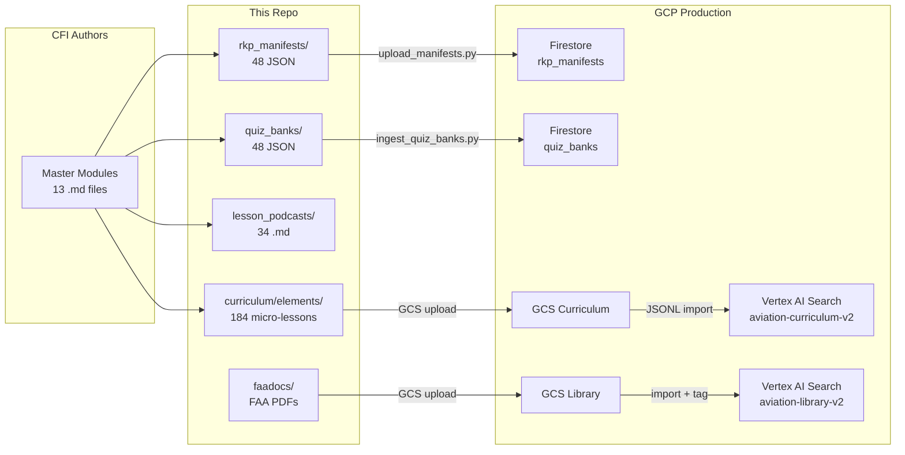
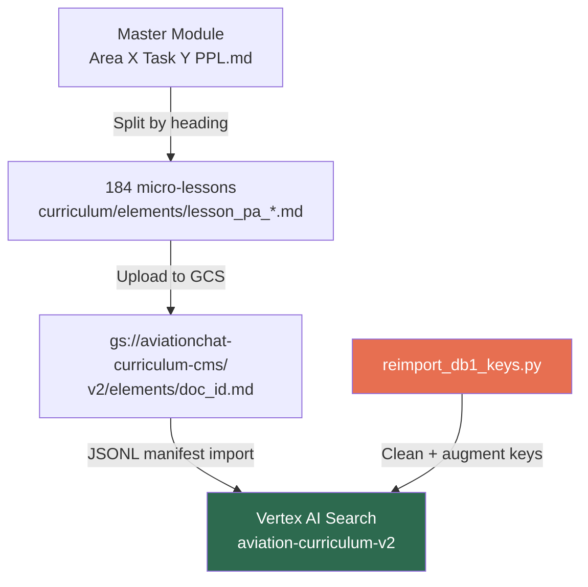
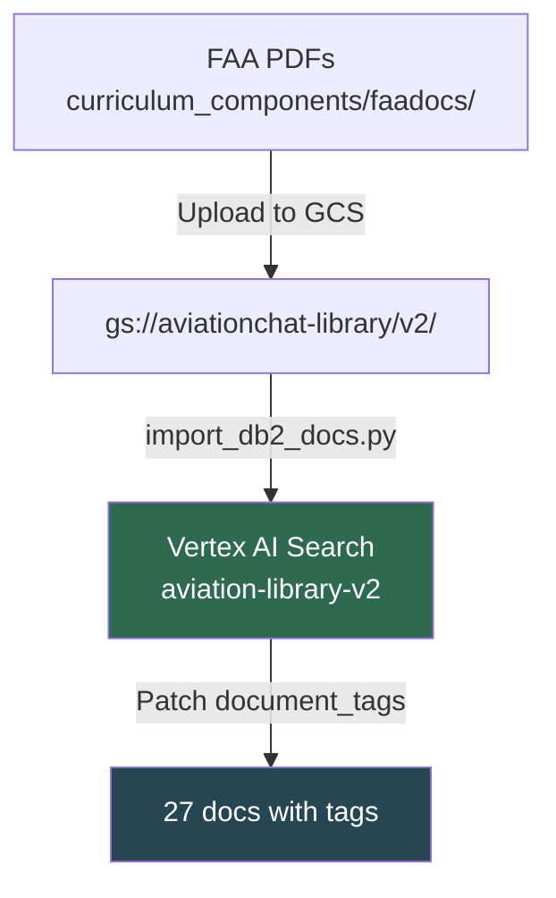
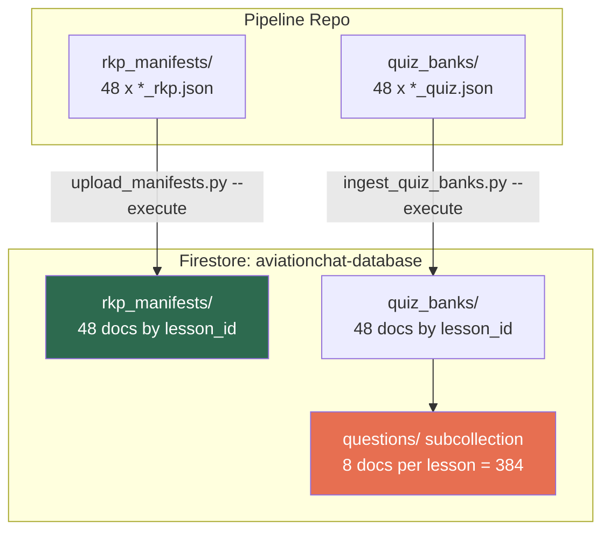
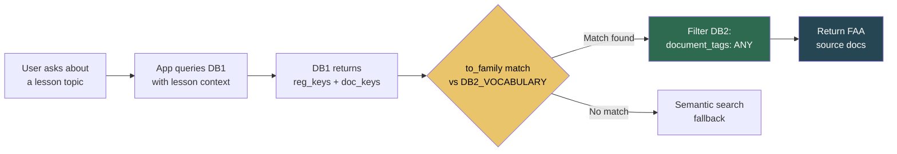
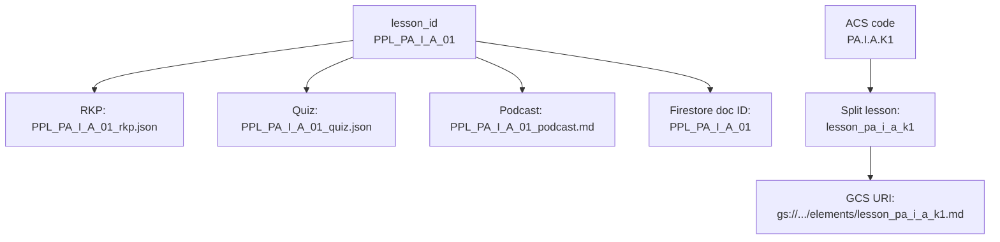

# AviationChat — Master Asset Registry

> **Last updated:** 2026-06-19 (verified against live Firestore + Vertex stores)  
> **Maintained by:** Pipeline team (this repo)  
> **Purpose:** Single source of truth for every curriculum asset — where it lives, what version it is, whether it's deployed, and what's missing.

> [!NOTE]
> **For *current* counts and live deployment state, run the generated map — don't trust the
> hand-typed numbers below.** `python scripts/generate_state_map.py --live` writes
> [STATE.md](STATE.md), which inventories both data folders and diffs the local files against
> Firestore/DB1/DB2 automatically. This registry stays the narrative explanation of *what each asset
> is and how it flows*; STATE.md is the always-fresh snapshot of *how many and whether deployed*.

> [!IMPORTANT]
> **Live state as of 2026-06-19 11:01 AM** (verified via Firestore query against `aviationchat-database`):
> - **DB1:** 184 docs, keys cleaned, **0 corrupt**, **0 empty doc_keys**, bridge resolves **48/48 lessons**
> - **DB2:** 27 docs (was 16), all **tagged with `document_tags`**, 171/184 lessons bridge-covered
> - **Firestore RKPs:** **48/48 deployed** ✅
> - **Firestore Quizzes:** **48/48 deployed**, all with **8 questions each in subcollection** ✅
> - **Pipeline repo:** 48 RKPs + 48 quizzes (synced with app repo) ✅
> - **App repo:** 48 RKPs + 48 quizzes ✅
> - **Offline tests:** 33 passed, 0 failed
> - **Zero discrepancies** across all three sources (Firestore / pipeline repo / app repo)

---

## 1. System Overview

### Architecture



### Access Paths — Quick Reference

| Resource | Location | Access |
|---|---|---|
| **DB1** (Curriculum) | Vertex AI Search: `aviation-curriculum-v2` | GCP Project: `aviationchat`, Location: `global` |
| **DB2** (Library) | Vertex AI Search: `aviation-library-v2` | GCP Project: `aviationchat`, Location: `global` |
| **Curriculum GCS** | `gs://aviationchat-curriculum-cms/v2/` | Lesson `.md` files + `curriculum_v2_import.jsonl` |
| **Library GCS** | `gs://aviationchat-library/` | FAA PDFs by subfolder (regulations/, handbooks/, advisory_circulars/) |
| **Firestore RKPs** | Database: `aviationchat-database`, Collection: `rkp_manifests` | Document ID = `lesson_id` (e.g., `PPL_PA_I_A_01`) |
| **Firestore Quizzes** | Database: `aviationchat-database`, Collection: `quiz_banks` | Document ID = `lesson_id` |
| **Local RKPs (pipeline)** | `curriculum_components/rkp_manifests/{lesson_id}_rkp.json` | 48 files |
| **Local RKPs (app)** | `AGY_AVIATIONCHAT/docs/specialist_lesson/rkp_manifests/{lesson_id}_rkp.json` | 48 files |
| **Local Quizzes (pipeline)** | `curriculum_components/quiz_banks/{lesson_id}_quiz.json` | 48 files |
| **Local Quizzes (app)** | `AGY_AVIATIONCHAT/docs/specialist_lesson/quiz_banks/{lesson_id}_quiz.json` | 48 files |
| **Local Podcasts** | `curriculum_components/lesson_podcasts/{lesson_id}_podcast.md` | 34 files (Area I only) |
| **Master Modules** | `curriculum_components/curriculum_modules/Area {N} Task {X} PPL.md` | 13 files |
| **Split Lessons** | `pipeline/curriculum/elements/lesson_pa_{area}_{task}_{element}.md` | 184 files |
| **Area IX metadata sidecars** | `pipeline/curriculum/sidecars/lesson_pa_ix_*.json` | 12 files |

### Credentials Required

| Operation | Credential | Location |
|---|---|---|
| GCS / Vertex AI Search / Firestore | Service Account JSON | `auth_keys/service-account.json` |
| Environment vars | `.env` file | `auth_keys/.env` |

### Schema Versions

| Schema | Version | Status | Reference |
|---|---|---|---|
| Quiz Bank | **v2.1** | 🔒 LOCKED (Consultant approved 2026-04-05) | `curriculum_components/quiz_schema.md` |
| RKP Manifest | Implicit (no version field) | Stable | `docs/instruction_docs/rkp_creation_guide.md` |
| DB1 structData | Hardened (Pydantic) | Enforced at ingest | `src/utils/schema.py` — `CurriculumStructData` |
| DB2 structData | Pydantic | Enforced at ingest | `src/utils/schema.py` — `LibraryStructData` |

---

## 2. Curriculum Coverage Matrix

> **Legend:**  
> ✅ = Present and complete | ⚠️ = Present, quality under review | ❌ = Missing  
> 🥇 = Gold standard (Area I, authored first) | ✅ = Verified (non-Area I, same schema + quality)  
> Firestore: ✅ = Verified deployed (2026-06-19 live query) | ❌ = Not deployed

### Area I — Preflight Preparation (35 lessons, GOLD STANDARD)

| # | Lesson ID | Title | Master Module | RKP | Quiz | Podcast | Quality | RKP Date | Quiz Date | Firestore |
|---|---|---|---|---|---|---|---|---|---|---|
| 1 | `PPL_PA_I_A_01` | Privileges & Limitations | ✅ Area 1 Task A | ✅ 4 RKPs | ✅ 8 Qs | ✅ | 🥇 Gold | 2026-06-15 | 2026-06-14 | ✅ |
| 2 | `PPL_PA_I_A_02` | Medical Certificates | ✅ Area 1 Task A | ✅ 4 RKPs | ✅ 8 Qs | ✅ | 🥇 Gold | 2026-06-14 | 2026-06-14 | ✅ |
| 3 | `PPL_PA_I_A_03` | BasicMed & Unfamiliar Aircraft Risk | ✅ Area 1 Task A | ✅ 4 RKPs | ✅ 8 Qs | ✅ | 🥇 Gold | 2026-06-14 | 2026-06-14 | ✅ |
| 4 | `PPL_PA_I_A_04` | Go/No-Go Decision Making | ✅ Area 1 Task A | ✅ 4 RKPs | ✅ 8 Qs | ✅ | 🥇 Gold | 2026-06-15 | 2026-06-14 | ✅ |
| 5 | `PPL_PA_I_B_01` | Required Aircraft Documents (ARROW) | ✅ Area 1 Task B | ✅ 4 RKPs | ✅ 8 Qs | ✅ | 🥇 Gold | 2026-06-15 | 2026-06-14 | ✅ |
| 6 | `PPL_PA_I_B_02` | Required Aircraft Inspections (AV1ATES) | ✅ Area 1 Task B | ✅ 4 RKPs | ✅ 8 Qs | ✅ | 🥇 Gold | 2026-06-15 | 2026-06-14 | ✅ |
| 7 | `PPL_PA_I_B_03` | Airworthiness Directives & SAIBs | ✅ Area 1 Task B | ✅ 4 RKPs | ✅ 8 Qs | ✅ | 🥇 Gold | 2026-06-15 | 2026-06-14 | ✅ |
| 8 | `PPL_PA_I_B_04` | Special Flight Permits & Owner Responsibilities | ✅ Area 1 Task B | ✅ 4 RKPs | ✅ 8 Qs | ✅ | 🥇 Gold | 2026-06-15 | 2026-06-14 | ✅ |
| 9 | `PPL_PA_I_B_05` | Inoperative Equipment — 91.213(d) | ✅ Area 1 Task B | ✅ 4 RKPs | ✅ 8 Qs | ✅ | 🥇 Gold | 2026-06-15 | 2026-06-14 | ✅ |
| 10 | `PPL_PA_I_C_01` | Weather Sources & Preflight Briefing | ✅ Area 1 Task C | ✅ 4 RKPs | ✅ 8 Qs | ✅ | 🥇 Gold | 2026-06-15 | 2026-06-14 | ✅ |
| 11 | `PPL_PA_I_C_02` | Reading & Decoding METARs | ✅ Area 1 Task C | ✅ 4 RKPs | ✅ 8 Qs | ✅ | 🥇 Gold | 2026-06-15 | 2026-06-14 | ✅ |
| 12 | `PPL_PA_I_C_03` | TAFs, GFA, and Winds Aloft | ✅ Area 1 Task C | ✅ 4 RKPs | ✅ 8 Qs | ✅ | 🥇 Gold | 2026-06-15 | 2026-06-14 | ✅ |
| 13 | `PPL_PA_I_C_04` | PIREPs, AIRMETs & SIGMETs | ✅ Area 1 Task C | ✅ 4 RKPs | ✅ 8 Qs | ✅ | 🥇 Gold | 2026-06-15 | 2026-06-14 | ✅ |
| 14 | `PPL_PA_I_C_05` | Weather Hazards — Thunderstorms & Icing | ✅ Area 1 Task C | ✅ 4 RKPs | ✅ 8 Qs | ✅ | 🥇 Gold | 2026-06-15 | 2026-06-14 | ✅ |
| 15 | `PPL_PA_I_D_01` | VFR Cruising Altitudes & MEFs | ✅ Area 1 Task D | ✅ 4 RKPs | ✅ 8 Qs | ✅ | 🥇 Gold | 2026-06-15 | 2026-06-14 | ✅ |
| 16 | `PPL_PA_I_D_02` | Navigation Math — TAS, GS, Fuel | ✅ Area 1 Task D | ✅ 4 RKPs | ✅ 8 Qs | ✅ | 🥇 Gold | 2026-06-15 | 2026-06-14 | ✅ |
| 17 | `PPL_PA_I_D_03` | VFR Flight Plans | ✅ Area 1 Task D | ✅ 4 RKPs | ✅ 8 Qs | ✅ | 🥇 Gold | 2026-06-15 | 2026-06-14 | ✅ |
| 18 | `PPL_PA_I_D_04` | Lost Procedures & GPS Navigation | ✅ Area 1 Task D | ✅ 4 RKPs | ✅ 8 Qs | ✅ | 🥇 Gold | 2026-06-15 | 2026-06-14 | ✅ |
| 19 | `PPL_PA_I_E_01` | Class A, B, and C Airspace | ✅ Area 1 Task E | ✅ 4 RKPs | ✅ 8 Qs | ✅ | 🥇 Gold | 2026-06-15 | 2026-06-14 | ✅ |
| 20 | `PPL_PA_I_E_02` | Class D, E, and G Airspace | ✅ Area 1 Task E | ✅ 4 RKPs | ✅ 8 Qs | ✅ | 🥇 Gold | 2026-06-15 | 2026-06-14 | ✅ |
| 21 | `PPL_PA_I_E_03` | VFR Weather Minimums — 91.155 | ✅ Area 1 Task E | ✅ 4 RKPs | ✅ 8 Qs | ✅ | 🥇 Gold | 2026-06-15 | 2026-06-14 | ✅ |
| 22 | `PPL_PA_I_E_04` | Special Use Airspace & TFRs | ✅ Area 1 Task E | ✅ 4 RKPs | ✅ 8 Qs | ✅ | 🥇 Gold | 2026-06-15 | 2026-06-14 | ✅ |
| 23 | `PPL_PA_I_F_01` | Density Altitude | ✅ Area 1 Task F | ✅ 4 RKPs | ✅ 8 Qs | ✅ | 🥇 Gold | 2026-06-15 | 2026-06-16 | ✅ |
| 24 | `PPL_PA_I_F_02` | Weight and Balance | ✅ Area 1 Task F | ✅ 4 RKPs | ✅ 8 Qs | ✅ | 🥇 Gold | 2026-06-15 | 2026-06-14 | ✅ |
| 25 | `PPL_PA_I_F_03` | Takeoff & Landing Performance | ✅ Area 1 Task F | ✅ 4 RKPs | ✅ 8 Qs | ✅ | 🥇 Gold | 2026-06-15 | 2026-06-14 | ✅ |
| 26 | `PPL_PA_I_F_04` | Aircraft Systems Overview | ✅ Area 1 Task F | ✅ 4 RKPs | ✅ 8 Qs | ✅ | 🥇 Gold | 2026-06-15 | 2026-06-14 | ✅ |
| 27 | `PPL_PA_I_G_01` | Primary Flight Controls & Trim | ✅ Area 1 Task G | ✅ 4 RKPs | ✅ 8 Qs | ✅ | 🥇 Gold | 2026-06-15 | 2026-06-14 | ✅ |
| 28 | `PPL_PA_I_G_02` | Powerplant & Propeller | ✅ Area 1 Task G | ✅ 4 RKPs | ✅ 8 Qs | ✅ | 🥇 Gold | 2026-06-15 | 2026-06-14 | ✅ |
| 29 | `PPL_PA_I_G_03` | Fuel & Oil Systems | ✅ Area 1 Task G | ✅ 4 RKPs | ✅ 8 Qs | ✅ | 🥇 Gold | 2026-06-15 | 2026-06-14 | ✅ |
| 30 | `PPL_PA_I_G_04` | Electrical System | ✅ Area 1 Task G | ✅ 4 RKPs | ✅ 8 Qs | ✅ | 🥇 Gold | 2026-06-15 | 2026-06-14 | ✅ |
| 31 | `PPL_PA_I_G_05` | Pitot-Static & Vacuum Systems | ✅ Area 1 Task G | ✅ 4 RKPs | ✅ 8 Qs | ✅ | 🥇 Gold | 2026-06-15 | 2026-06-14 | ✅ |
| 32 | `PPL_PA_I_H_01` | Hypoxia & Hyperventilation | ✅ Area 1 Task H | ✅ 4 RKPs | ✅ 8 Qs | ✅ | 🥇 Gold | 2026-06-15 | 2026-06-14 | ✅ |
| 33 | `PPL_PA_I_H_02` | Spatial Disorientation | ✅ Area 1 Task H | ✅ 4 RKPs | ✅ 8 Qs | ✅ | 🥇 Gold | 2026-06-15 | 2026-06-14 | ✅ |
| 34 | `PPL_PA_I_H_03` | ADM & Hazardous Attitudes | ✅ Area 1 Task H | ✅ 4 RKPs | ✅ 8 Qs | ✅ | 🥇 Gold | 2026-06-15 | 2026-06-14 | ✅ |
| 35 | `PPL_PA_I_H_04` | ADM: PAVE & IMSAFE | ✅ Area 1 Task H | ✅ 3 RKPs | ✅ 8 Qs | ❌ | 🥇 Gold | — | — | ✅ |

### Area III — Airport & Seaplane Base Operations (3 lessons)

| # | Lesson ID | Title | Master Module | RKP | Quiz | Podcast | Quality | RKP Date | Quiz Date | Firestore |
|---|---|---|---|---|---|---|---|---|---|---|
| 36 | `PPL_PA_III_A_01` | Radio Communications & ATC Phraseology | ✅ Area 3 Tasks A,B | ✅ 4 RKPs | ✅ 8 Qs | ❌ | ✅ | 2026-06-15 | 2026-06-16 | ✅ |
| 37 | `PPL_PA_III_A_02` | Light Signals, Transponders & Emergency Reporting | ✅ Area 3 Tasks A,B | ✅ 4 RKPs | ✅ 8 Qs | ❌ | ✅ | 2026-06-15 | 2026-06-15 | ✅ |
| 38 | `PPL_PA_III_B_01` | Traffic Patterns & Airport Operations | ✅ Area 3 Tasks A,B | ✅ 4 RKPs | ✅ 8 Qs | ❌ | ✅ | 2026-06-15 | 2026-06-15 | ✅ |

### Area VI — Navigation (3 lessons)

| # | Lesson ID | Title | Master Module | RKP | Quiz | Podcast | Quality | RKP Date | Quiz Date | Firestore |
|---|---|---|---|---|---|---|---|---|---|---|
| 39 | `PPL_PA_VI_B_01` | Ground-Based & Satellite Navigation | ✅ Area 6 Task B | ✅ 3 RKPs | ✅ 8 Qs | ❌ | ✅ | 2026-06-15 | 2026-06-16 | ✅ |
| 40 | `PPL_PA_VI_B_02` | Transponders, ADS-B & Radar Services | ✅ Area 6 Task B | ✅ 3 RKPs | ✅ 8 Qs | ❌ | ✅ | 2026-06-15 | 2026-06-16 | ✅ |
| 41 | `PPL_PA_VI_B_03` | Navigation Risk Management & EFBs | ✅ Area 6 Task B | ✅ 4 RKPs | ✅ 8 Qs | ❌ | ✅ | 2026-06-15 | 2026-06-16 | ✅ |

### Area VII — Slow Flight & Stalls (2 lessons)

| # | Lesson ID | Title | Master Module | RKP | Quiz | Podcast | Quality | RKP Date | Quiz Date | Firestore |
|---|---|---|---|---|---|---|---|---|---|---|
| 42 | `PPL_PA_VII_A_01` | Slow Flight, Stall Aerodynamics & Recovery | ✅ Area 7 A,B,D | ✅ 4 RKPs | ✅ 8 Qs | ❌ | ✅ | 2026-06-14 | 2026-06-16 | ✅ |
| 43 | `PPL_PA_VII_D_01` | Spin Awareness & Recovery | ✅ Area 7 A,B,D | ✅ 3 RKPs | ✅ 8 Qs | ❌ | ✅ | 2026-06-14 | 2026-06-16 | ✅ |

### Area IX — Emergency Operations (2 lessons)

| # | Lesson ID | Title | Master Module | RKP | Quiz | Podcast | Quality | RKP Date | Quiz Date | Firestore |
|---|---|---|---|---|---|---|---|---|---|---|
| 44 | `PPL_PA_IX_B_01` | Emergency Approach & Landing | ✅ Area 9 Tasks B,C | ✅ 3 RKPs | ✅ 8 Qs | ❌ | ✅ | 2026-06-14 | 2026-06-16 | ✅ |
| 45 | `PPL_PA_IX_C_01` | Systems Malfunctions, Fire & Startle Response | ✅ Area 9 Tasks B,C | ✅ 4 RKPs | ✅ 8 Qs | ❌ | ✅ | 2026-06-14 | 2026-06-16 | ✅ |

### Area XI — Night Operations (3 lessons)

| # | Lesson ID | Title | Master Module | RKP | Quiz | Podcast | Quality | RKP Date | Quiz Date | Firestore |
|---|---|---|---|---|---|---|---|---|---|---|
| 46 | `PPL_PA_XI_A_01` | Night Vision Physiology & Airport Lighting | ✅ Area 11 Task A | ✅ 4 RKPs | ✅ 8 Qs | ❌ | ✅ | 2026-06-15 | 2026-06-16 | ✅ |
| 47 | `PPL_PA_XI_A_02` | Night Equipment, Taxi & Navigation | ✅ Area 11 Task A | ✅ 5 RKPs | ✅ 8 Qs | ❌ | ✅ | 2026-06-15 | 2026-06-16 | ✅ |
| 48 | `PPL_PA_XI_A_03` | Night Risk Management & ADM | ✅ Area 11 Task A | ✅ 6 RKPs | ✅ 8 Qs | ❌ | ✅ | 2026-06-15 | 2026-06-16 | ✅ |

### Summary Counts

| Metric | Area I | Non-Area I | Total | Firestore |
|---|---|---|---|---|
| Lessons | 35 | 13 | **48** | **48** ✅ |
| RKP manifests | 35 | 13 | **48** | **48/48** ✅ |
| Quiz banks | 35 | 13 | **48** | **48/48** ✅ (all 8 Qs in subcollection) |
| Podcasts | 34 | 0 | **34** | N/A |
| Master modules | 8 | 5 | **13** | N/A |
| Questions (8 per quiz) | 280 | 104 | **384** | **384** ✅ |

### Gaps

| Gap | Count | Details |
|---|---|---|
| **Missing Podcasts** | 14 | All non-Area I lessons + `PPL_PA_I_H_04` |
| **13 reference-only lessons** | 13 | Cite docs not in DB2 (AME Guide, FCC forms, legal interpretations) — covered by semantic search |

---

## 3. DB1 — Curriculum Store (Vertex AI Search)

### Store Details

| Property | Value |
|---|---|
| Store ID | `aviation-curriculum-v2` |
| Display Name | Aviation Curriculum V2 |
| GCP Project | `aviationchat` |
| Location | `global` |
| Parsing | Layout-aware |
| Chunk Size | 500 tokens |
| Content Type | Markdown (`.md`) |
| Import Mode | INCREMENTAL (changed 2026-06-18 — safer, no wipe risk) |
| Verified Doc Count | **184** micro-lessons (verified live 2026-06-18) |
| Key Health | **0 corrupt**, **0 empty doc_keys** (repaired 2026-06-18 via `update_document`) |

### How Documents Get There



### structData Schema (per document)

```json
{
  "id": "lesson_pa_i_a_k1",
  "structData": {
    "acs_code": "PA.I.A.K1",
    "title": "Privileges & Limitations",
    "type": "knowledge",
    "ancestral_context": "...",
    "reg_keys": ["14 CFR 61.56", "14 CFR 61.57"],
    "doc_keys": ["AC 61-98D", "FAA-H-8083-25C"],
    "keywords": ["currency", "flight review"]
  },
  "content": {
    "mimeType": "text/plain",
    "uri": "gs://aviationchat-curriculum-cms/v2/elements/lesson_pa_i_a_k1.md"
  }
}
```

### Split Lessons by Area (from repo map)

| Area.Task | Element Type Counts | Example IDs |
|---|---|---|
| I.A | K1-K6, R1-R2, S1 (8 elements, 4 lessons) | `lesson_pa_i_a_k1` … `lesson_pa_i_a_s1` |
| I.B | K1-K4, R1, S1-S3 (up to 13 elements, 5 lessons) | `lesson_pa_i_b_k1a` … `lesson_pa_i_b_s3` |
| I.C | K1-K4, R1-R2, S1-S3 (9 elements, 5 lessons) | `lesson_pa_i_c_k1` … `lesson_pa_i_c_s3` |
| I.D | K1-K6, R1-R7, S1-S5 (up to 19 elements, 4 lessons) | `lesson_pa_i_d_k1` … `lesson_pa_i_d_s5` |
| I.E | K1-K4, R1, S1-S3 (8 elements, 4 lessons) | `lesson_pa_i_e_k1` … `lesson_pa_i_e_s3` |
| I.F | K1-K3, R1-R3, S1-S2 (up to 10 elements, 4 lessons) | `lesson_pa_i_f_k1` … `lesson_pa_i_f_s2` |
| I.G | K1a-K2, R1-R3, S1-S2 (up to 16 elements, 5 lessons) | `lesson_pa_i_g_k1a` … `lesson_pa_i_g_s2` |
| I.H | K1-K4, R1-R4, S1-S2 (up to 16 elements, 3 lessons) | `lesson_pa_i_h_k1a` … `lesson_pa_i_h_s2` |
| III.A | K1-K9, R1-R2, S1 (12 elements, 2 lessons) | `lesson_pa_iii_a_k1` … `lesson_pa_iii_a_s1` |
| III.B | K1-K4, R1-R3, S1-S2 (7 elements, 1 lesson) | `lesson_pa_iii_b_k1` … `lesson_pa_iii_b_s2` |
| VI.B | K1-K4, R1-R5, S1-S5 (14 elements, 3 lessons) | `lesson_pa_vi_b_k1` … `lesson_pa_vi_b_s5` |
| VII.A-D | K1-K4, R1, S3 (+B,D) (7+ elements, 2 lessons) | `lesson_pa_vii_a_k1` … `lesson_pa_vii_d_k3` |
| IX.B-C | K1-K4, R1-R4, S1 (12 elements, 2 lessons) | `lesson_pa_ix_b_k1` … `lesson_pa_ix_c_s1` |
| XI.A | K1-K8, R1-R7 (15 elements, 3 lessons) | `lesson_pa_xi_a_k1` … `lesson_pa_xi_a_r7` |

### Key Pipeline Scripts

| Script | Purpose | Entry Point |
|---|---|---|
| `src/gcp/reimport_db1_keys.py` | **[Primary]** Rebuild DB1 keys (pull live → clean + augment + validate → upsert via `update_document`); writes `curriculum.jsonl` | `python src/gcp/reimport_db1_keys.py [--execute]` |
| `src/gcp/import_db2_docs.py` | **[NEW]** Upload FAA PDFs → DB2 + patch `document_tags` | `python src/gcp/import_db2_docs.py [--execute]` |
| `src/gcp/probe_bridge_hop.py` | **[NEW]** Live bridge probe (DB1→DB2 resolution test) | `python src/gcp/probe_bridge_hop.py [--limit N]` |
| `src/utils/generate_metadata.py` | LLM-based metadata extraction (writes sidecars to `curriculum/new/`) | Standalone |
| `src/utils/schema.py` | Pydantic schema + key normalization + coverage analysis | Imported by pipeline |
| `src/utils/db2_tags.py` | **[NEW]** Shared DB2 tag extraction logic | Imported by import scripts |
| `scripts/derive_db2_vocabulary.py` | **[NEW]** Derive `DB2_VOCABULARY` from live DB2 store | `python scripts/derive_db2_vocabulary.py` |

> [!NOTE]
> `src/gcp/import_db1_v2.py` was **deleted** in the 2026-06-18 session (hardcoded paths, bypassed schema). Replaced by `reimport_db1_keys.py`.

---

## 4. DB2 — Library Store (Vertex AI Search)

### Store Details

| Property | Value |
|---|---|
| Store ID | `aviation-library-v2` |
| Display Name | Aviation Library V2 |
| GCP Project | `aviationchat` |
| Location | `global` |
| Parsing | Layout-aware |
| Chunk Size | 1024 tokens |
| Content Type | PDF |
| Import Mode | INCREMENTAL (changed 2026-06-18) |
| Verified Doc Count | **27 docs** (verified live 2026-06-18; was 16) |
| Tags Status | **27/27 tagged** with `document_tags` (was 0/16 — patched 2026-06-18) |

### How Documents Get There



### DB2 Document Tags Vocabulary

These are the **only** tokens that match `document_tags: ANY(...)` filters in the app's DB1→DB2 bridge hop. **Machine-derived** from the live DB2 store by `scripts/derive_db2_vocabulary.py` (2026-06-19). Sourced from `src/utils/schema.py` `DB2_VOCABULARY`.

> [!IMPORTANT]
> This vocabulary is now **machine-derived, not hand-authored**. After adding new docs to DB2, re-run
> `python scripts/derive_db2_vocabulary.py` and paste the output into `schema.py`.

#### Regulations (4 tags — live in DB2)

| Tag | Document |
|---|---|
| `14 CFR 61` | Certification: Pilots, Flight Instructors, and Ground Instructors |
| `14 CFR 67` | Medical Standards and Certification |
| `14 CFR 68` | BasicMed |
| `14 CFR 91` | General Operating and Flight Rules |

#### Handbooks (7 tags — live in DB2)

| Tag | Document | Notes |
|---|---|---|
| `FAA-H-8083-1B` | Weight & Balance Handbook | |
| `FAA-H-8083-2` | Risk Management Handbook | Family tag (matches `-2A`) |
| `FAA-H-8083-3C` | Airplane Flying Handbook (AFH) | Split into 4 parts (273 MB original > Vertex cap) |
| `FAA-H-8083-15B` | Instrument Procedures Handbook | |
| `FAA-H-8083-25` | Pilot's Handbook of Aeronautical Knowledge (PHAK) | Family tag (matches `-25C`) |
| `FAA-H-8083-28` | Aviation Maintenance Technician Handbook | |
| `AIM` | Aeronautical Information Manual | |

#### Advisory Circulars (12 tags — live in DB2)

| Tag | Document |
|---|---|
| `AC 00-45H` | Aviation Weather Services |
| `AC 60-22` | Aeronautical Decision Making |
| `AC 61-67C` | Stall and Spin Awareness Training |
| `AC 61-98E` | Currency Requirements and Guidance |
| `AC 61-142` | Sharing Aircraft Operating Expenses |
| `AC 68-1` | BasicMed |
| `AC 68-1A` | BasicMed (Amended) |
| `AC 90-48E` | Pilots' Role in Collision Avoidance |
| `AC 90-66C` | Non-Towered Airport Flight Operations |
| `AC 91-67` | Minimum Equipment Requirements |
| `AC 91-73B` | Parts 91 and 135 Single-Pilot Procedures |
| `AC 91-92` | Pilot Guide: Runway Safety |

#### Other (1 tag)

| Tag | Document |
|---|---|
| `FAA-S-ACS-6C` | Private Pilot Airman Certification Standards |

**Total DB2 vocabulary: 24 tags** (derived from 27 live documents)

> [!NOTE]
> Family-level matching (`to_family()` in `schema.py`) means `AC 61-98D` in the curriculum matches
> `AC 61-98E` in DB2, and `FAA-H-8083-25C` matches `FAA-H-8083-25`. This is intentional — editions
> drift but the document is the same.

### Library Pipeline Scripts

| Script | Purpose |
|---|---|
| `src/gcp/import_db2_docs.py` | **[Primary]** Upload FAA PDFs + patch `document_tags` (gated `--execute`) |
| `scripts/derive_db2_vocabulary.py` | Re-derive vocabulary from live DB2 after any change |

### Local FAA Document Storage

FAA PDFs are stored in `curriculum_components/faadocs/` (gitignored via `*.pdf`). 8 documents confirmed + downloaded from faa.gov on 2026-06-18 (365 MB, integrity-checked).

> [!WARNING]
> The full AFH (`FAA-H-8083-3C.pdf`, 273 MB) exceeds Vertex's 200 MB per-doc limit. It was split into 4 parts using `pypdf`. An orphan `gs://aviationchat-library/v2/FAA-H-8083-3C.pdf` may still exist in the bucket — safe to delete.

---

## 5. RKP Manifest Details

### Schema Fields (per manifest)

| Field | Type | Description |
|---|---|---|
| `lesson_id` | string | Unique ID: `PPL_PA_{AREA}_{TASK}_{SEQ}` |
| `title` | string | Human-readable lesson title (3-6 words) |
| `acs_task_reference` | string | ACS task area (e.g., "Area I, Task A") |
| `acs_element_keys` | string[] | ACS element codes covered |
| `required_knowledge_points` | RKP[] | 3-6 knowledge points per lesson |
| `lesson_overview` | string | Narrative essay (500-1000 words) |
| `audio_file` | string | Audio companion filename |
| `video_file` | string | Video companion filename |

### RKP Sub-Fields (per knowledge point)

| Field | Type | Description |
|---|---|---|
| `id` | string | Sequential within lesson: `RKP_01`, `RKP_02`, etc. |
| `title` | string | Short name (2-5 words) |
| `why` | string | One-sentence importance statement |
| `knowledge` | string | Core teaching paragraph (source of truth, never auto-modified) |
| `acs_elements` | string[] | Which ACS element(s) this point addresses |
| `far_references` | string[] | Regulatory citations (e.g., `14 CFR 61.56`) |
| `bridge_keys` | string[] | Document-level DB2 tokens (e.g., `FAA-H-8083-25C`) |
| `knowledge_formatted` | string | Auto-generated flashcard markdown (via Gemini Pro) |

### Full RKP Inventory

| # | Lesson ID | Title | RKPs | ACS Keys | Bridge Keys | FAR Refs | KF | Overview | Modified |
|---|---|---|---|---|---|---|---|---|---|
| 1 | `PPL_PA_I_A_01` | Privileges & Limitations | 4 | K1, K2, R1 | 4 unique | 5 unique | ✅ | ✅ | 2026-06-15 |
| 2 | `PPL_PA_I_A_02` | Medical Certificates | 4 | K3, K4 | 4 unique | 5 unique | ✅ | ✅ | 2026-06-14 |
| 3 | `PPL_PA_I_A_03` | BasicMed & Unfamiliar Aircraft Risk | 4 | K5, R2 | 4 unique | 6 unique | ✅ | ✅ | 2026-06-14 |
| 4 | `PPL_PA_I_A_04` | Go/No-Go Decision Making | 4 | K6, S1 | 5 unique | 3 unique | ✅ | ✅ | 2026-06-15 |
| 5 | `PPL_PA_I_B_01` | Required Aircraft Documents (ARROW) | 4 | K1, S1 | 6 unique | 7 unique | ✅ | ✅ | 2026-06-15 |
| 6 | `PPL_PA_I_B_02` | Required Inspections (AV1ATES) | 4 | K2 | 5 unique | 6 unique | ✅ | ✅ | 2026-06-15 |
| 7 | `PPL_PA_I_B_03` | Airworthiness Directives | 4 | K3, K3a, K3b | 5 unique | 5 unique | ✅ | ✅ | 2026-06-15 |
| 8 | `PPL_PA_I_B_04` | Special Flight Permits | 4 | K4, R1, S2 | 5 unique | 6 unique | ✅ | ✅ | 2026-06-15 |
| 9 | `PPL_PA_I_B_05` | Inoperative Equipment — 91.213 | 4 | K3c, K3d, S3 | 5 unique | 4 unique | ✅ | ✅ | 2026-06-15 |
| 10 | `PPL_PA_I_C_01` | Weather Sources & Briefing | 4 | K1, S1 | 5 unique | 4 unique | ✅ | ✅ | 2026-06-15 |
| 11 | `PPL_PA_I_C_02` | METARs & SPECIs | 4 | K2, K2a | 4 unique | 4 unique | ✅ | ✅ | 2026-06-15 |
| 12 | `PPL_PA_I_C_03` | TAFs, GFA & Winds Aloft | 4 | K2, K2b | 4 unique | 4 unique | ✅ | ✅ | 2026-06-15 |
| 13 | `PPL_PA_I_C_04` | PIREPs, AIRMETs & SIGMETs | 4 | K2c, K2d | 5 unique | 4 unique | ✅ | ✅ | 2026-06-15 |
| 14 | `PPL_PA_I_C_05` | Weather Hazards | 4 | K3, R1, R2 | 5 unique | 4 unique | ✅ | ✅ | 2026-06-15 |
| 15 | `PPL_PA_I_D_01` | VFR Cruising Altitudes | 4 | K2, S2 | 4 unique | 5 unique | ✅ | ✅ | 2026-06-15 |
| 16 | `PPL_PA_I_D_02` | Nav Math — TAS/GS/Fuel | 4 | K3, S3, S4 | 3 unique | 3 unique | ✅ | ✅ | 2026-06-15 |
| 17 | `PPL_PA_I_D_03` | VFR Flight Plans | 4 | K4, R2 | 4 unique | 4 unique | ✅ | ✅ | 2026-06-15 |
| 18 | `PPL_PA_I_D_04` | Lost Procedures & GPS | 4 | K5, S8 | 4 unique | 5 unique | ✅ | ✅ | 2026-06-15 |
| 19 | `PPL_PA_I_E_01` | Class A/B/C Airspace | 4 | K1, K1a-c | 3 unique | 6 unique | ✅ | ✅ | 2026-06-15 |
| 20 | `PPL_PA_I_E_02` | Class D/E/G Airspace | 4 | K1d-f | 4 unique | 5 unique | ✅ | ✅ | 2026-06-15 |
| 21 | `PPL_PA_I_E_03` | VFR Weather Minimums | 4 | K2, S1 | 4 unique | 3 unique | ✅ | ✅ | 2026-06-15 |
| 22 | `PPL_PA_I_E_04` | Special Use Airspace | 4 | K3, S2 | 5 unique | 7 unique | ✅ | ✅ | 2026-06-15 |
| 23 | `PPL_PA_I_F_01` | Density Altitude | 4 | K1, K1a, K1b | 4 unique | 3 unique | ✅ | ✅ | 2026-06-15 |
| 24 | `PPL_PA_I_F_02` | Weight & Balance | 4 | K2, S1 | 4 unique | 3 unique | ✅ | ✅ | 2026-06-15 |
| 25 | `PPL_PA_I_F_03` | Takeoff/Landing Performance | 4 | K3, S2 | 4 unique | 3 unique | ✅ | ✅ | 2026-06-15 |
| 26 | `PPL_PA_I_F_04` | CG Effects | 4 | K2, R1 | 3 unique | 3 unique | ✅ | ✅ | 2026-06-15 |
| 27 | `PPL_PA_I_G_01` | Flight Controls & Trim | 4 | K1, K1a | 3 unique | 2 unique | ✅ | ✅ | 2026-06-15 |
| 28 | `PPL_PA_I_G_02` | Powerplant & Propeller | 4 | K1b, K1c | 3 unique | 4 unique | ✅ | ✅ | 2026-06-15 |
| 29 | `PPL_PA_I_G_03` | Fuel & Oil Systems | 4 | K1d, K1e | 2 unique | 2 unique | ✅ | ✅ | 2026-06-15 |
| 30 | `PPL_PA_I_G_04` | Electrical System | 4 | K1f, K1g | 2 unique | 2 unique | ✅ | ✅ | 2026-06-15 |
| 31 | `PPL_PA_I_G_05` | Pitot-Static & Vacuum | 4 | K1h, K1i | 3 unique | 3 unique | ✅ | ✅ | 2026-06-15 |
| 32 | `PPL_PA_I_H_01` | Hypoxia & Hyperventilation | 4 | K1, K2 | 2 unique | 3 unique | ✅ | ✅ | 2026-06-15 |
| 33 | `PPL_PA_I_H_02` | Spatial Disorientation | 4 | K4, K5 | 4 unique | 3 unique | ✅ | ✅ | 2026-06-15 |
| 34 | `PPL_PA_I_H_03` | ADM & Hazardous Attitudes | 4 | K6, K8 | 4 unique | 3 unique | ✅ | ✅ | 2026-06-15 |
| 35 | `PPL_PA_I_H_04` | ADM: PAVE & IMSAFE | 3 | S1, R1 | 3 unique | 3 unique | ✅ | ❌ | — |
| 36 | `PPL_PA_III_A_01` | Radio Comms & ATC Phraseology | 4 | — | 3 unique | 2 unique | ✅ | ✅ | 2026-06-15 |
| 37 | `PPL_PA_III_A_02` | Light Signals & Transponders | 4 | — | 3 unique | 4 unique | ✅ | ✅ | 2026-06-15 |
| 38 | `PPL_PA_III_B_01` | Traffic Patterns & Airport Ops | 4 | — | 4 unique | 3 unique | ✅ | ✅ | 2026-06-15 |
| 39 | `PPL_PA_VI_B_01` | Ground-Based & Satellite Nav | 3 | — | 2 unique | 1 unique | ✅ | ✅ | 2026-06-15 |
| 40 | `PPL_PA_VI_B_02` | Transponders & ADS-B | 3 | — | 3 unique | 3 unique | ✅ | ✅ | 2026-06-15 |
| 41 | `PPL_PA_VI_B_03` | Nav Risk Management & EFBs | 4 | — | 4 unique | 4 unique | ✅ | ✅ | 2026-06-15 |
| 42 | `PPL_PA_VII_A_01` | Slow Flight & Stalls | 4 | — | 4 unique | 2 unique | ✅ | ✅ | 2026-06-14 |
| 43 | `PPL_PA_VII_D_01` | Spin Awareness | 3 | — | 3 unique | 2 unique | ✅ | ✅ | 2026-06-14 |
| 44 | `PPL_PA_IX_B_01` | Emergency Approach & Landing | 3 | — | 3 unique | 1 unique | ✅ | ✅ | 2026-06-14 |
| 45 | `PPL_PA_IX_C_01` | Systems Malfunctions & Fire | 4 | — | 4 unique | 2 unique | ✅ | ✅ | 2026-06-14 |
| 46 | `PPL_PA_XI_A_01` | Night Vision & Airport Lighting | 4 | — | 4 unique | 1 unique | ✅ | ✅ | 2026-06-15 |
| 47 | `PPL_PA_XI_A_02` | Night Equipment & Taxi | 5 | — | 5 unique | 5 unique | ✅ | ✅ | 2026-06-15 |
| 48 | `PPL_PA_XI_A_03` | Night Risk Management | 6 | — | 4 unique | 5 unique | ✅ | ✅ | 2026-06-15 |

### Firestore Ingestion Flow



> [!NOTE]
> The app reads quizzes from the **subcollection** path (`quiz_banks/{lesson_id}/questions/*`), not the embedded array.

### Upload Script

| Script | Firestore Target | Collection | Mode |
|---|---|---|---|
| `src/gcp/upload_manifests.py` | `aviationchat-database` | `rkp_manifests` | Gated (`--execute`) |

**Status:** Updated 2026-06-18 — now uses `config.py` paths (no more hardcoded `c:\Sudo_Hatter_Command\...`).
**Last upload:** 2026-06-18 — 47/47 manifests uploaded. Firestore has 48 (includes legacy `PPL_PA_I_H_04`, whose quiz subcollection was repaired 2026-06-19).

---

## 6. Quiz Bank Details

### Schema Version

**Quiz Schema v2.1 — LOCKED** (Consultant approved 2026-04-05)

| Rule | Value |
|---|---|
| Questions per bank | **8** (non-negotiable, FR12-B) |
| Perspectives | legal (2), safety (2), application (2), risk_management (2) |
| Question types | `mcq` (legal/safety/application) + `sjt` preferred for risk_management |
| Correct answer format | Single letter: `"A"`, `"B"`, `"C"`, or `"D"` |
| `tested_rkp_id` | Mandatory on all 384 questions |
| SJT correct answer | ⚠️ **CONTESTED — do not treat as a rule.** The old "always `D`" convention is retired by the PRD (§7.1/§11), and the live corpus does not follow it: measured 2026-07-22 across all 48 banks / 384 questions, `correct_answer` is **B 67% overall** and, for `risk_management` questions, **B 61% / D 33%**. Options are NOT shuffled at render (`quiz_bank_service.py` shuffles question order only), so any positional skew is a real tell. **Open decision for Daniel:** adopt "no positional meaning, distribute evenly" and re-balance the corpus. |

### Full Quiz Inventory

| # | Lesson ID | Title | Qs | Legal | Safety | Application | Risk Mgmt | Quality | Modified |
|---|---|---|---|---|---|---|---|---|---|
| 1 | `PPL_PA_I_A_01` | Privileges & Limitations | 8 | 2 | 2 | 2 | 2 | 🥇 | 2026-06-14 |
| 2 | `PPL_PA_I_A_02` | Medical Certificates | 8 | 2 | 2 | 2 | 2 | 🥇 | 2026-06-14 |
| 3 | `PPL_PA_I_A_03` | BasicMed & Risk | 8 | 2 | 2 | 2 | 2 | 🥇 | 2026-06-14 |
| 4 | `PPL_PA_I_A_04` | Go/No-Go Decision | 8 | 2 | 2 | 2 | 2 | 🥇 | 2026-06-14 |
| 5 | `PPL_PA_I_B_01` | ARROW Documents | 8 | 2 | 2 | 2 | 2 | 🥇 | 2026-06-14 |
| 6 | `PPL_PA_I_B_02` | AV1ATES Inspections | 8 | 2 | 2 | 2 | 2 | 🥇 | 2026-06-14 |
| 7 | `PPL_PA_I_B_03` | ADs & SAIBs | 8 | 2 | 2 | 2 | 2 | 🥇 | 2026-06-14 |
| 8 | `PPL_PA_I_B_04` | Special Flight Permits | 8 | 2 | 2 | 2 | 2 | 🥇 | 2026-06-14 |
| 9 | `PPL_PA_I_B_05` | Inop Equipment | 8 | 2 | 2 | 2 | 2 | 🥇 | 2026-06-14 |
| 10 | `PPL_PA_I_C_01` | Weather Sources | 8 | 2 | 2 | 2 | 2 | 🥇 | 2026-06-14 |
| 11 | `PPL_PA_I_C_02` | METARs | 8 | 2 | 2 | 2 | 2 | 🥇 | 2026-06-14 |
| 12 | `PPL_PA_I_C_03` | TAFs & Winds Aloft | 8 | 2 | 2 | 2 | 2 | 🥇 | 2026-06-14 |
| 13 | `PPL_PA_I_C_04` | AIRMETs & SIGMETs | 8 | 2 | 2 | 2 | 2 | 🥇 | 2026-06-14 |
| 14 | `PPL_PA_I_C_05` | Weather Hazards | 8 | 2 | 2 | 2 | 2 | 🥇 | 2026-06-14 |
| 15 | `PPL_PA_I_D_01` | VFR Altitudes | 8 | 2 | 2 | 2 | 2 | 🥇 | 2026-06-14 |
| 16 | `PPL_PA_I_D_02` | Nav Math | 8 | 2 | 2 | 2 | 2 | 🥇 | 2026-06-14 |
| 17 | `PPL_PA_I_D_03` | VFR Flight Plans | 8 | 2 | 2 | 2 | 2 | 🥇 | 2026-06-14 |
| 18 | `PPL_PA_I_D_04` | Lost Procedures | 8 | 2 | 2 | 2 | 2 | 🥇 | 2026-06-14 |
| 19 | `PPL_PA_I_E_01` | Class A/B/C | 8 | 4 | 1 | 1 | 2 | 🥇 | 2026-06-14 |
| 20 | `PPL_PA_I_E_02` | Class D/E/G | 8 | 3 | 1 | 2 | 2 | 🥇 | 2026-06-14 |
| 21 | `PPL_PA_I_E_03` | VFR Wx Minimums | 8 | 2 | 2 | 2 | 2 | 🥇 | 2026-06-14 |
| 22 | `PPL_PA_I_E_04` | Special Use Airspace | 8 | 3 | 1 | 2 | 2 | 🥇 | 2026-06-14 |
| 23 | `PPL_PA_I_F_01` | Density Altitude | 8 | 2 | 2 | 2 | 2 | 🥇 | 2026-06-16 |
| 24 | `PPL_PA_I_F_02` | Weight & Balance | 8 | 2 | 2 | 2 | 2 | 🥇 | 2026-06-14 |
| 25 | `PPL_PA_I_F_03` | Performance | 8 | 1 | 2 | 3 | 2 | 🥇 | 2026-06-14 |
| 26 | `PPL_PA_I_F_04` | Systems Overview | 8 | 1 | 3 | 2 | 2 | 🥇 | 2026-06-14 |
| 27 | `PPL_PA_I_G_01` | Flight Controls | 8 | 2 | 2 | 2 | 2 | 🥇 | 2026-06-14 |
| 28 | `PPL_PA_I_G_02` | Powerplant | 8 | 1 | 3 | 2 | 2 | 🥇 | 2026-06-14 |
| 29 | `PPL_PA_I_G_03` | Fuel & Oil | 8 | 1 | 2 | 3 | 2 | 🥇 | 2026-06-14 |
| 30 | `PPL_PA_I_G_04` | Electrical | 8 | 2 | 2 | 3 | 1 | 🥇 | 2026-06-14 |
| 31 | `PPL_PA_I_G_05` | Pitot-Static/Vacuum | 8 | 1 | 2 | 4 | 1 | 🥇 | 2026-06-14 |
| 32 | `PPL_PA_I_H_01` | Hypoxia | 8 | 2 | 2 | 2 | 2 | 🥇 | 2026-06-14 |
| 33 | `PPL_PA_I_H_02` | Spatial Disorientation | 8 | 0 | 3 | 3 | 2 | 🥇 | 2026-06-14 |
| 34 | `PPL_PA_I_H_03` | ADM | 8 | 1 | 0 | 4 | 3 | 🥇 | 2026-06-14 |
| 35 | `PPL_PA_I_H_04` | ADM: PAVE & IMSAFE | 8 | 1 | 2 | 2 | 3 | 🥇 | — |
| 36 | `PPL_PA_III_A_01` | Radio Comms | 8 | 2 | 2 | 2 | 2 | 🔄 | 2026-06-16 |
| 37 | `PPL_PA_III_A_02` | Light Signals | 8 | 2 | 2 | 2 | 2 | 🔄 | 2026-06-15 |
| 38 | `PPL_PA_III_B_01` | Traffic Patterns | 8 | 2 | 2 | 2 | 2 | 🔄 | 2026-06-15 |
| 39 | `PPL_PA_VI_B_01` | Nav Systems | 8 | 2 | 2 | 2 | 2 | 🔄 | 2026-06-16 |
| 40 | `PPL_PA_VI_B_02` | Transponders/ADS-B | 8 | 2 | 2 | 2 | 2 | 🔄 | 2026-06-16 |
| 41 | `PPL_PA_VI_B_03` | Nav Risk/EFBs | 8 | 2 | 2 | 2 | 2 | 🔄 | 2026-06-16 |
| 42 | `PPL_PA_VII_A_01` | Stalls & Recovery | 8 | 2 | 2 | 2 | 2 | 🔄 | 2026-06-16 |
| 43 | `PPL_PA_VII_D_01` | Spin Awareness | 8 | 2 | 2 | 2 | 2 | 🔄 | 2026-06-16 |
| 44 | `PPL_PA_IX_B_01` | Emergency Approach | 8 | 2 | 2 | 2 | 2 | 🔄 | 2026-06-16 |
| 45 | `PPL_PA_IX_C_01` | Malfunctions & Fire | 8 | 2 | 2 | 2 | 2 | 🔄 | 2026-06-16 |
| 46 | `PPL_PA_XI_A_01` | Night Vision/Lighting | 8 | 2 | 2 | 2 | 2 | 🔄 | 2026-06-16 |
| 47 | `PPL_PA_XI_A_02` | Night Equipment | 8 | 2 | 2 | 2 | 2 | 🔄 | 2026-06-16 |
| 48 | `PPL_PA_XI_A_03` | Night Risk/ADM | 8 | 2 | 2 | 2 | 2 | 🔄 | 2026-06-16 |

### Perspective Distribution Notes

Most quizzes follow the standard 2-2-2-2 distribution. Notable deviations (all Area I — intentional):
- `PPL_PA_I_E_01`: 4 legal, 1 safety, 1 application (airspace regs are heavily legal)
- `PPL_PA_I_G_05`: 4 application, 1 legal, 1 risk (instruments are application-heavy)
- `PPL_PA_I_H_02`: 0 legal, 3 safety, 3 application (spatial disorientation isn't a regulatory topic)
- `PPL_PA_I_H_03`: 0 safety, 4 application, 3 risk, 1 legal (ADM is decision-focused)
- `PPL_PA_I_H_04`: 1 legal, 2 safety, 2 application, 3 risk (PAVE/IMSAFE is risk-decision-focused)

---

## 7. Naming Conventions & Access Patterns

### Bridge Hop: DB1 to DB2 Resolution



### Naming Convention Flow



### Derive Any Filename from lesson_id

Given a `lesson_id` like `PPL_PA_I_A_01`:

| Asset | Pattern | Result |
|---|---|---|
| RKP manifest | `{lesson_id}_rkp.json` | `PPL_PA_I_A_01_rkp.json` |
| Quiz bank | `{lesson_id}_quiz.json` | `PPL_PA_I_A_01_quiz.json` |
| Podcast script | `{lesson_id}_podcast.md` | `PPL_PA_I_A_01_podcast.md` |
| Audio file | `PPL_PA_{AREA}_{TASK}_audio.m4a` | `PPL_PA_I_A_audio.m4a` |
| Video file | `PPL_PA_{AREA}_{TASK}_video.mp4` | `PPL_PA_I_A_video.mp4` |
| Firestore RKP doc | `rkp_manifests/{lesson_id}` | `rkp_manifests/PPL_PA_I_A_01` |
| Firestore quiz doc | `quiz_banks/{lesson_id}` | `quiz_banks/PPL_PA_I_A_01` |

### Derive Split Lesson IDs

Given ACS code `PA.I.A.K1`:
```
lesson_id = "lesson_" + acs_code.lower().replace(".", "_")
         = "lesson_pa_i_a_k1"
```

### GCS URI Patterns

| Asset | URI Pattern |
|---|---|
| Split lesson | `gs://aviationchat-curriculum-cms/v2/elements/{doc_id}.md` |
| JSONL manifest | `gs://aviationchat-curriculum-cms/v2/curriculum_v2_import.jsonl` |
| Library PDF | `gs://aviationchat-library/{subfolder}/{filename}.pdf` |
| Library manifest | `gs://aviationchat-library/library_metadata.jsonl` |

### Firestore Paths

| Collection | Document ID | Database |
|---|---|---|
| `rkp_manifests` | `{lesson_id}` (e.g., `PPL_PA_I_A_01`) | `aviationchat-database` |
| `quiz_banks` | `{lesson_id}` (e.g., `PPL_PA_I_A_01`) | `aviationchat-database` |

### Pipeline Script Quick Reference

| Task | Command | Script |
|---|---|---|
| Repair DB1 keys | `python src/gcp/reimport_db1_keys.py [--execute]` | `src/gcp/reimport_db1_keys.py` |
| Upload FAA docs to DB2 | `python src/gcp/import_db2_docs.py [--execute]` | `src/gcp/import_db2_docs.py` |
| Upload RKP manifests to Firestore | `python src/gcp/upload_manifests.py [--execute]` | `src/gcp/upload_manifests.py` |
| Upload quiz banks to Firestore | `python src/gcp/ingest_quiz_banks.py [--execute]` | `src/gcp/ingest_quiz_banks.py` |
| Probe bridge hop (live test) | `python src/gcp/probe_bridge_hop.py [--limit N]` | `src/gcp/probe_bridge_hop.py` |
| Derive DB2 vocabulary | `python scripts/derive_db2_vocabulary.py` | `scripts/derive_db2_vocabulary.py` |
| Generate `knowledge_formatted` | `python curriculum_components/scripts/generate_knowledge_formatted.py` | `curriculum_components/scripts/generate_knowledge_formatted.py` |
| Create V2 data stores | `python -m src.gcp.create_v2_stores` | `src/gcp/create_v2_stores.py` |
| Run offline test suite | `python -m pytest src/tests/ -q` | `src/tests/` (33 tests) |

---

## 8. ACS Coverage Map

### Current Coverage (48 lessons across 6 Areas)

| ACS Area | Description | Tasks Covered | Lessons | Status |
|---|---|---|---|---|
| **I** | Preflight Preparation | A, B, C, D, E, F, G, H | 35 | ✅ |
| **III** | Airport & Seaplane Operations | A, B | 3 | ✅ |
| **VI** | Navigation | B | 3 | ✅ |
| **VII** | Slow Flight & Stalls | A, D | 2 | ✅ |
| **IX** | Emergency Operations | B, C | 2 | ✅ |
| **XI** | Night Operations | A | 3 | ✅ |

### Missing ACS Areas (not yet authored)

| ACS Area | Description | Status |
|---|---|---|
| **II** | Preflight Procedures | ❌ Not started |
| **IV** | Takeoffs, Landings, Go-Arounds | ❌ Not started |
| **V** | Performance & Ground Reference Maneuvers | ❌ Not started |
| **VIII** | Basic Instrument Maneuvers | ❌ Not started |
| **X** | Multiengine Operations | N/A (PPL single-engine) |
| **XII** | Postflight Procedures | ❌ Not started |

---

> **How to update this document:**
> 1. After shipping new RKPs/quizzes, add rows to Sections 2, 5, and 6
> 2. After verifying Firestore uploads, run the verification script and update the Firestore column
> 3. After adding new DB2 documents, re-run `scripts/derive_db2_vocabulary.py` and update Section 4
> 4. Update the "Last updated" date and the live-state banner at the top

